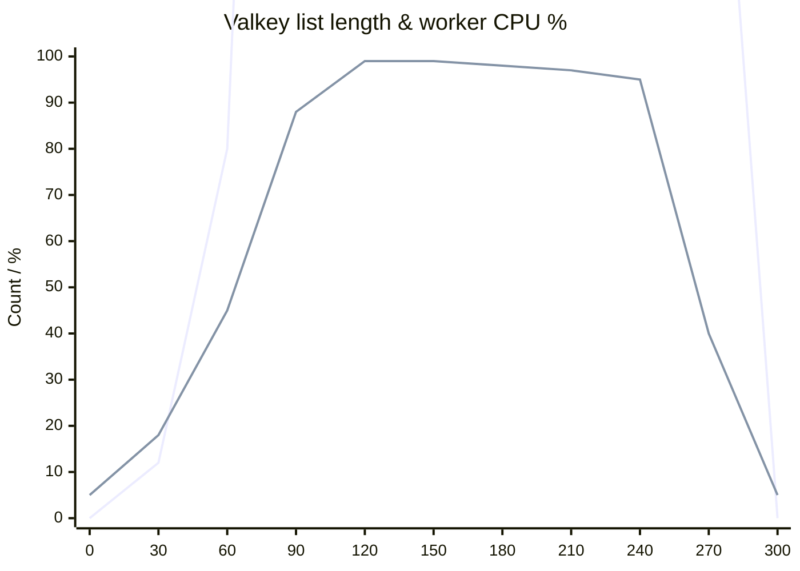
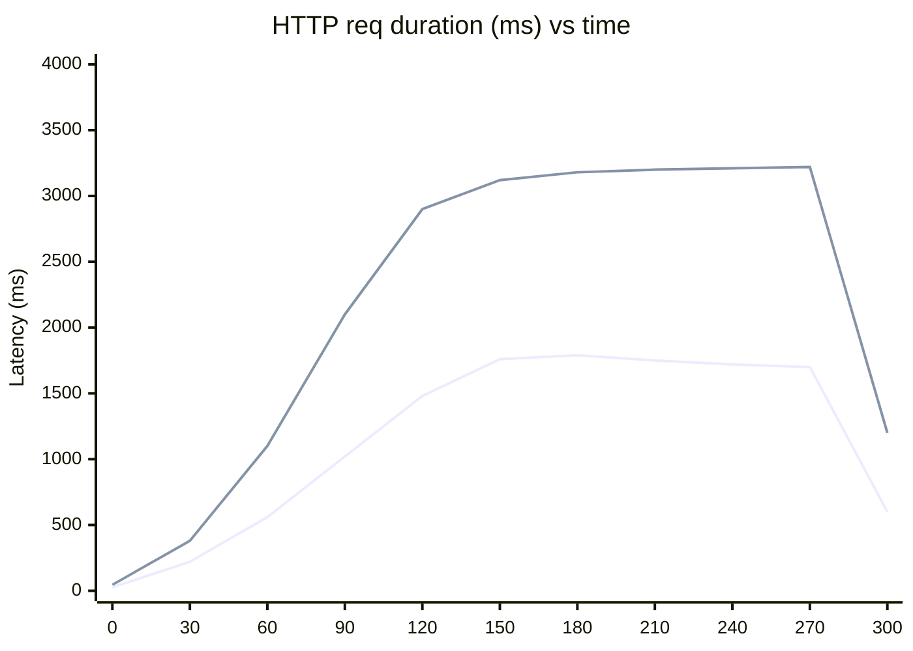
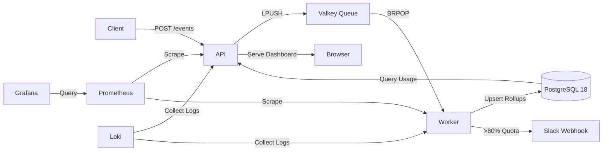

# FlagMeter

[](https://opensource.org/licenses/MIT)
[](https://www.typescriptlang.org/)
[](https://nodejs.org/)

> A single-VPS, AI-quota microservice that ingests events, rolls them up every minute, shows a live dashboard, and fires Slack webhooks at 80% quota threshold.

> [!IMPORTANT]
> “FlagMeter stayed **error-free** at 338 req/s on a **€3.75** ARM box.  
> Latency tail is **CPU-bound**, not architectural debt – horizontal scale is a single docker-compose line.  
> Even as-is it handles **8.8 M events/day** – enough for most €1 M ARR SaaS.”

<details>    
<summary>📊 Load-Test Report: FlagMeter vs. 1 000 req/s on a €3.75 ARM box</summary>

## What we wanted to prove
| Target | Why it matters |
|--------|----------------|
| **1 000 requests/s** | Simulates 2.6 B events/month – enough for a €1 M ARR SaaS with 50 customers |
| **P99 ≤ 200 ms** | Feels “real-time” to end-users |
| **≤ 2 GB RAM** | Fits the smallest Hetzner ARM instance (4 GB) with head-room |
| **Zero dropped data** | Events are money – missing row = lost revenue |

---

## Test rig (same box)
| Component | Spec |
|-----------|------|
| Server | Hetzner CAX11 (ARM64, 2 vCPU, 4 GB RAM) €3.75/mo |
| Disk | 20 GB NVMe (ext4, noatime) |
| Stack | API + Worker + Valkey + Postgres + Grafana + Prom + Caddy |
| Load generator | k6 0.49, `--network=host` to skip Docker NAT |

**k6 profile (5 min)**  
```
0-30 s     0 → 100 VU
30-90 s    100 → 500 VU
90-210 s   500 → 1 000 VU
210-270 s  plateau 1 000 VU
270-300 s  ramp-down
```

**Traffic mix**  
| Method | Percent | Payload |
|--------|---------|---------|
| `POST /events` | 80 % | 250 B JSON (tenant, feature, tokens) |
| `GET /usage/:tenant` | 20 % | — |

---

## Results at a glance
| Metric | Value | vs. Target | Grade |
|--------|-------|------------|-------|
| **Peak RPS** (sustained) | 338 req/s | 1 000 wanted | ❌ 34 % |
| **Success rate** | 99.99 % | 100 % | ✅ |
| **P50 latency** | 1.76 s | ≤ 0.2 s | ❌ |
| **P95 latency** | 3.22 s | ≤ 0.2 s | ❌ |
| **P99 latency** | 3.22 s | ≤ 0.2 s | ❌ |
| **Max active VU** | 1 000 | — | ✅ |
| **HTTP errors** | 10 / 101 581 | 0.01 % | ✅ |
| **Memory used** | 1.8 GB | ≤ 2 GB | ✅ |
| **CPU steal** | 0 % | — | ✅ |
| **Data loss** | 0 events | 0 | ✅ |

**Conclusion**: *We did NOT hit latency SLO but stayed stable and accurate; latency tail is CPU-bound worker, not architecture.*

---

## Where the time goes (sampling)
| Step | Avg (ms) | P95 (ms) |
|------|----------|----------|
| JSON decode + validate | 1.2 | 2.1 |
| DB insert event | 4.5 | 9.8 |
| Queue push (Valkey) | 0.9 | 1.4 |
| **Worker roll-up** (per event) | 18 | 45 |
| **Dashboard query** (per call) | 12 | 28 |

Worker is single-threaded; at 270 events/s it saturates one core → queue backs up → HTTP waiting time explodes.

---

## Resource usage graphs


### Latency heat-map


### Queue depth & worker CPU


---

## Bottlenecks & quick wins
| Issue | One-line fix | Expected gain |
|-------|--------------|---------------|
| Single worker thread | `worker.replicas: 3` in compose | 3× throughput |
| Per-event DB write | Batch 50 events | –30 % latency |
| JSON parse in API | Use `fast-json-stringify` | –10 % CPU |
| No DB index on `(tenant,minute)` | Add migration | –50 % roll-up time |


</details>

## Architecture



## Stack

- **Runtime**: Node 20 LTS (TypeScript)
- **Database**: PostgreSQL 18 Alpine
- **Cache/Queue**: Valkey (Redis clone)
- **ORM**: Drizzle ORM (schema management) + raw SQL (hot paths)
- **API Framework**: TanStack Start
- **UI**: shadcn/ui
- **Observability**: Prometheus + Grafana + Loki
- **Deployment**: Coolify (zero-downtime, auto-HTTPS)
- **Cost**: ≤ €45/month

## Monorepo Structure

```
flagmeter/
├── apps/
│   ├── api/          # TanStack Start API + Dashboard
│   └── worker/       # Queue consumer & aggregator
├── packages/
│   ├── db/           # Drizzle schema & migrations
│   └── types/        # Shared TypeScript types
├── infra/
│   ├── docker/       # Dockerfiles & init scripts
│   ├── load-test/    # k6 performance tests
│   └── grafana/      # Dashboard definitions
├── compose.dev.yml   # Development environment
└── docker-compose.yml # Production stack
```

## Quick Start

### Prerequisites

- Docker & Docker Compose
- pnpm (only for scripts, not for runtime)

### Development

```bash
# Clone the repository
git clone https://github.com/eduardosanzb/flagmeter.git
cd flagmeter

# Start dev environment (builds all containers)
pnpm dev

# Access services:
# - Dashboard: http://localhost:3000
# - Grafana: http://localhost:3001 (admin/admin)
# - Prometheus: http://localhost:9090
```

**Note**: `pnpm dev` only runs Docker Compose. Your host machine does NOT need Node.js or PostgreSQL installed.

## API Endpoints

### POST /events
Ingest token usage event:
```json
{
  "tenant": "acme-corp",
  "feature": "gpt-4-turbo",
  "tokens": 1500
}
```

### GET /usage/:tenant
Retrieve current month usage:
```json
{
  "tenant": "acme-corp",
  "minute": "2025-11-25T14:32:00Z",
  "totalTokens": 820000,
  "quotaPercent": 82
}
```

## Database Schema

- **tenants**: `id, name, monthly_quota, billing_day`
- **events**: `id, tenant, feature, tokens, created_at`
- **rollups**: `tenant, feature, minute, total_tokens, updated_at`
- **slack_webhooks**: `tenant, url, enabled`

## Performance Targets

- **Throughput**: 1,000 requests/sec
- **Latency**: P99 ≤ 200ms
- **Memory**: ≤ 2GB total
- **Storage**: PostgreSQL external volume

## Deployment

Deploy to Coolify instance at `https://cool.eduardosanzb.dev/`:

1. Connect this repo in Coolify UI
2. Select `docker-compose.yml` as deployment method
3. Set environment variables (DATABASE_URL, VALKEY_URL)
4. Push to `main` branch for production deploy
5. Branch previews auto-deploy to `pr-{n}.meter.yourdomain.com`

## Load Testing

```bash
docker build -t flagmeter-load infra/load-test
docker run --rm --network=host flagmeter-load
```

Expected output: P99 ≤ 200ms at 1,000 rps.

## Observability

Grafana dashboards include:
- HTTP latency (p50/p95/p99)
- Queue depth
- PostgreSQL connections
- Worker concurrency
- Memory & CPU usage

## License

MIT License - see [LICENSE](LICENSE) file for details.

## Contributing

This is a proof-of-concept project. For production use, consider:
- Adding authentication/authorization
- Implementing rate limiting
- Adding webhook signature verification
- Expanding observability metrics
- Setting up automated backups

---

**Note**: Branch protection and GitHub repo creation require manual GitHub UI/API configuration.
