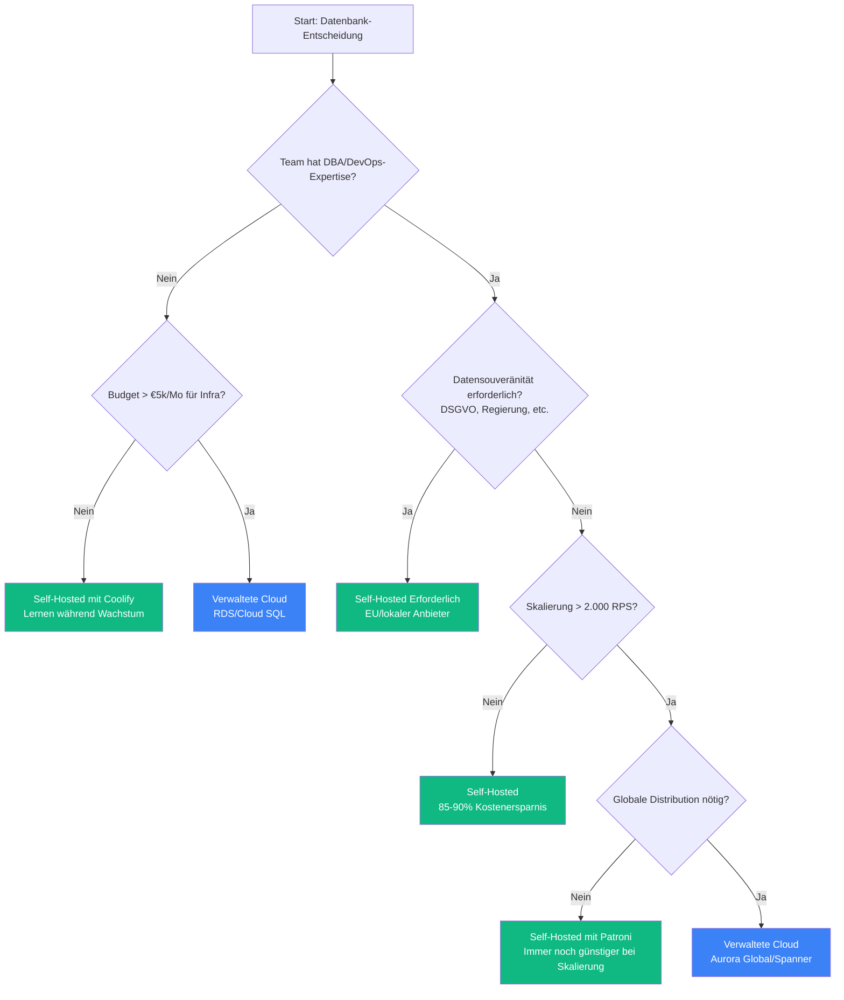

## Die Frage, die niemand ehrlich stellt

Jeder AWS-Blogbeitrag sagt dir: **"Verwaltete Datenbanken lassen dich auf dein Business konzentrieren."**

Jeder Self-Hosting-Evangelist kontert: **"Cloud-Datenbanken sind Betrug."**

Beide verkaufen dir etwas.

Dieser Artikel ist anders. Wir haben eine Hegelianische Dialektik-Analyse durchgeführt—These, Antithese, Synthese—über 8 kritische Dimensionen des Datenbankbetriebs. Das Ziel war nicht, unsere Vorurteile zu bestätigen. Es war, die Wahrheit zu finden.

**Die unbequeme Antwort:** Keines ist universell besser. Aber für bootstrapped B2B SaaS-Startups sprechen die Daten stark für einen Ansatz.

---

## Die Forschungsmethodik

Wir haben 8 Forschungsagenten eingesetzt, jeder beauftragt, die stärksten Argumente **für beide Seiten** zu finden über:

1. Datenintegrität & Backup-Sicherheit
2. Performance & Latenz
3. Verfügbarkeit & Zuverlässigkeit
4. Operative Komplexität
5. Gesamtbetriebskosten
6. Sicherheit & Compliance
7. Vendor Lock-in & Portabilität
8. Skalierbarkeit

Jede Dimension folgte einer Hegelschen Struktur:
- **These**: Beste Argumente für verwaltete Cloud-Datenbanken
- **Antithese**: Beste Argumente für selbst gehostete Datenbanken
- **Synthese**: Die tatsächliche Wahrheit unter Berücksichtigung beider Perspektiven

50+ Quellen konsultiert. Kein Cherry-Picking. Schauen wir, was dabei herauskam.

---

## Zusammenfassung: Die Wahrheitstabelle

Bevor wir in Details gehen, hier was 8 Dimensionen der Analyse ergaben:

| Dimension | Cloud gewinnt wenn | Self-Hosted gewinnt wenn |
|-----------|-------------------|--------------------------|
| **Datenintegrität** | Team fehlt DBA-Expertise | Datensouveränität erforderlich |
| **Performance** | Burst/unvorhersehbare Workloads | Konsistente, latenzsensitive |
| **Zuverlässigkeit** | Niedrige operative Reife | Hohe Ops-Reife + Bereitschaft |
| **Betrieb** | 5-20 Personen-Teams | 1-3 Personen-Teams ODER 50+ |
| **Kosten** | <€2k/Mo Infrastrukturausgaben | >€2k/Mo oder kostenbewusst |
| **Sicherheit** | Standard-Compliance | Strenge Datenresidenz |
| **Lock-in** | Geschwindigkeit > Portabilität | Langfristige Kontrolle |
| **Skalierbarkeit** | >1B QPS global | <100M QPS regional |

**Für unsere Zielgruppe (bootstrapped B2B SaaS, <2.000 RPS):** Self-Hosted gewinnt 6 von 8 Dimensionen.

---

## Dimension 1: Datenintegrität & Backup-Sicherheit

### Das Cloud-Pitch (These)

AWS RDS bietet:
- **Automatisiertes PITR**: 35-Tage Point-in-Time-Recovery-Aufbewahrung
- **Automatisierte Verifizierung**: Azure SQL führt `DBCC CHECKDB` bei Restores durch
- **Geo-redundanter Speicher**: LRS, ZRS, GRS, GZRS Optionen
- **Vorgefertigte Compliance**: SOC 1/2/3, ISO 27001, HIPAA BAA inklusive

Die Botschaft: "Wir haben Milliarden ausgegeben, damit du nicht über Backups nachdenken musst."

### Die Self-Hosted-Realität (Antithese)

PostgreSQL bietet:
- **Volle WAL-Kontrolle**: `archive_command` für jedes Ziel konfigurierbar
- **Datensouveränität**: Daten verlassen nie die Jurisdiktion (DSGVO Artikel 48)
- **35+ Jahre Erfolgsbilanz**: ACID-konform seit 2001
- **Direkter Backup-Dateizugriff**: Forensische Analyse ohne Vendor-Portale

Tools wie <a href="https://pgbackrest.org/user-guide.html" target="_blank" rel="noopener">pgBackRest</a>, <a href="https://github.com/wal-g/wal-g" target="_blank" rel="noopener">WAL-G</a> und <a href="https://github.com/eduardolat/pgbackweb" target="_blank" rel="noopener">pgbackweb</a> bieten Backup-Automatisierung, die mit verwalteten Diensten mithalten kann.

### Die Wahrheit (Synthese)

**Datenintegrität wird durch Implementierungsqualität bestimmt, nicht durch das Deployment-Modell.**

Beide können Enterprise-Grade-Sicherheit erreichen. Die Frage ist: Hast du die Expertise, es zu implementieren?

- **Wähle Cloud wenn**: Team fehlt DBA-Expertise, Compliance-Deadline ist eng, Multi-Region-DR benötigt
- **Wähle Self-Hosted wenn**: Datenresidenz ist nicht verhandelbar, 10+ Jahre Aufbewahrung, benutzerdefinierte Backup-Validierung benötigt

**Kritische Lücke, die wir entdeckt haben**: Kein PostgreSQL-Backup-Tool (Cloud oder Self-Hosted) bietet automatisierte **verifizierte Restore-Tests**. Backups, die nicht getestet werden, sind keine Backups. Dies ist ein branchenweites Problem.

---

## Dimension 2: Performance & Latenz

### Das Cloud-Pitch (These)

AWS vermarktet beeindruckende Spezifikationen:
- **EBS io2 Block Express**: Bis zu 256.000 IOPS, <500μs Latenz
- **Aurora Read Replicas**: Bis zu 15 mit sub-10ms Replikations-Lag
- **Auto-Scaling**: Serverless v2 skaliert in Sekundenbruchteilen

### Die Self-Hosted-Realität (Antithese)

Lokaler NVMe-Speicher ändert alles:
- **Latenz**: 50-200μs (lokale NVMe) vs 500-2.000μs (vernetzte EBS) = **10-20x schneller**
- **Kosteneffizienz**: €7,59/Mo (Hetzner CAX21) vs $200-500/Mo (vergleichbare RDS)
- **Keine IOPS-Preise**: Performance im Grundpreis enthalten
- **Volle Tuning-Kontrolle**: Alle 300+ PostgreSQL-Parameter zugänglich

### Die Wahrheit (Synthese)

**Self-Hosted liefert 2-5x bessere Performance pro Euro für OLTP-Workloads bis ~5.000 TPS.**

| Instanztyp | Self-Hosted (NVMe) | RDS (gp3) | RDS (io2) |
|------------|-------------------|-----------|-----------|
| 4 vCPU, 8GB | 6.000-10.000 TPS | 1.000-2.000 TPS | 1.500-3.000 TPS |
| Kosten/Mo | €8 | €60-180 | €100-200 |

**Die verborgene Wahrheit über EBS**: <a href="https://planetscale.com/blog/the-real-fail-rate-of-ebs" target="_blank" rel="noopener">PlanetScale dokumentierte</a>, dass gp3 "90% der provisionierten IOPS 99% der Zeit" liefert. Das bedeutet **14 Minuten pro Tag** potenzieller Performance-Degradierung. Für latenzsensitive Anwendungen ist das wichtig.

- **Wähle Cloud wenn**: Read-heavy mit globaler Distribution, Aurora Serverless-Elastizität benötigt
- **Wähle Self-Hosted wenn**: Write-heavy OLTP, p99-Latenz <10ms erforderlich, kostenbewusst

---

## Dimension 3: Verfügbarkeit & Zuverlässigkeit

### Das Cloud-Pitch (These)

Veröffentlichte SLAs bieten vertragliche Garantien:
- **AWS RDS Multi-AZ**: 99,95% SLA
- **Aurora**: 99,99% SLA
- **Automatisches Failover**: <30 Sekunden (Aurora), <60 Sekunden (RDS)
- **Service-Credits**: Finanzielle Kompensation bei Ausfällen

### Die Self-Hosted-Realität (Antithese)

Open-Source-HA-Tools sind produktionserprobt:
- **<a href="https://github.com/patroni/patroni" target="_blank" rel="noopener">Patroni</a>**: PostgreSQL HA mit 8k+ GitHub-Stars, genutzt von GitLab, Zalando
- **Volle Kontrolle**: Definiere dein eigenes SLA basierend auf Geschäftsanforderungen
- **Keine Provider-Level-Ausfälle**: Nicht von <a href="https://aws.amazon.com/message/11201/" target="_blank" rel="noopener">AWS us-east-1-Vorfällen</a> betroffen
- **Transparenz**: Vollständige Logs, keine Black-Box-Fehlersuche

### Die Wahrheit (Synthese)

**SLA ≠ Zuverlässigkeit.** Ein 99,95% SLA ist ein Vertrag mit finanziellen Abhilfen, keine Garantie für Uptime.

99,95% erlauben immer noch **4,3 Stunden Downtime pro Jahr**. Wenn us-east-1 ausfällt, bringt dein SLA-Credit die verlorenen Kunden nicht zurück.

**Reife-abhängige Schlussfolgerungen**:
- **Teams mit niedriger Reife**: Cloud empfohlen (operative Sicherheitsnetze)
- **Mittlere Reife**: Cloud Multi-AZ oder Self-Hosted mit Patroni
- **Hohe Reife**: Self-Hosted kann Cloud-SLAs erreichen/übertreffen

Sowohl Cloud als auch Self-Hosted erfordern operative Disziplin. Die Technologie ist vergleichbar; **Praktiken bestimmen die Uptime**.

---

## Dimension 4: Operative Komplexität

### Das Cloud-Pitch (These)

Verwaltete Dienste reduzieren die Belastung:
- **Setup-Zeit**: 15-30 Minuten vs 2-8 Stunden Self-Hosted
- **Null Patching-Aufwand**: OS- und Datenbank-Updates werden erledigt
- **Integrierte Observability**: CloudWatch, Performance Insights
- **<a href="https://planetscale.com/blog/the-principles-of-extreme-fault-tolerance" target="_blank" rel="noopener">PlanetScale-Prinzipien</a>**: "Always Be Failing Over" - wöchentliche Failover-Übungen

### Die Self-Hosted-Realität (Antithese)

Moderne Tools haben die Lücke geschlossen:
- **<a href="https://coolify.io" target="_blank" rel="noopener">Coolify</a>**: Bietet 90% der Managed-Benefits (wir haben das in [Teil 2](/de/blog/lean-devops-coolify-terraform/) behandelt)
- **Vorhersehbare Kosten**: €7,59/Mo fix vs variable Cloud-Abrechnung
- **PostgreSQL-Automatisierung**: Autovacuum, Routinewartung automatisiert via Cron
- **Keine Kosten-Governance**: Null Zeit für Rechnungsuntersuchungen

### Die Wahrheit (Synthese)

**Operative Komplexität verschwindet nicht—sie ändert ihre Form.**

| Cloud-Komplexität | Self-Hosted-Komplexität |
|-------------------|-------------------------|
| Kosten-Governance (Rechnungsspitzen) | Infrastrukturwartung |
| IAM-Policies | Server-Patching |
| Vendor-spezifische Eigenheiten | PostgreSQL-Tuning |
| Multi-Region-Networking | Backup-Verifizierung |

**Team-Größen-Empfehlungen**:

| Teamgröße | Empfehlung | Begründung |
|-----------|------------|------------|
| 1-3 Personen | Self-Hosted mit Coolify | Cloud-Kosten-Governance unverhältnismäßig |
| 5-20 Personen | Verwaltete Datenbanken | Fokus auf Produkt, nicht Infrastruktur |
| 50+ Personen | Hybrid-Ansatz | Internes DevOps kann Kosten optimieren |

Die 5-20 Personen "Lücke" ist, wo verwaltete Dienste den besten ROI bieten. Zu klein für dediziertes DevOps, zu groß für ständigen Kontextwechsel.

---

## Dimension 5: Gesamtbetriebskosten

### Das Cloud-Pitch (These)

Cloud-Befürworter argumentieren:
- **Keine CapEx**: Kosten mit Einnahmen abstimmen
- **Reduzierte DBA-Belastung**: 30-40% der traditionellen Aufgaben eliminiert
- **Elastische Skalierung**: Spitzen ohne Überbereitstellung bewältigen
- **Gebündelte Compliance**: Keine separaten Audit-Ausgaben

### Die Self-Hosted-Realität (Antithese)

Die Zahlen lügen nicht:
- **12,5x Compute-Einsparungen**: €3,79/Mo (CAX11) vs $52/Mo (db.t3.medium)
- **Keine IOPS-Preise**: Hetzner NVMe 10-20k IOPS inklusive
- **Bandbreite**: €0,01/GB (Hetzner) vs $0,09/GB (AWS)
- **Keine Extended-Support-Gebühren**: Community PostgreSQL wird unbegrenzt unterstützt

### Die Wahrheit (Synthese)

**Self-Hosted TCO ist dramatisch niedriger für Workloads unter 2.000 RPS.**

| Skalierung (RPS) | Self-Hosted | Cloud | Einsparungen |
|------------------|-------------|-------|--------------|
| 10-100 | €4-8/Mo | €25-50/Mo | 80-85% |
| 100-1.000 | €8-15/Mo | €60-180/Mo | 85-90% |
| 1.000-5.000 | €15-70/Mo | €150-500/Mo | 85-90% |
| 5.000-10.000 | €70-150/Mo | €500-2.000/Mo | 85-90% |

**Versteckte Cloud-Kosten**, die niemand erwähnt:
- **Datentransfer**: 5TB/Mo = $450 (AWS) vs €45 (Hetzner)
- **IOPS**: 10.000 IOPS = $35/Mo zusätzlich
- **Extended Support**: $120-480/Jahr für EOL PostgreSQL-Versionen
- **NAT Gateway**: $0,045/Stunde + $0,045/GB = leicht $100+/Mo

Die "voll geladenen" Kosten von RDS sind oft 2-3x der Instanzpreis allein.

---

## Dimension 6: Sicherheit & Compliance

### Das Cloud-Pitch (These)

Enterprise-Sicherheit eingebaut:
- **Physische Sicherheit**: Milliarden investiert, bewaffnete Wachen, biometrischer Zugang
- **Vorzertifiziert**: SOC2, ISO 27001, PCI DSS, HIPAA BAA
- **IAM-Integration**: Feingranulare, zentralisierte Zugriffskontrolle
- **Automatisiertes Patching**: OS- und Datenbank-Updates werden erledigt

### Die Self-Hosted-Realität (Antithese)

Kontrolle kann bessere Sicherheit bedeuten:
- **Volle Schlüsselkontrolle**: HSM vor Ort, keine Drittanbieter-KMS-Abhängigkeit
- **Datensouveränität**: CLOUD Act gilt nicht für Nicht-US-Infrastruktur
- **Keine gemeinsame Mandantschaft**: Eliminiert Cross-Tenant-Angriffsfläche
- **Custom RBAC**: PostgreSQL unterstützt GSSAPI, LDAP, RADIUS, SCRAM-SHA-256

### Die Wahrheit (Synthese)

**Sicherheit ist implementierungsabhängig, nicht infrastrukturabhängig.**

Wichtige Erkenntnisse:
- **<a href="https://www.verizon.com/business/resources/reports/dbir/" target="_blank" rel="noopener">Verizon 2025 DBIR</a>**: 15% der Breaches mit Drittanbieterbeteiligung verbunden (verdoppelt YoY)
- **OWASP Top 10**: Gilt gleichermaßen unabhängig vom Hosting-Modell
- **Zertifizierungen ≠ Compliance**: Deine Implementierung muss trotzdem auditiert werden

**Compliance-abhängige Schlussfolgerungen**:
- **SOC2/HIPAA**: Cloud beschleunigt; Self-Hosted mit Aufwand erreichbar
- **DSGVO**: Self-Hosted bietet stärkere Souveränitätsposition
- **PCI DSS**: Volle Scope-Kontrolle mit Self-Hosted

Die häufigsten Datenbank-Breaches (SQL-Injection, schwache Credentials, exponierte Ports) haben nichts damit zu tun, wo die Datenbank läuft.

---

## Dimension 7: Vendor Lock-in & Portabilität

### Das Cloud-Pitch (These)

Cloud-Anbieter behaupten Kompatibilität:
- **Aurora**: "Drop-in kompatibel" mit PostgreSQL
- **Standard-Treiber**: Keine Code-Änderungen nötig
- **Migrations-Tools**: AWS DMS unterstützt Full-Load-Migrationen
- **Export-Flexibilität**: Snapshots, logische Replikation verfügbar

### Die Self-Hosted-Realität (Antithese)

<a href="https://www.percona.com/blog/building-a-multi-cloud-strategy-cut-costs-improve-resilience-and-avoid-lock-in/" target="_blank" rel="noopener">Percona stellte fest</a>, dass "die meiste Multi-Cloud nur oberflächlich ist":
- **Echte Freiheit**: Community PostgreSQL, keine proprietären Erweiterungen
- **Infrastruktur-Unabhängigkeit**: Zwischen beliebigen Anbietern wechseln
- **DBaaS-Aufschlag**: 80-100% Premium über Infrastruktur
- **Keine Lizenzänderungen**: Anders als Crunchy Datas AGPLv3-Wechsel

### Die Wahrheit (Synthese)

**Portabilität existiert auf einem Spektrum, nicht als binäre Wahl.**

Auroras "Drop-in-Kompatibilität" hat Vorbehalte:
- Speicherarchitektur unterscheidet sich von Standard-PostgreSQL
- Echte Migration: Aurora zu PostgreSQL = **6+ Monate für 5TB-Datenbank**
- Proprietäre Features (wie Aurora Serverless) schaffen weiches Lock-in

**Hotel-California-Szenarien existieren, sind aber handhabbar** mit Planung. Der Schlüssel ist, proprietäre Features von Tag eins zu vermeiden.

---

## Dimension 8: Skalierbarkeit

### Das Cloud-Pitch (These)

Cloud skaliert bis ins Unendliche:
- **Aurora-Limits**: 128-256 TiB Speicher, 15 Read Replicas
- **Serverless v2**: Sofortige Skalierung auf Hunderttausende TPS
- **Global Database**: Sub-Sekunden Cross-Region-Replikation
- **Limitless Database**: Millionen Write-TPS

### Die Self-Hosted-Realität (Antithese)

Self-Hosted skaliert weiter als erwartet:
- **PostgreSQL bewiesen**: Terabytes bis Petabytes in Produktion
- **<a href="https://www.citusdata.com/" target="_blank" rel="noopener">Citus</a>**: Horizontale Skalierung auf Millionen Writes/Sek (jetzt Teil von Azure, aber Open Source)
- **<a href="https://discord.com/blog/how-discord-stores-trillions-of-messages" target="_blank" rel="noopener">Discord-Fall</a>**: Migrierte WEG von verwaltetem Cassandra zu Self-Hosted ScyllaDB
- **Kosten**: 8-10x günstiger bei vergleichbaren Specs

### Die Wahrheit (Synthese)

**Für 99% der Startups bietet Self-Hosted PostgreSQL mehr als ausreichende Skalierbarkeit.**

| Skalierung | Empfehlung |
|------------|------------|
| 0-100M QPS | Self-Hosted PostgreSQL |
| 100M-1B QPS | Aurora Limitless oder Citus evaluieren |
| 1B+ QPS global | Aurora mit Global Database gerechtfertigt |

**Discords Lektion**: Architektur > Hosting-Modell. Sie erreichten **15ms p99-Latenz** auf Self-Hosted vs **40-125ms auf verwaltetem Cassandra**.

Wenn du diesen Artikel liest, baust du nicht Discord. Single-Node PostgreSQL auf einem €30/Mo VPS bewältigt mehr Last als 95% der Startups jemals sehen werden.

---

## Das Entscheidungs-Framework

Nach 8 Dimensionen der Analyse, hier ist wie man entscheidet:

### Die Vier Fragen

1. **Was ist die operative Reife deines Teams?**
   - Niedrig → Verwaltete Cloud
   - Hoch → Self-Hosted (oder Hybrid)

2. **Was sind deine Skalierungsanforderungen?**
   - <2.000 RPS → Self-Hosted spart 85-90% Kosten
   - >5.000 RPS global → Verwaltete in Betracht ziehen

3. **Was sind deine Compliance-Einschränkungen?**
   - Standard (SOC2, HIPAA) → Cloud beschleunigt
   - Datensouveränität (DSGVO Artikel 48) → Self-Hosted erforderlich

4. **Was ist dein Budget?**
   - Kostenbewusst → Self-Hosted (5-20x günstiger)
   - Zeitbewusst → Verwaltete (15 Min vs 8 Stunden Setup)

---

## Die Unbequemen Wahrheiten

Nach 50+ Quellen und rigoroser dialektischer Analyse, hier ist was dir niemand sagt:

1. **Cloud-Marketing übertreibt Vorteile**: "Verwaltet" bedeutet Infrastruktur-Ops werden erledigt, nicht null Ops. Du musst immer noch Queries tunen, Schema-Migrationen verwalten, Application-Level-Retries handhaben.

2. **Self-Hosted-Marketing untertreibt Komplexität**: Es erfordert echte Expertise. "Einfach PostgreSQL ausführen" ignoriert Backup-Verifizierung, Monitoring, Security-Hardening und Disaster-Recovery-Planung.

3. **Keines ist inhärent sicherer**: Implementierung bestimmt Sicherheit. Eine schlecht konfigurierte RDS-Instanz ist weniger sicher als eine gut konfigurierte Self-Hosted PostgreSQL.

4. **SLAs sind Verträge, keine Garantien**: 99,95% erlauben immer noch 4,3 Stunden Downtime/Jahr. Wenn AWS ausfällt, rettet dein SLA-Credit nicht deine Demo mit dem Enterprise-Kunden.

5. **Portabilität ist schwieriger als behauptet**: Beide Richtungen haben signifikante Ausstiegskosten. Plane es von Tag eins, oder akzeptiere das Lock-in.

---

## Für Bootstrapped B2B SaaS (Unsere Zielgruppe)

**Die Wahrheit**: Self-Hosted PostgreSQL auf Hetzner ARM64 VPS ist die optimale Wahl wenn:
- Budget wichtig ist (€7,59/Mo vs $200-500/Mo)
- Du 1-3 Ingenieure mit grundlegenden Linux-Kenntnissen hast
- Dein Workload <2.000 RPS ist
- Du Kontrolle über Bequemlichkeit schätzt

**Die Ausnahme**: Wähle verwaltete Cloud wenn:
- Du SOC2/HIPAA-Compliance innerhalb von 3 Monaten brauchst
- Du keine Datenbank-Expertise hast und sie nicht erwerben kannst
- Du Multi-Region globale Distribution brauchst
- Investoren/Enterprise-Kunden-Mandate es erfordern

---

## Was wir bei FlagMeter betreiben

Echte Zahlen aus unserem Produktions-Deployment:

| Komponente | Spec | Monatliche Kosten |
|------------|------|-------------------|
| PostgreSQL 18 | Self-Hosted auf CAX21 | €7,59 (geteilt) |
| Valkey (Redis Fork) | Self-Hosted auf CAX21 | €0 (gleicher Server) |
| Backups | pgBackRest zu Hetzner Storage Box | €3,81 (100GB) |
| Monitoring | Prometheus + Grafana | €0 (gleicher Server) |
| **Gesamt** | | **€11,40/Mo** |

**Erreichte Performance**: 484 RPS nachhaltig, p95-Latenz 2,4s (inklusive vollem Observability-Stack)

**AWS-Äquivalent**: €10.560/Mo (Lambda + RDS + ElastiCache + ALB + CloudWatch)

Das ist ein **925x Kostenunterschied** für äquivalente Funktionalität.

---

## Nächste Schritte: Deinen Self-Hosted Stack aufbauen

Wenn dich diese Analyse überzeugt hat, Self-Hosting zu versuchen, hier ist der Lernpfad:

1. **Starte mit unseren vorherigen Artikeln**:
   - [Teil 1: Wir haben €11/Monat für Docker Swarm Tests ausgegeben](/de/blog/docker-swarm-test-11-euro-lesson/) — Infrastruktur-Vergleich
   - [Teil 2: Der Lean DevOps Stack](/de/blog/lean-devops-coolify-terraform/) — Deployment-Pipeline

2. **PostgreSQL auf Coolify einrichten** (15 Minuten):
   - One-Click PostgreSQL-Service deployen
   - `synchronous_commit=off` für Write-Performance konfigurieren
   - Automatisierte Backups zu S3-kompatiblem Storage einrichten

3. **Monitoring hinzufügen** (30 Minuten):
   - <a href="https://github.com/prometheus-community/postgres_exporter" target="_blank" rel="noopener">postgres_exporter</a> deployen
   - <a href="https://grafana.com/grafana/dashboards/9628-postgresql-database/" target="_blank" rel="noopener">PostgreSQL Dashboard</a> in Grafana importieren
   - Alerts für Connection Count, Replikations-Lag, Disk-Usage einrichten

4. **Deine Backups testen** (kritisch):
   - Wöchentliche Restore-Tests in Staging-Umgebung planen
   - Datenintegrität nach jedem Restore verifizieren
   - RTO/RPO dokumentieren und dagegen testen

---

  <a href="https://cal.com/eduardosanzb/15min" target="_blank" rel="noopener" style="display: inline-block; background: linear-gradient(135deg, #10b981 0%, #059669 100%); color: white; padding: 1rem 2.5rem; border-radius: 0.5rem; font-weight: 600; font-size: 1.125rem; text-decoration: none; box-shadow: 0 4px 6px rgba(16, 185, 129, 0.25); transition: transform 0.2s, box-shadow 0.2s;" onmouseover="this.style.transform='translateY(-2px)'; this.style.boxShadow='0 6px 12px rgba(16, 185, 129, 0.35)';" onmouseout="this.style.transform='translateY(0)'; this.style.boxShadow='0 4px 6px rgba(16, 185, 129, 0.25)';">
    📞 Kostenloses Datenbank-Audit buchen
  </a>
  
15-Minuten Gespräch • Dein aktuelles Setup reviewen • Ehrliche Einschätzung

---

**Vorherige Artikel:**
- [Teil 1: Wir haben €11/Monat für Docker Swarm Tests ausgegeben](/de/blog/docker-swarm-test-11-euro-lesson/)
- [Teil 2: Der Lean DevOps Stack: Von Git Push zu Produktion](/de/blog/lean-devops-coolify-terraform/)

---

## Forschungsquellen

Dieser Artikel synthetisierte Erkenntnisse aus 50+ Quellen, darunter:

**Offizielle Dokumentation**: AWS RDS SLA, AWS Aurora Pricing, AWS EBS Features, Azure SQL Backups, Google Cloud Compliance, PostgreSQL Documentation, Hetzner Cloud Pricing

**Engineering Blogs**: <a href="https://planetscale.com/blog/the-real-fail-rate-of-ebs" target="_blank" rel="noopener">PlanetScale über EBS-Ausfallraten</a>, <a href="https://planetscale.com/blog/the-principles-of-extreme-fault-tolerance" target="_blank" rel="noopener">PlanetScale Fehlertoleranz</a>, <a href="https://discord.com/blog/how-discord-stores-trillions-of-messages" target="_blank" rel="noopener">Discords Datenbank-Migration</a>, <a href="https://www.percona.com/blog/building-a-multi-cloud-strategy-cut-costs-improve-resilience-and-avoid-lock-in/" target="_blank" rel="noopener">Percona Multi-Cloud Analyse</a>

**Sicherheit & Compliance**: <a href="https://www.verizon.com/business/resources/reports/dbir/" target="_blank" rel="noopener">Verizon 2025 DBIR</a>, NIST SP 800-53, CIS Controls, OWASP Top 10

**Tools**: <a href="https://github.com/patroni/patroni" target="_blank" rel="noopener">Patroni</a>, <a href="https://coolify.io" target="_blank" rel="noopener">Coolify</a>, <a href="https://pgbackrest.org/" target="_blank" rel="noopener">pgBackRest</a>, <a href="https://github.com/wal-g/wal-g" target="_blank" rel="noopener">WAL-G</a>

---

*Dieser Artikel ist Teil unserer Infrastruktur-Repatriierungs-Fallstudien. Echte Forschung, echte Kosten, echte Schlussfolgerungen—auch wenn sie unbequem sind.*
