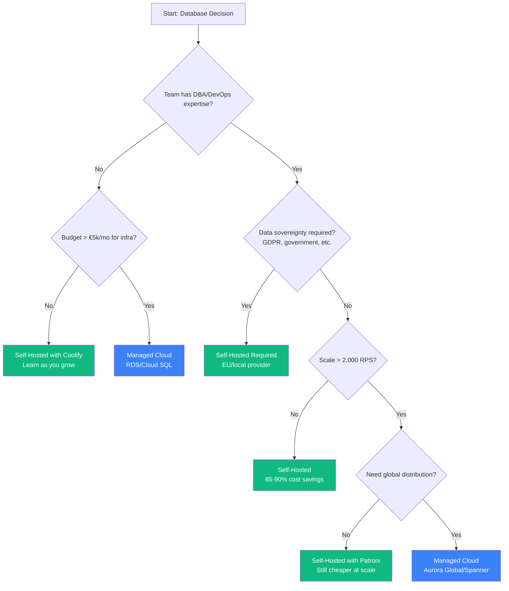

## The Question No One Asks Honestly

Every AWS blog post tells you: **"Managed databases let you focus on your business."**

Every self-hosting evangelist counters: **"Cloud databases are a scam."**

Both are selling you something.

This article is different. We ran a Hegelian dialectic analysis—thesis, antithesis, synthesis—across 8 critical dimensions of database operations. The goal wasn't to confirm our biases. It was to find the truth.
**The uncomfortable answer:** Neither is universally better. But for bootstrapped B2B SaaS startups, the data strongly favors one approach.

---

## The Research Methodology

We deployed 8 research agents, each tasked with finding the strongest arguments **for both sides** across:

1. Data Integrity & Backup Safety
2. Performance & Latency
3. Availability & Reliability
4. Operational Complexity
5. Total Cost of Ownership
6. Security & Compliance
7. Vendor Lock-in & Portability
8. Scalability

Each dimension followed a Hegelian structure:
- **Thesis**: Best arguments for managed cloud databases
- **Antithesis**: Best arguments for self-hosted databases
- **Synthesis**: The actual truth, accounting for both perspectives

50+ sources consulted. No cherry-picking. Let's see what emerged.

---

## Executive Summary: The Truth Table

Before diving into details, here's what 8 dimensions of analysis revealed:

| Dimension | Cloud Wins When | Self-Hosted Wins When |
|-----------|-----------------|----------------------|
| **Data Integrity** | Team lacks DBA expertise | Data sovereignty required |
| **Performance** | Burst/unpredictable workloads | Consistent, latency-sensitive |
| **Reliability** | Low operational maturity | High ops maturity + on-call |
| **Operations** | 5-20 person teams | 1-3 person teams OR 50+ |
| **Cost** | <€2k/mo infra spend | >€2k/mo or cost-sensitive |
| **Security** | Standard compliance | Strict data residency |
| **Lock-in** | Speed > portability | Long-term control |
| **Scalability** | >1B QPS global | <100M QPS regional |

**For our target audience (bootstrapped B2B SaaS, <2,000 RPS):** Self-hosted wins 6 of 8 dimensions.

---

## Dimension 1: Data Integrity & Backup Safety

### The Cloud Pitch (Thesis)

AWS RDS offers:
- **Automated PITR**: 35-day point-in-time recovery retention
- **Automated verification**: Azure SQL runs `DBCC CHECKDB` on restores
- **Geo-redundant storage**: LRS, ZRS, GRS, GZRS options
- **Pre-built compliance**: SOC 1/2/3, ISO 27001, HIPAA BAA included

The message: "We've spent billions so you don't have to think about backups."

### The Self-Hosted Reality (Antithesis)

PostgreSQL offers:
- **Full WAL control**: Configure `archive_command` for any destination
- **Data sovereignty**: Data never leaves jurisdiction (GDPR Article 48)
- **35+ year track record**: ACID compliant since 2001
- **Direct backup file access**: Forensic analysis without vendor portals

Tools like <a href="https://pgbackrest.org/user-guide.html" target="_blank" rel="noopener">pgBackRest</a>, <a href="https://github.com/wal-g/wal-g" target="_blank" rel="noopener">WAL-G</a>, and <a href="https://github.com/eduardolat/pgbackweb" target="_blank" rel="noopener">pgbackweb</a> provide backup automation that rivals managed services.

### The Truth (Synthesis)

**Data integrity is determined by implementation quality, not deployment model.**

Both can achieve enterprise-grade safety. The question is: do you have the expertise to implement it?

- **Choose Cloud When**: Team lacks DBA expertise, compliance deadline is tight, need multi-region DR
- **Choose Self-Hosted When**: Data residency is non-negotiable, 10+ year retention, need custom backup validation

**Critical gap we discovered**: No PostgreSQL backup tool (cloud or self-hosted) offers automated **verified restore testing**. Backups that aren't tested aren't backups. This is an industry-wide problem.

---

## Dimension 2: Performance & Latency

### The Cloud Pitch (Thesis)

AWS markets impressive specs:
- **EBS io2 Block Express**: Up to 256,000 IOPS, <500μs latency
- **Aurora read replicas**: Up to 15 with sub-10ms replication lag
- **Auto-scaling**: Serverless v2 scales in fractions of a second

### The Self-Hosted Reality (Antithesis)

Local NVMe storage changes everything:
- **Latency**: 50-200μs (local NVMe) vs 500-2,000μs (networked EBS) = **10-20x faster**
- **Cost efficiency**: €7.59/mo (Hetzner CAX21) vs $200-500/mo (comparable RDS)
- **No IOPS pricing**: Performance included in base price
- **Full tuning control**: All 300+ PostgreSQL parameters accessible

### The Truth (Synthesis)

**Self-hosted delivers 2-5x better performance per dollar for OLTP workloads up to ~5,000 TPS.**

| Instance Type | Self-Hosted (NVMe) | RDS (gp3) | RDS (io2) |
|---------------|-------------------|-----------|-----------|
| 4 vCPU, 8GB | 6,000-10,000 TPS | 1,000-2,000 TPS | 1,500-3,000 TPS |
| Cost/mo | €8 | €60-180 | €100-200 |

**The hidden truth about EBS**: <a href="https://planetscale.com/blog/the-real-fail-rate-of-ebs" target="_blank" rel="noopener">PlanetScale documented</a> that gp3 delivers "90% of provisioned IOPS 99% of the time." That means **14 minutes per day** of potential performance degradation. For latency-sensitive applications, this matters.

- **Choose Cloud When**: Read-heavy with global distribution, need Aurora Serverless elasticity
- **Choose Self-Hosted When**: Write-heavy OLTP, p99 latency <10ms required, budget-conscious

---

## Dimension 3: Availability & Reliability

### The Cloud Pitch (Thesis)

Published SLAs provide contractual guarantees:
- **AWS RDS Multi-AZ**: 99.95% SLA
- **Aurora**: 99.99% SLA
- **Automatic failover**: <30 seconds (Aurora), <60 seconds (RDS)
- **Service credits**: Financial compensation for outages

### The Self-Hosted Reality (Antithesis)

Open-source HA tools are production-proven:
- **<a href="https://github.com/patroni/patroni" target="_blank" rel="noopener">Patroni</a>**: PostgreSQL HA with 8k+ GitHub stars, used by GitLab, Zalando
- **Full control**: Define your own SLA based on business needs
- **No provider-level outages**: Not affected by <a href="https://aws.amazon.com/message/11201/" target="_blank" rel="noopener">AWS us-east-1 incidents</a>
- **Transparency**: Full logs, no black-box troubleshooting

### The Truth (Synthesis)

**SLA ≠ Reliability.** A 99.95% SLA is a contract with financial remedies, not a guarantee of uptime.

99.95% still allows **4.3 hours of downtime per year**. When us-east-1 goes down, your SLA credit doesn't bring back lost customers.

**Maturity-dependent conclusions**:
- **Low maturity teams**: Cloud recommended (operational safety nets)
- **Medium maturity**: Cloud Multi-AZ, or self-hosted with Patroni
- **High maturity**: Self-hosted can match/exceed cloud SLAs

Both cloud and self-hosted require operational discipline. Technology is comparable; **practices determine uptime**.

---

## Dimension 4: Operational Complexity

### The Cloud Pitch (Thesis)

Managed services reduce burden:
- **Setup time**: 15-30 minutes vs 2-8 hours self-hosted
- **Zero patching burden**: OS and database updates handled
- **Built-in observability**: CloudWatch, Performance Insights
- **<a href="https://planetscale.com/blog/the-principles-of-extreme-fault-tolerance" target="_blank" rel="noopener">PlanetScale principles</a>**: "Always Be Failing Over" - weekly failover exercises

### The Self-Hosted Reality (Antithesis)

Modern tools have closed the gap:
- **<a href="https://coolify.io" target="_blank" rel="noopener">Coolify</a>**: Provides 90% of managed benefits (we covered this in [Part 2](/blog/lean-devops-coolify-terraform/))
- **Predictable costs**: €7.59/mo fixed vs variable cloud billing
- **PostgreSQL automation**: Autovacuum, routine maintenance automated via cron
- **No cost governance**: Zero time spent investigating bills

### The Truth (Synthesis)

**Operational complexity doesn't disappear—it changes form.**

| Cloud Complexity | Self-Hosted Complexity |
|------------------|------------------------|
| Cost governance (bill spikes) | Infrastructure maintenance |
| IAM policies | Server patching |
| Vendor-specific quirks | PostgreSQL tuning |
| Multi-region networking | Backup verification |

**Team Size Recommendations**:

| Team Size | Recommendation | Rationale |
|-----------|----------------|-----------|
| 1-3 persons | Self-hosted with Coolify | Cloud cost governance disproportionate |
| 5-20 persons | Managed databases | Focus on product, not infrastructure |
| 50+ persons | Hybrid approach | Internal DevOps can optimize costs |

The 5-20 person "gap" is where managed services provide the best ROI. Too small for dedicated DevOps, too big to context-switch constantly.

---

## Dimension 5: Total Cost of Ownership

### The Cloud Pitch (Thesis)

Cloud advocates argue:
- **No CapEx**: Align costs with revenue
- **Reduced DBA burden**: 30-40% of traditional tasks eliminated
- **Elastic scaling**: Handle spikes without overprovisioning
- **Bundled compliance**: No separate audit spend

### The Self-Hosted Reality (Antithesis)

The numbers don't lie:
- **12.5x compute savings**: €3.79/mo (CAX11) vs $52/mo (db.t3.medium)
- **No IOPS pricing**: Hetzner NVMe 10-20k IOPS included
- **Bandwidth**: €0.01/GB (Hetzner) vs $0.09/GB (AWS)
- **No Extended Support fees**: Community PostgreSQL supported indefinitely

### The Truth (Synthesis)

**Self-hosted TCO is dramatically lower for workloads under 2,000 RPS.**

| Scale (RPS) | Self-Hosted | Cloud | Savings |
|-------------|-------------|-------|---------|
| 10-100 | €4-8/mo | €25-50/mo | 80-85% |
| 100-1,000 | €8-15/mo | €60-180/mo | 85-90% |
| 1,000-5,000 | €15-70/mo | €150-500/mo | 85-90% |
| 5,000-10,000 | €70-150/mo | €500-2,000/mo | 85-90% |

**Hidden Cloud Costs** nobody mentions:
- **Data transfer**: 5TB/mo = $450 (AWS) vs €45 (Hetzner)
- **IOPS**: 10,000 IOPS = $35/mo additional
- **Extended Support**: $120-480/year for EOL PostgreSQL versions
- **NAT Gateway**: $0.045/hour + $0.045/GB = easily $100+/mo

The "fully loaded" cost of RDS is often 2-3x the instance price alone.

---

## Dimension 6: Security & Compliance

### The Cloud Pitch (Thesis)

Enterprise security built in:
- **Physical security**: Billions invested, armed guards, biometric access
- **Pre-certified**: SOC2, ISO 27001, PCI DSS, HIPAA BAA
- **IAM integration**: Fine-grained, centralized access control
- **Automated patching**: OS and database updates handled

### The Self-Hosted Reality (Antithesis)

Control can mean better security:
- **Full key control**: HSM on-premises, no third-party KMS dependency
- **Data sovereignty**: CLOUD Act doesn't apply to non-US infrastructure
- **No shared tenancy**: Eliminates cross-tenant attack surface
- **Custom RBAC**: PostgreSQL supports GSSAPI, LDAP, RADIUS, SCRAM-SHA-256

### The Truth (Synthesis)

**Security is implementation-dependent, not infrastructure-dependent.**

Key findings:
- **<a href="https://www.verizon.com/business/resources/reports/dbir/" target="_blank" rel="noopener">Verizon 2025 DBIR</a>**: 15% of breaches linked to third-party involvement (doubled YoY)
- **OWASP Top 10**: Applies equally regardless of hosting model
- **Certifications ≠ Compliance**: Your implementation must still be audited

**Compliance-Dependent Conclusions**:
- **SOC2/HIPAA**: Cloud accelerates; self-hosted achievable with effort
- **GDPR**: Self-hosted offers stronger sovereignty posture
- **PCI DSS**: Full scope control with self-hosted

The most common database breaches (SQL injection, weak credentials, exposed ports) have nothing to do with where the database runs.

---

## Dimension 7: Vendor Lock-in & Portability

### The Cloud Pitch (Thesis)

Cloud providers claim compatibility:
- **Aurora**: "Drop-in compatible" with PostgreSQL
- **Standard drivers**: No code changes needed
- **Migration tools**: AWS DMS supports full-load migrations
- **Export flexibility**: Snapshots, logical replication available

### The Self-Hosted Reality (Antithesis)

<a href="https://www.percona.com/blog/building-a-multi-cloud-strategy-cut-costs-improve-resilience-and-avoid-lock-in/" target="_blank" rel="noopener">Percona found</a> that "most multi-cloud is surface-level only":
- **True freedom**: Community PostgreSQL, no proprietary extensions
- **Infrastructure independence**: Move between any provider
- **DBaaS markup**: 80-100% premium over infrastructure
- **No license changes**: Unlike Crunchy Data's AGPLv3 shift

### The Truth (Synthesis)

**Portability exists on a spectrum, not as a binary choice.**

Aurora's "drop-in compatibility" has caveats:
- Storage architecture differs from standard PostgreSQL
- Real migration: Aurora to PostgreSQL = **6+ months for 5TB database**
- Proprietary features (like Aurora Serverless) create soft lock-in

**Hotel California scenarios exist but are manageable** with planning. The key is avoiding proprietary features from day one.

---

## Dimension 8: Scalability

### The Cloud Pitch (Thesis)

Cloud scales to infinity:
- **Aurora limits**: 128-256 TiB storage, 15 read replicas
- **Serverless v2**: Instant scaling to hundreds of thousands TPS
- **Global Database**: Sub-second cross-region replication
- **Limitless Database**: Millions of write TPS

### The Self-Hosted Reality (Antithesis)

Self-hosted scales further than you'd expect:
- **PostgreSQL proven**: Terabytes to petabytes in production
- **<a href="https://www.citusdata.com/" target="_blank" rel="noopener">Citus</a>**: Horizontal scaling to millions of writes/sec (now part of Azure, but open source)
- **<a href="https://discord.com/blog/how-discord-stores-trillions-of-messages" target="_blank" rel="noopener">Discord case</a>**: Migrated AWAY from managed Cassandra to self-hosted ScyllaDB
- **Cost**: 8-10x cheaper at comparable specs

### The Truth (Synthesis)

**For 99% of startups, self-hosted PostgreSQL provides more than adequate scalability.**

| Scale | Recommendation |
|-------|----------------|
| 0-100M QPS | Self-hosted PostgreSQL |
| 100M-1B QPS | Evaluate Aurora Limitless or Citus |
| 1B+ QPS global | Aurora with Global Database justified |

**Discord's lesson**: Architecture > hosting model. They achieved **15ms p99 latency** on self-hosted vs **40-125ms on managed Cassandra**.

If you're reading this article, you're not building Discord. Single-node PostgreSQL on a €30/mo VPS handles more load than 95% of startups will ever see.

---

## The Decision Framework

After 8 dimensions of analysis, here's how to decide:

### The Four Questions

1. **What is your team's operational maturity?**
   - Low → Managed Cloud
   - High → Self-Hosted (or Hybrid)

2. **What is your scale requirement?**
   - <2,000 RPS → Self-hosted saves 85-90% costs
   - >5,000 RPS global → Consider managed

3. **What are your compliance constraints?**
   - Standard (SOC2, HIPAA) → Cloud accelerates
   - Data sovereignty (GDPR Article 48) → Self-hosted required

4. **What is your budget?**
   - Cost-sensitive → Self-hosted (5-20x cheaper)
   - Time-sensitive → Managed (15 min vs 8 hours setup)

---

## The Uncomfortable Truths

After 50+ sources and rigorous dialectical analysis, here's what nobody tells you:

1. **Cloud marketing overstates benefits**: "Managed" means infrastructure ops handled, not zero ops. You still need to tune queries, manage schema migrations, handle application-level retries.

2. **Self-hosted marketing understates complexity**: It requires genuine expertise. "Just run PostgreSQL" ignores backup verification, monitoring, security hardening, and disaster recovery planning.

3. **Neither is inherently more secure**: Implementation determines security. A poorly configured RDS instance is less secure than a well-configured self-hosted PostgreSQL.

4. **SLAs are contracts, not guarantees**: 99.95% still allows 4.3 hours downtime/year. When AWS goes down, your SLA credit doesn't save your demo with the enterprise customer.

5. **Portability is harder than claimed**: Both directions have significant exit costs. Plan for it from day one, or accept the lock-in.

---

## For Bootstrapped B2B SaaS (Our Target Audience)

**The Truth**: Self-hosted PostgreSQL on Hetzner ARM64 VPS is the optimal choice when:
- Budget matters (€7.59/mo vs $200-500/mo)
- You have 1-3 engineers with basic Linux skills
- Your workload is <2,000 RPS
- You value control over convenience

**The Exception**: Choose managed cloud when:
- You need SOC2/HIPAA compliance within 3 months
- You have no database expertise and cannot acquire it
- You need multi-region global distribution
- Investor/enterprise customer mandates require it

---

## What We Run at FlagMeter

Real numbers from our production deployment:

| Component | Spec | Monthly Cost |
|-----------|------|--------------|
| PostgreSQL 18 | Self-hosted on CAX21 | €7.59 (shared) |
| Valkey (Redis fork) | Self-hosted on CAX21 | €0 (same server) |
| Backups | pgBackRest to Hetzner Storage Box | €3.81 (100GB) |
| Monitoring | Prometheus + Grafana | €0 (same server) |
| **Total** | | **€11.40/mo** |

**Performance achieved**: 484 RPS sustained, p95 latency 2.4s (including full observability stack)

**AWS equivalent**: €10,560/mo (Lambda + RDS + ElastiCache + ALB + CloudWatch)

That's a **925x cost difference** for equivalent functionality.

---

## Next Steps: Building Your Self-Hosted Stack

If this analysis convinced you to try self-hosting, here's the learning path:

1. **Start with our previous articles**:
   - [Part 1: We Spent €11/month Testing Docker Swarm](/blog/docker-swarm-test-11-euro-lesson/) — Infrastructure comparison
   - [Part 2: The Lean DevOps Stack](/blog/lean-devops-coolify-terraform/) — Deployment pipeline

2. **Set up PostgreSQL on Coolify** (15 minutes):
   - Deploy one-click PostgreSQL service
   - Configure `synchronous_commit=off` for write performance
   - Set up automated backups to S3-compatible storage

3. **Add monitoring** (30 minutes):
   - Deploy <a href="https://github.com/prometheus-community/postgres_exporter" target="_blank" rel="noopener">postgres_exporter</a>
   - Import <a href="https://grafana.com/grafana/dashboards/9628-postgresql-database/" target="_blank" rel="noopener">PostgreSQL dashboard</a> into Grafana
   - Set up alerts for connection count, replication lag, disk usage

4. **Test your backups** (critical):
   - Schedule weekly restore tests to a staging environment
   - Verify data integrity after each restore
   - Document your RTO/RPO and test against it

---

  <a href="https://cal.com/eduardosanzb/15min" target="_blank" rel="noopener" style="display: inline-block; background: linear-gradient(135deg, #10b981 0%, #059669 100%); color: white; padding: 1rem 2.5rem; border-radius: 0.5rem; font-weight: 600; font-size: 1.125rem; text-decoration: none; box-shadow: 0 4px 6px rgba(16, 185, 129, 0.25); transition: transform 0.2s, box-shadow 0.2s;" onmouseover="this.style.transform='translateY(-2px)'; this.style.boxShadow='0 6px 12px rgba(16, 185, 129, 0.35)';" onmouseout="this.style.transform='translateY(0)'; this.style.boxShadow='0 4px 6px rgba(16, 185, 129, 0.25)';">
    📞 Book Your Free Database Audit
  </a>
  
15-minute call • Review your current setup • Honest assessment

---

**Previous in series:**
- [Part 1: We Spent €11/month Testing Docker Swarm So You Don't Have To](/blog/docker-swarm-test-11-euro-lesson/)
- [Part 2: The Lean DevOps Stack: From Git Push to Production](/blog/lean-devops-coolify-terraform/)

---

## Research Sources

This article synthesized findings from 50+ sources, including:

**Official Documentation**: AWS RDS SLA, AWS Aurora Pricing, AWS EBS Features, Azure SQL Backups, Google Cloud Compliance, PostgreSQL Documentation, Hetzner Cloud Pricing

**Engineering Blogs**: <a href="https://planetscale.com/blog/the-real-fail-rate-of-ebs" target="_blank" rel="noopener">PlanetScale on EBS Failure Rates</a>, <a href="https://planetscale.com/blog/the-principles-of-extreme-fault-tolerance" target="_blank" rel="noopener">PlanetScale Fault Tolerance</a>, <a href="https://discord.com/blog/how-discord-stores-trillions-of-messages" target="_blank" rel="noopener">Discord's Database Migration</a>, <a href="https://www.percona.com/blog/building-a-multi-cloud-strategy-cut-costs-improve-resilience-and-avoid-lock-in/" target="_blank" rel="noopener">Percona Multi-Cloud Analysis</a>

**Security & Compliance**: <a href="https://www.verizon.com/business/resources/reports/dbir/" target="_blank" rel="noopener">Verizon 2025 DBIR</a>, NIST SP 800-53, CIS Controls, OWASP Top 10

**Tools**: <a href="https://github.com/patroni/patroni" target="_blank" rel="noopener">Patroni</a>, <a href="https://coolify.io" target="_blank" rel="noopener">Coolify</a>, <a href="https://pgbackrest.org/" target="_blank" rel="noopener">pgBackRest</a>, <a href="https://github.com/wal-g/wal-g" target="_blank" rel="noopener">WAL-G</a>

---

*This article is part of our infrastructure repatriation case studies. Real research, real costs, real conclusions—even when they're uncomfortable.*
