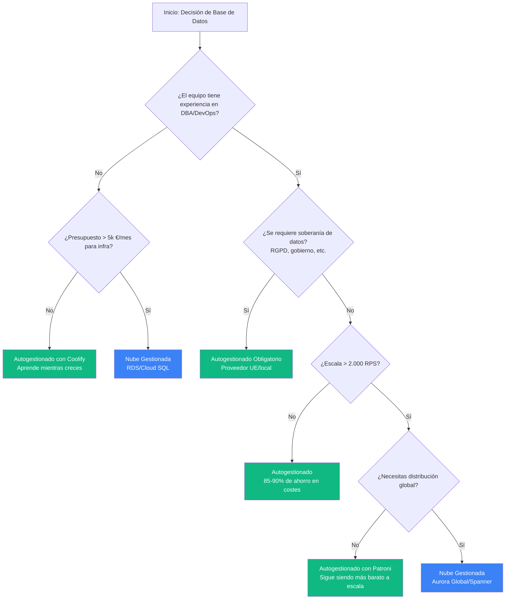

## La pregunta que nadie hace honestamente

Cada publicación en el blog de AWS te dice: **"Las bases de datos gestionadas te permiten centrarte en tu negocio"**.

Cada evangelista del autohospedaje responde: **"Las bases de datos en la nube son una estafa"**.

Ambos te están vendiendo algo.

Este artículo es diferente. Realizamos un análisis dialéctico hegeliano —tesis, antítesis, síntesis— a través de 8 dimensiones críticas de las operaciones de bases de datos. El objetivo no era confirmar nuestros sesgos, sino encontrar la verdad.

**La respuesta incómoda:** ninguna es universalmente mejor. Pero para las startups SaaS B2B con recursos limitados, los datos favorecen fuertemente a un enfoque.

---

## La metodología de investigación

Desplegamos 8 agentes de investigación, cada uno con la tarea de encontrar los argumentos más sólidos **para ambos lados** en las siguientes áreas:

1. Integridad de los datos y seguridad de las copias de seguridad
2. Rendimiento y latencia
3. Disponibilidad y fiabilidad
4. Complejidad operativa
5. Coste total de propiedad (TCO)
6. Seguridad y cumplimiento
7. Bloqueo de proveedor y portabilidad
8. Escalabilidad

Cada dimensión siguió una estructura hegeliana:
- **Tesis**: Los mejores argumentos para las bases de datos gestionadas en la nube.
- **Antítesis**: Los mejores argumentos para las bases de datos autogestionadas.
- **Síntesis**: La verdad real, teniendo en cuenta ambas perspectivas.

Se consultaron más de 50 fuentes. Sin sesgos. Veamos qué surgió.

---

## Resumen Ejecutivo: La Tabla de la Verdad

Antes de entrar en detalles, esto es lo que revelaron las 8 dimensiones del análisis:

| Dimensión | La Nube Gana Cuando | Lo Autogestionado Gana Cuando |
|-----------|-----------------|----------------------|
| **Integridad de Datos** | El equipo carece de experiencia en DBA | Se requiere soberanía de datos |
| **Rendimiento** | Cargas de trabajo con picos o impredecibles | Cargas consistentes y sensibles a la latencia |
| **Fiabilidad** | Baja madurez operativa | Alta madurez operativa + guardias (on-call) |
| **Operaciones** | Equipos de 5 a 20 personas | Equipos de 1 a 3 personas O más de 50 |
| **Coste** | Gasto en infra < 2.000 €/mes | Gasto > 2.000 €/mes o alta sensibilidad al coste |
| **Seguridad** | Cumplimiento estándar | Residencia de datos estricta |
| **Bloqueo** | Velocidad > portabilidad | Control a largo plazo |
| **Escalabilidad** | > 1.000 millones QPS global | < 100 millones QPS regional |

**Para nuestro público objetivo (SaaS B2B, < 2.000 RPS):** Lo autogestionado gana en 6 de las 8 dimensiones.

---

## Dimensión 1: Integridad de los Datos y Seguridad de las Copias de Seguridad

### El discurso de la nube (Tesis)

AWS RDS ofrece:
- **PITR automatizado**: Retención de recuperación en un punto en el tiempo de 35 días.
- **Verificación automatizada**: Azure SQL ejecuta `DBCC CHECKDB` en las restauraciones.
- **Almacenamiento georedundante**: Opciones LRS, ZRS, GRS, GZRS.
- **Cumplimiento pre-construido**: SOC 1/2/3, ISO 27001, HIPAA BAA incluidos.

El mensaje: "Hemos gastado miles de millones para que tú no tengas que pensar en las copias de seguridad".

### La realidad autogestionada (Antithesis)

PostgreSQL ofrece:
- **Control total de WAL**: Configura `archive_command` para cualquier destino.
- **Soberanía de datos**: Los datos nunca salen de la jurisdicción (RGPD Artículo 48).
- **Trayectoria de más de 35 años**: Cumple con ACID desde 2001.
- **Acceso directo a archivos de backup**: Análisis forense sin portales de proveedores.

Herramientas como <a href="https://pgbackrest.org/user-guide.html" target="_blank" rel="noopener">pgBackRest</a>, <a href="https://github.com/wal-g/wal-g" target="_blank" rel="noopener">WAL-G</a> y <a href="https://github.com/eduardolat/pgbackweb" target="_blank" rel="noopener">pgbackweb</a> proporcionan una automatización de copias de seguridad que rivaliza con los servicios gestionados.

### La Verdad (Síntesis)

**La integridad de los datos viene determinada por la calidad de la implementación, no por el modelo de despliegue.**

Ambos pueden alcanzar una seguridad de nivel empresarial. La pregunta es: ¿tienes la experiencia para implementarlo?

- **Elige la nube cuando**: El equipo carece de experiencia en DBA, el plazo de cumplimiento es ajustado, necesitas recuperación ante desastres (DR) multiregión.
- **Elige lo autogestionado cuando**: La residencia de los datos no es negociable, necesitas retención de más de 10 años, necesitas validación de backup personalizada.

**Brecha crítica que descubrimos**: Ninguna herramienta de backup de PostgreSQL (nube o autogestionada) ofrece **pruebas de restauración verificadas** automatizadas. Las copias de seguridad que no se prueban no son copias de seguridad. Este es un problema de toda la industria.

---

## Dimensión 2: Rendimiento y Latencia

### El discurso de la nube (Tesis)

AWS comercializa especificaciones impresionantes:
- **EBS io2 Block Express**: Hasta 256.000 IOPS, latencia < 500μs.
- **Réplicas de lectura de Aurora**: Hasta 15 con un desfase de replicación sub-10ms.
- **Auto-escalado**: Serverless v2 escala en fracciones de segundo.

### La realidad autogestionada (Antítesis)

El almacenamiento NVMe local lo cambia todo:
- **Latencia**: 50-200μs (NVMe local) vs 500-2.000μs (EBS en red) = **10-20 veces más rápido**.
- **Eficiencia de costes**: 7,59 €/mes (Hetzner CAX21) vs 200-500 $/mes (RDS comparable).
- **Sin precios por IOPS**: El rendimiento está incluido en el precio base.
- **Control total del ajuste**: Acceso a los más de 300 parámetros de PostgreSQL.

### La Verdad (Síntesis)

**Lo autogestionado ofrece entre 2 y 5 veces mejor rendimiento por cada euro para cargas de trabajo OLTP de hasta ~5.000 TPS.**

| Tipo de instancia | Autogestionado (NVMe) | RDS (gp3) | RDS (io2) |
|---------------|-------------------|-----------|-----------|
| 4 vCPU, 8GB | 6.000-10.000 TPS | 1.000-2.000 TPS | 1.500-3.000 TPS |
| Coste/mes | 8 € | 60-180 € | 100-200 € |

**La verdad oculta sobre EBS**: <a href="https://planetscale.com/blog/the-real-fail-rate-of-ebs" target="_blank" rel="noopener">PlanetScale documentó</a> que gp3 entrega "el 90% de los IOPS provisionados el 99% del tiempo". Eso significa **14 minutos al día** de degradación potencial del rendimiento. Para aplicaciones sensibles a la latencia, esto importa.

- **Elige la nube cuando**: Tienes mucha lectura con distribución global, necesitas la elasticidad de Aurora Serverless.
- **Elige lo autogestionado cuando**: Tienes mucha escritura OLTP, requieres latencia p99 < 10ms, eres consciente del presupuesto.

---

## Dimensión 3: Disponibilidad y Fiabilidad

### El discurso de la nube (Tesis)

Los SLA publicados proporcionan garantías contractuales:
- **AWS RDS Multi-AZ**: SLA del 99,95%.
- **Aurora**: SLA del 99,99%.
- **Failover automático**: < 30 segundos (Aurora), < 60 segundos (RDS).
- **Créditos de servicio**: Compensación financiera por interrupciones.

### La realidad autogestionada (Antítesis)

Las herramientas de alta disponibilidad (HA) de código abierto están probadas en producción:
- **<a href="https://github.com/patroni/patroni" target="_blank" rel="noopener">Patroni</a>**: HA de PostgreSQL con más de 8.000 estrellas en GitHub, utilizado por GitLab, Zalando.
- **Control total**: Define tu propio SLA basado en las necesidades del negocio.
- **Sin interrupciones a nivel de proveedor**: No afectado por los <a href="https://aws.amazon.com/message/11201/" target="_blank" rel="noopener">incidentes de AWS us-east-1</a>.
- **Transparencia**: Logs completos, sin resolución de problemas de "caja negra".

### La Verdad (Síntesis)

**SLA ≠ Fiabilidad.** Un SLA del 99,95% es un contrato con remedios financieros, no una garantía de tiempo de actividad.

Un 99,95% todavía permite **4,3 horas de inactividad al año**. Cuando us-east-1 se cae, tu crédito de SLA no te devuelve a los clientes perdidos.

**Conclusiones según la madurez**:
- **Equipos de baja madurez**: Nube recomendada (redes de seguridad operativas).
- **Madurez media**: Nube Multi-AZ, o autogestionado con Patroni.
- **Alta madurez**: Lo autogestionado puede igualar o superar los SLA de la nube.

Tanto la nube como lo autogestionado requieren disciplina operativa. La tecnología es comparable; **las prácticas determinan el tiempo de actividad**.

---

## Dimensión 4: Complejidad operativa

### El discurso de la nube (Tesis)

Los servicios gestionados reducen la carga:
- **Tiempo de configuración**: 15-30 minutos vs 2-8 horas autogestionado.
- **Cero carga de parches**: Actualizaciones del SO y de la base de datos gestionadas.
- **Observabilidad integrada**: CloudWatch, Performance Insights.
- **<a href="https://planetscale.com/blog/the-principles-of-extreme-fault-tolerance" target="_blank" rel="noopener">Principios de PlanetScale</a>**: "Always Be Failing Over" — ejercicios semanales de failover.

### La realidad autogestionada (Antítesis)

Las herramientas modernas han cerrado la brecha:
- **<a href="https://coolify.io" target="_blank" rel="noopener">Coolify</a>**: Proporciona el 90% de los beneficios gestionados (cubrimos esto en la [Parte 2](/es/blog/lean-devops-coolify-terraform/)).
- **Costes predecibles**: 7,59 €/mes fijo vs facturación variable de la nube.
- **Automatización de PostgreSQL**: Autovacuum, mantenimiento rutinario automatizado vía cron.
- **Sin gobernanza de costes**: Cero tiempo dedicado a investigar facturas.

### La Verdad (Síntesis)

**La complejidad operativa no desaparece, cambia de forma.**

| Complejidad en la Nube | Complejidad Autogestionada |
|------------------|------------------------|
| Gobernanza de costes (picos en la factura) | Mantenimiento de la infraestructura |
| Políticas de IAM | Parcheo de servidores |
| Peculiaridades específicas del proveedor | Ajuste de PostgreSQL |
| Redes multiregión | Verificación de backups |

**Recomendaciones por tamaño de equipo**:

| Tamaño del equipo | Recomendación | Justificación |
|-----------|----------------|-----------|
| 1-3 personas | Autogestionado con Coolify | Gobernanza de costes en la nube desproporcionada |
| 5-20 personas | Bases de datos gestionadas | Centrarse en el producto, no en la infraestructura |
| 50+ personas | Enfoque híbrido | El equipo interno de DevOps puede optimizar costes |

La "brecha" de los equipos de 5 a 20 personas es donde los servicios gestionados ofrecen el mejor ROI. Demasiado pequeños para un DevOps dedicado, demasiado grandes para cambiar de contexto constantemente.

---

## Dimensión 5: Coste total de propiedad (TCO)

### El discurso de la nube (Tesis)

Los defensores de la nube argumentan:
- **Sin CapEx**: Alinea los costes con los ingresos.
- **Carga de DBA reducida**: Eliminación del 30-40% de las tareas tradicionales.
- **Escalado elástico**: Maneja picos sin sobredimensionar.
- **Cumplimiento incluido**: Sin gasto de auditoría por separado.

### La realidad autogestionada (Antítesis)

Los números no mienten:
- **Ahorro de computación de 12,5 veces**: 3,79 €/mes (CAX11) vs 52 $/mes (db.t3.medium).
- **Sin precios por IOPS**: Hetzner NVMe incluye entre 10k y 20k IOPS.
- **Ancho de banda**: 0,01 €/GB (Hetzner) vs 0,09 $/GB (AWS).
- **Sin tarifas de Soporte Extendido**: PostgreSQL de la comunidad soportado indefinidamente.

### La Verdad (Síntesis)

**El TCO de lo autogestionado es dramáticamente menor para cargas de trabajo de menos de 2.000 RPS.**

| Escala (RPS) | Autogestionado | Nube | Ahorro |
|-------------|-------------|-------|---------|
| 10-100 | 4-8 €/mes | 25-50 €/mes | 80-85% |
| 100-1.000 | 8-15 €/mes | 60-180 €/mes | 85-90% |
| 1.000-5.000 | 15-70 €/mes | 150-500 €/mes | 85-90% |
| 5.000-10.000 | 70-150 €/mes | 500-2.000 €/mes | 85-90% |

**Costes ocultos de la nube** que nadie menciona:
- **Transferencia de datos**: 5TB/mes = 450 $ (AWS) vs 45 € (Hetzner).
- **IOPS**: 10.000 IOPS = 35 $/mes adicionales.
- **Soporte extendido**: 120-480 $/año para versiones de PostgreSQL al final de su vida útil.
- **NAT Gateway**: 0,045 $/hora + 0,045 $/GB = fácilmente más de 100 $/mes.

El coste "completo" de RDS suele ser de 2 a 3 veces el precio de la instancia por sí sola.

---

## Dimensión 6: Seguridad y Cumplimiento

### El discurso de la nube (Tesis)

Seguridad empresarial integrada:
- **Seguridad física**: Miles de millones invertidos, guardias armados, acceso biométrico.
- **Pre-certificada**: SOC2, ISO 27001, PCI DSS, HIPAA BAA.
- **Integración con IAM**: Control de acceso centralizado y detallado.
- **Parcheo automatizado**: Actualizaciones del SO y de la base de datos gestionadas.

### La realidad autogestionada (Antítesis)

El control puede significar una mejor seguridad:
- **Control total de las claves**: HSM local, sin dependencia de KMS de terceros.
- **Soberanía de datos**: La ley CLOUD no se aplica a infraestructuras que no sean de EE. UU.
- **Sin tenencia compartida**: Elimina la superficie de ataque entre inquilinos.
- **RBAC personalizado**: PostgreSQL soporta GSSAPI, LDAP, RADIUS, SCRAM-SHA-256.

### La Verdad (Síntesis)

**La seguridad depende de la implementación, no de la infraestructura.**

Hallazgos clave:
- **<a href="https://www.verizon.com/business/resources/reports/dbir/" target="_blank" rel="noopener">Verizon 2025 DBIR</a>**: El 15% de las brechas están relacionadas con la participación de terceros (duplicado año tras año).
- **Top 10 de OWASP**: Se aplica por igual independientemente del modelo de hosting.
- **Certificaciones ≠ Cumplimiento**: Tu implementación aún debe ser auditada.

**Conclusiones según el cumplimiento**:
- **SOC2/HIPAA**: La nube acelera; lo autogestionado es alcanzable con esfuerzo.
- **RGPD**: Lo autogestionado ofrece una postura de soberanía más sólida.
- **PCI DSS**: Control total del alcance con lo autogestionado.

Las brechas de base de datos más comunes (inyección SQL, credenciales débiles, puertos expuestos) no tienen nada que ver con dónde se ejecuta la base de datos.

---

## Dimensión 7: Bloqueo de proveedor y portabilidad

### El discurso de la nube (Tesis)

Los proveedores de nube afirman que existe compatibilidad:
- **Aurora**: "Compatible directamente" con PostgreSQL.
- **Drivers estándar**: No se necesitan cambios en el código.
- **Herramientas de migración**: AWS DMS soporta migraciones de carga completa.
- **Flexibilidad de exportación**: Snapshots, replicación lógica disponible.

### La realidad autogestionada (Antítesis)

<a href="https://www.percona.com/blog/building-a-multi-cloud-strategy-cut-costs-improve-resilience-and-avoid-lock-in/" target="_blank" rel="noopener">Percona descubrió</a> que "la mayoría de la multi-nube es solo superficial":
- **Libertad verdadera**: PostgreSQL de la comunidad, sin extensiones propietarias.
- **Independencia de infraestructura**: Muévete entre cualquier proveedor.
- **Margen de DBaaS**: Un sobrecoste del 80-100% sobre la infraestructura.
- **Sin cambios de licencia**: A diferencia del cambio a AGPLv3 de Crunchy Data.

### La Verdad (Síntesis)

**La portabilidad existe en un espectro, no como una elección binaria.**

La "compatibilidad directa" de Aurora tiene matices:
- La arquitectura de almacenamiento difiere de la de PostgreSQL estándar.
- Migración real: de Aurora a PostgreSQL = **más de 6 meses para una base de datos de 5TB**.
- Las características propietarias (como Aurora Serverless) crean un bloqueo suave.

**Los escenarios tipo "Hotel California" existen pero son manejables** con planificación. La clave es evitar las características propietarias desde el primer día.

---

## Dimensión 8: Escalabilidad

### El discurso de la nube (Tesis)

La nube escala al infinito:
- **Límites de Aurora**: 128-256 TiB de almacenamiento, 15 réplicas de lectura.
- **Serverless v2**: Escalado instantáneo a cientos de miles de TPS.
- **Base de Datos Global**: Replicación entre regiones en menos de un segundo.
- **Limitless Database**: Millones de TPS de escritura.

### La realidad autogestionada (Antítesis)

Lo autogestionado escala más de lo que esperarías:
- **PostgreSQL probado**: De terabytes a petabytes en producción.
- **<a href="https://www.citusdata.com/" target="_blank" rel="noopener">Citus</a>**: Escalado horizontal a millones de escrituras/seg (ahora parte de Azure, pero de código abierto).
- **<a href="https://discord.com/blog/how-discord-stores-trillions-of-messages" target="_blank" rel="noopener">Caso de Discord</a>**: Migraron DESDE Cassandra gestionada a ScyllaDB autogestionada.
- **Coste**: De 8 a 10 veces más barato con especificaciones comparables.

### La Verdad (Síntesis)

**Para el 99% de las startups, PostgreSQL autogestionado proporciona una escalabilidad más que adecuada.**

| Escala | Recomendación |
|-------|----------------|
| 0-100M QPS | PostgreSQL Autogestionado |
| 100M-1B QPS | Evaluar Aurora Limitless o Citus |
| 1B+ QPS global | Aurora con Base de Datos Global justificado |

**La lección de Discord**: Arquitectura > modelo de hosting. Consiguieron una **latencia p99 de 15ms** en autogestionado frente a los **40-125ms en Cassandra gestionada**.

Si estás leyendo este artículo, no estás construyendo Discord. Un PostgreSQL de un solo nodo en un VPS de 30 €/mes maneja más carga de la que el 95% de las startups verá jamás.

---

## El marco de decisión

Tras 8 dimensiones de análisis, así es como debes decidir:

### Las cuatro preguntas

1. **¿Cuál es la madurez operativa de tu equipo?**
   - Baja → Nube Gestionada
   - Alta → Autogestionado (o Híbrido)

2. **¿Cuál es tu requisito de escala?**
   - < 2.000 RPS → Autogestionado ahorra 85-90% de costes.
   - > 5.000 RPS global → Considerar gestionado.

3. **¿Cuáles son tus limitaciones de cumplimiento?**
   - Estándar (SOC2, HIPAA) → La nube acelera.
   - Soberanía de datos (RGPD Artículo 48) → Autogestionado obligatorio.

4. **¿Cuál es tu presupuesto?**
   - Sensible al coste → Autogestionado (5-20 veces más barato).
   - Sensible al tiempo → Gestionado (15 min vs 8 horas de configuración).

---

## Las verdades incómodas

Tras más de 50 fuentes y un riguroso análisis dialéctico, esto es lo que nadie te cuenta:

1. **El marketing de la nube exagera los beneficios**: "Gestionado" significa que las operaciones de infraestructura están cubiertas, no que haya cero operaciones. Todavía tienes que ajustar las consultas, gestionar las migraciones de esquema y manejar los reintentos a nivel de aplicación.

2. **El marketing de lo autogestionado subestima la complejidad**: Requiere experiencia genuina. "Simplemente ejecuta PostgreSQL" ignora la verificación de backups, la monitorización, el endurecimiento de la seguridad y la planificación de la recuperación ante desastres.

3. **Ninguno es inherentemente más seguro**: La implementación determina la seguridad. Una instancia de RDS mal configurada es menos segura que un PostgreSQL autogestionado bien configurado.

4. **Los SLA son contratos, no garantías**: Un 99,95% todavía permite 4,3 horas de inactividad al año. Cuando AWS se cae, tu crédito de SLA no salva tu demo con el cliente corporativo.

5. **La portabilidad es más difícil de lo que se afirma**: Ambas direcciones tienen costes de salida significativos. Planifícalo desde el primer día o acepta el bloqueo.

---

## Para SaaS B2B con recursos limitados (Nuestro Público Objetivo)

**La Verdad**: PostgreSQL autogestionado en un VPS ARM64 de Hetzner es la opción óptima cuando:
- El presupuesto importa (7,59 €/mes vs 200-500 $/mes).
- Tienes entre 1 y 3 ingenieros con conocimientos básicos de Linux.
- Tu carga de trabajo es < 2.000 RPS.
- Valoras el control sobre la comodidad.

**La Excepción**: Elige la nube gestionada cuando:
- Necesitas cumplir con SOC2/HIPAA en menos de 3 meses.
- No tienes experiencia en bases de datos y no puedes adquirirla.
- Necesitas distribución global multiregión.
- Los mandatos de inversores o clientes corporativos lo requieren.

---

## Qué ejecutamos en FlagMeter

Cifras reales de nuestro despliegue en producción:

| Componente | Especificación | Coste Mensual |
|-----------|------|--------------|
| PostgreSQL 18 | Autogestionado en CAX21 | 7,59 € (compartido) |
| Valkey (fork de Redis) | Autogestionado en CAX21 | 0 € (mismo servidor) |
| Backups | pgBackRest a Hetzner Storage Box | 3,81 € (100GB) |
| Monitorización | Prometheus + Grafana | 0 € (mismo servidor) |
| **Total** | | **11,40 €/mes** |

**Rendimiento alcanzado**: 484 RPS sostenidos, latencia p95 de 2,4s (incluyendo el stack completo de observabilidad).

**Equivalente en AWS**: 10.560 €/mes (Lambda + RDS + ElastiCache + ALB + CloudWatch).

Eso es una **diferencia de coste de 925 veces** para una funcionalidad equivalente.

---

## Próximos pasos: Construir tu stack autogestionado

Si este análisis te convenció para probar el autohospedaje, este es el camino de aprendizaje:

1. **Empieza con nuestros artículos anteriores**:
   - [Parte 1: Gastamos 11 €/mes probando Docker Swarm](/es/blog/docker-swarm-test-11-euro-lesson/) — Comparativa de infraestructura.
   - [Parte 2: El stack de DevOps Lean](/es/blog/lean-devops-coolify-terraform/) — Pipeline de despliegue.

2. **Configura PostgreSQL en Coolify** (15 minutos):
   - Despliega el servicio de PostgreSQL con un solo clic.
   - Configura `synchronous_commit=off` para el rendimiento de escritura.
   - Configura copias de seguridad automatizadas en un almacenamiento compatible con S3.

3. **Añade monitorización** (30 minutos):
   - Despliega <a href="https://github.com/prometheus-community/postgres_exporter" target="_blank" rel="noopener">postgres_exporter</a>.
   - Importa el <a href="https://grafana.com/grafana/dashboards/9628-postgresql-database/" target="_blank" rel="noopener">dashboard de PostgreSQL</a> en Grafana.
   - Configura alertas para el recuento de conexiones, desfase de replicación y uso de disco.

4. **Prueba tus backups** (crítico):
   - Programa pruebas de restauración semanales en un entorno de staging.
   - Verifica la integridad de los datos tras cada restauración.
   - Documenta tu RTO/RPO y haz pruebas contra ellos.

---

  <a href="https://cal.com/eduardosanzb/15min" target="_blank" rel="noopener" style="display: inline-block; background: linear-gradient(135deg, #10b981 0%, #059669 100%); color: white; padding: 1rem 2.5rem; border-radius: 0.5rem; font-weight: 600; font-size: 1.125rem; text-decoration: none; box-shadow: 0 4px 6px rgba(16, 185, 129, 0.25); transition: transform 0.2s, box-shadow 0.2s;" onmouseover="this.style.transform='translateY(-2px)'; this.style.boxShadow='0 6px 12px rgba(16, 185, 129, 0.35)';" onmouseout="this.style.transform='translateY(0)'; this.style.boxShadow='0 4px 6px rgba(16, 185, 129, 0.25)';">
    📞 Reserva tu Auditoría de Base de Datos Gratuita
  </a>
  
Llamada de 15 minutos • Revisa tu configuración actual • Evaluación honesta

---

**Anterior en la serie:**
- [Parte 1: Gastamos 11 €/mes probando Docker Swarm para que tú no tengas que hacerlo](/es/blog/docker-swarm-test-11-euro-lesson/)
- [Parte 2: El stack de DevOps Lean: de Git Push a Producción](/es/blog/lean-devops-coolify-terraform/)

---

## Fuentes de investigación

Este artículo sintetizó los hallazgos de más de 50 fuentes, incluyendo:

**Documentación oficial**: AWS RDS SLA, AWS Aurora Pricing, AWS EBS Features, Azure SQL Backups, Google Cloud Compliance, Documentación de PostgreSQL, Hetzner Cloud Pricing.

**Blogs de ingeniería**: <a href="https://planetscale.com/blog/the-real-fail-rate-of-ebs" target="_blank" rel="noopener">PlanetScale sobre fallos de EBS</a>, <a href="https://planetscale.com/blog/the-principles-of-extreme-fault-tolerance" target="_blank" rel="noopener">Tolerancia a fallos de PlanetScale</a>, <a href="https://discord.com/blog/how-discord-stores-trillions-of-messages" target="_blank" rel="noopener">Migración de la base de datos de Discord</a>, <a href="https://www.percona.com/blog/building-a-multi-cloud-strategy-cut-costs-improve-resilience-and-avoid-lock-in/" target="_blank" rel="noopener">Análisis multi-nube de Percona</a>.

**Seguridad y Cumplimiento**: <a href="https://www.verizon.com/business/resources/reports/dbir/" target="_blank" rel="noopener">Verizon 2025 DBIR</a>, NIST SP 800-53, Controles CIS, Top 10 de OWASP.

**Herramientas**: <a href="https://github.com/patroni/patroni" target="_blank" rel="noopener">Patroni</a>, <a href="https://coolify.io" target="_blank" rel="noopener">Coolify</a>, <a href="https://pgbackrest.org/" target="_blank" rel="noopener">pgBackRest</a>, <a href="https://github.com/wal-g/wal-g" target="_blank" rel="noopener">WAL-G</a>.

---

*Este artículo es parte de nuestros casos de estudio sobre repatriación de infraestructura. Investigación real, costes reales, conclusiones reales — incluso cuando son incómodas.*
