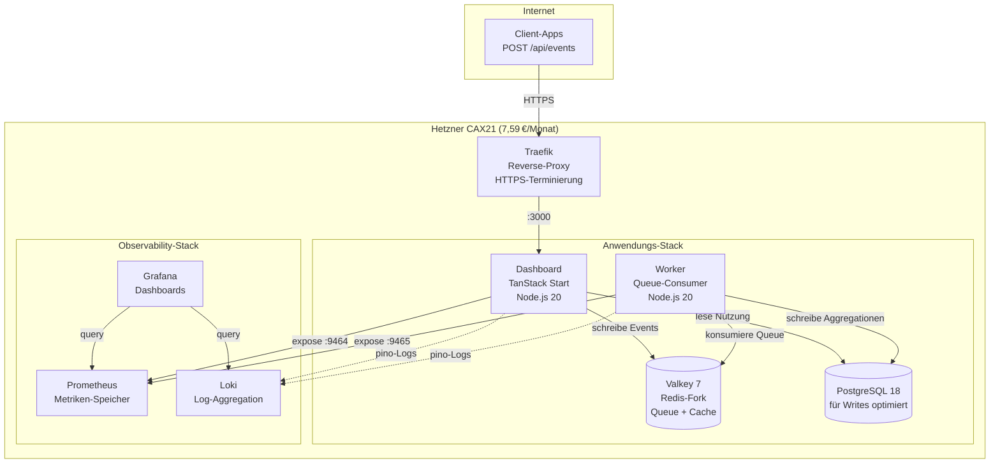

## Executive Summary: Ergebnisse der Lasttests

Wir haben **vier Architekturen** mit identischem Code, identischen Lastmustern (bis zu 1200 gleichzeitige Nutzer, 4,5 Minuten) und identischer Hetzner-Infrastruktur getestet. Hier ist, was wir gelernt haben:

| Test | Architektur | vCPU | Monatliche Kosten | RPS | Kosten pro<br/>100 RPS | P95-Latenz | Fehler | Ergebnis |
|------|-------------|------|-------------------|-----|------------------------|------------|--------|----------|
| **1** | Einzelner CAX11 | 2 | 3,79 € | 228 | 1,66 € | 5.303 ms | 0,80 % | ❌ Fehlgeschlagen |
| **2** | 2×CAX11 Swarm<br/>(ausgelastet) | 4 | 7,58 € | 354 | 2,14 € | 3.524 ms | 0,00 % | ✅ Bestanden |
| **3** | **Einzelner CAX21** | **4** | **7,59 €** | **484** | **1,57 €** | **2.462 ms** | **0,00 %** | **🏆 Gewinner** |
| **4** | CAX21+CAX11 Swarm<br/>(asymmetrisch) | 6 | 11,38 € | 343 | 3,32 € | 3.557 ms | 0,00 % | ❌ Schlechter als Test 2 |


**Single-Server-Architektur:** Alles läuft in Docker Compose auf einem einzigen Hetzner CAX21 (4 vCPU, 8 GB RAM, ARM64).

**Gesamtkosten pro Monat:** 7,59 €

**AWS-Äquivalent (Vergleich 1:1):** 100–120 €/Monat (einzelne t4g.xlarge Graviton-Instanz, selbst verwaltet)

### Wichtigste Erkenntnisse:

**🏆 Einzelner CAX21 gewinnt alles:**
- **37 % mehr Durchsatz** als ausgelasteter Swarm (484 vs. 354 RPS)
- **30 % niedrigere Latenz** als ausgelasteter Swarm (2,5 s vs. 3,5 s P95)
- **nur 0,01 € teurer** als Swarm (7,59 € vs. 7,58 €)
- **keine operative Komplexität** (keine Overlay-Netzwerke, keine Orchestrierung)

**📉 Die „Steuer“ verteilter Systeme ist real:**
- Traefik verbrauchte **5× mehr CPU** auf Swarm (180 % vs. 36 %) bei **geringerem Durchsatz**
- Overlay-Netzwerk-Overhead hat die Performance gekillt
- Mehr Server ≠ mehr Performance (Test 4 bewies dies)

**💡 Die Lektion der Infrastruktur-Rückführung:**
Im kleinen bis mittleren Maßstab (unter 500 RPS) **schlägt Einfachheit Verteilung**. Docker Compose auf einem einzelnen Server übertraf Docker Swarm um 37 % bei gleichen Kosten.

Hier ist, was uns die Infrastruktur-Rückführung im Detail lehrte.


## Der Aufbau

Wenn Sie ein B2B-SaaS-Startup aufbauen, kennen Sie das Angebot: „Fangen Sie einfach an, dann skalieren Sie mit AWS." Aber einfach auf AWS bedeutet 5.000+ €/Monat, sobald Sie die Managed Services hinzufügen, die Ihre Investoren erwarten.

Wir testen **<a href="https://www.hpe.com/emea_europe/en/what-is/cloud-repatriation.html" target="_blank" rel="noopener">Infrastruktur-Rückführung</a>** für Startups in der Frühphase: Workloads von teuren Cloud-Plattformen zurück zu nachhaltiger, vorhersagbarer VPS-Infrastruktur.

Unser Testfall: **<a href="https://github.com/eduardosanzb/flagmeter-vps-poc" target="_blank" rel="noopener">FlagMeter</a>** – ein Kontingent-Tracker für B2B-SaaS-Produkte. Einfacher Stack: TypeScript, PostgreSQL, Valkey (Redis-Fork), deployed via Docker Compose. Genau die Art von Anwendung, bei der AWS-Kosten außer Kontrolle geraten.

**Die Startup-Einschränkung:** Monatliche Kosten unter 10 € halten und gleichzeitig beweisen, dass Sie echte Last bewältigen können. Infrastruktur-Budget für Kundenakquise sparen, nicht für Cloud-Aufschläge.

**Die Frage:** Was ist die einfachste Architektur, die 500 Anfragen pro Sekunde bewältigt und dabei nachhaltig bleibt?

Jeder Accelerator, jeder Tech-Berater sagt: „Verteilt ist besser. Docker Swarm für kleine Skalierung, Kubernetes für ernsthafte Arbeit." Das Spielbuch ist Dogma: Anliegen trennen, Workloads isolieren, horizontal skalieren.

Wir führten **vier identische Lasttests** durch, um dieses Dogma zu hinterfragen. Gleicher Code, gleiches Lastmuster (1200 gleichzeitige Nutzer, die `/api/events` für 4,5 Minuten bombardieren), gleiche <a href="https://www.hetzner.com/cloud" target="_blank" rel="noopener">Hetzner Cloud</a>-Server. Echtes Geld, echte Infrastruktur, echte Ausfälle.

### Die FlagMeter-Architektur

Hier ist der einfache, nachhaltige Stack, den wir getestet haben:




**Was Startups tatsächlich bauen:**
- Lambda-Funktionen (1GB Speicher, 1,5s durchschnittliche Ausführungszeit)
- RDS Multi-AZ (weil „Produktion braucht HA")
- ElastiCache (weil „Redis ist kritisch")
- ALB (weil „wir brauchen Load Balancing")
- CloudWatch (weil „wir brauchen Observability")
- NAT Gateway (weil Lambda Internet braucht)

**Kosten bei unserer Testlast (484 RPS für 8 Stunden/Tag):**
- Lambda: 9.900 €/Monat (418M Requests × 1,5s × 0,0000166667 €/GB-Sekunde)
- RDS db.m5.large Multi-AZ: 280 €/Monat
- ElastiCache cache.m5.large: 180 €/Monat
- ALB + NAT + CloudWatch + Egress: 200 €/Monat
- **Gesamt: 10.560 €/Monat**

Oder bei leichter Nutzung (1 Stunde/Tag): Immer noch 1.500–2.000 €/Monat.

**Performance:** 484 RPS bei P95-Latenz 2,5 s, null Fehler


*Das FlagMeter-Dashboard: Echtzeit-Kontingent-Tracking für B2B-SaaS-Produkte. Läuft auf 7,59 €/Monat Infrastruktur.*

---

## Test 1: Einzelner CAX11 (Die Grundlinie)

**Setup:**
- <a href="https://www.hetzner.com/cloud/arm" target="_blank" rel="noopener">Hetzner CAX11</a>: 2 vCPU, 4 GB RAM, ARM64
- Kosten: **3,79 €/Monat**
- Alles auf einem Server: App, Worker, PostgreSQL, Valkey, Prometheus, Grafana, Traefik

**Hypothese:** „Das wird unter Last zusammenbrechen.“

**Ergebnisse:**
```
RPS: 228
P95-Latenz: 5.303 ms (5,3 Sekunden)
Fehler: 0,80 % (35 5xx-Fehler, 456 Timeouts)
CPU: 100 % ausgelastet (0 % Idle)
Load-Durchschnitt: 10,64 auf 2 Kernen
```

**Urteil:** ❌ **Fehlgeschlagen**. Die 2-vCPU-Grenze ist real. Services konkurrierten um CPU, was zu kaskadierenden Ausfällen führte.

**Schlüsselerkenntnis:** Wenn Prometheus Metriken abruft → CPU-Spitze → Dashboard wird langsam → Queue wächst → Timeouts kaskadieren. Keine Isolation = kaskadierende Ausfälle.

---

## Test 2: 2× CAX11 Docker Swarm („Branchen-Best Practice“)

**Setup:**
- **Manager-Node:** CAX11 (2 vCPU) – Traefik, Prometheus, Grafana, Loki
- **Worker-Node:** CAX11 (2 vCPU) – App, Worker, PostgreSQL, Valkey
- **Gesamt:** 4 vCPU, 8 GB RAM, **7,58 €/Monat**
- Privates Overlay-Netzwerk verbindet die Nodes

**Hypothese:** „Trennung verhindert kaskadierende Ausfälle. Observability isoliert von der Anwendung.“

**Ergebnisse:**
```
RPS: 354 (+55 % vs. einzelner CAX11)
P95-Latenz: 3.524 ms
Fehler: 0,00 % ✅
Manager-CPU: Traefik bei 180 % (Flaschenhals!)
Worker-CPU: Komfortabel, viel Spielraum
```

**Urteil:** ✅ **Bestanden** (keine Fehler), aber unerwartet langsam.

**Wichtige Beobachtung:** Traefik verbrauchte 180 % CPU auf dem Manager (90 % pro Kern). Warum? Wir wussten es noch nicht. Aber die Isolation funktionierte – Observability konnte die Anwendung nicht zum Absturz bringen.

---

## Test 3: Einzelner CAX21 (Der Champion der Rückführung)

Bevor wir komplexe Konfigurationen testeten, wollten wir einen fairen Vergleich: **Gleiche Gesamt-vCPU wie Swarm (4 Kerne), Einzelnode-Einfachheit.**

**Setup:**
- <a href="https://www.hetzner.com/cloud/arm" target="_blank" rel="noopener">Hetzner CAX21</a>: 4 vCPU, 8 GB RAM, ARM64
- Kosten: **7,59 €/Monat** (nur 0,01 € mehr als Swarm!)
- Alles auf einem Server – so wie Infrastruktur früher funktionierte

**Hypothese:** „Sollte die 354 RPS des Swarms erreichen.“

**Ergebnisse:**
```
RPS: 484 (+37 % vs. Swarm!)
P95-Latenz: 2.462 ms (−30 % vs. Swarm!)
Fehler: 0,00 % ✅
CPU: 2–7 % Idle bis in die letzten Minuten
Traefik: Nur 36 % CPU (vs. 180 % auf Swarm!)
PostgreSQL: 110 % CPU (der tatsächliche Flaschenhals)
```

**Urteil:** 🏆 **Gewinner**. Beste Performance bei identischen Kosten.

**Die Lektion der Rückführung:** Traefik verbrauchte **5× weniger CPU** (36 % vs. 180 %) bei **37 % mehr Durchsatz**. Localhost-Kommunikation eliminierte die „Steuer“ verteilter Systeme. Das Overlay-Netzwerk war nicht kostenlos – es war teuer.

---

## Test 4: „Lass uns den Swarm reparieren!“ (Der 11 €-Fehler)

Wir dachten: „Traefik ist auf 2 vCPU limitiert. Upgrade den Manager auf CAX21 (4 vCPU) und das Problem ist gelöst!“

**Setup:**
- **Manager-Node:** CAX21 (4 vCPU) ⬆️ **Upgegraded!**
- **Worker-Node:** CAX11 (2 vCPU)
- **Gesamt:** 6 vCPU, 12 GB RAM, **11,38 €/Monat** (+50 % Kosten)

**Hypothese:** „Traefik fällt auf ~60 % CPU, wir erreichen 400–450 RPS.“

**Erwartet:** 🎯 400–450 RPS
**Tatsächlich:** 💥 **343 RPS** (3 % **schlechter** als ausgelasteter Swarm!)

**Ergebnisse:**
```
RPS: 343 (−3 % vs. ausgelasteter Swarm!)
P95-Latenz: 3.497 ms (im Wesentlichen gleich)
Fehler: 0,00 % ✅
Manager: Traefik 73 % CPU (komfortabel), Load 1,79
Worker: Load 5,90 (295 % der Kapazität!), 10 Tasks auf 2 Kernen
Kosten: 50 % mehr als ausgelasteter Swarm
```

**Urteil:** ❌ **Desaster**. 50 % mehr bezahlt für 3 % schlechtere Performance.

**Der asymmetrische Fehler:** Der stärkere Manager schickte MEHR Traffic, als der Worker verarbeiten konnte. Anfragen stauten sich beim Worker, nicht beim Manager. Wir verwandelten einen Traefik-Flaschenhals in einen Worker-Flaschenhals – und machten es schlimmer.

---

## Die „Steuer“ verteilter Systeme

Warum verbrauchte Traefik **5× mehr CPU** im Swarm vs. Einzelnode?

**Einzelnode (nachhaltig):**
```
Internet → Traefik → App (localhost:3000) → Antwort
```
- Ein Netzwerk-Hop
- Gemeinsamer Speicher (minimaler Overhead)
- Traefik: 36 % CPU für 484 RPS

**Swarm (komplex):**
```
Internet → Traefik (Manager) →
  Overlay-Netzwerk (VXLAN) →
  App (Worker) →
  Overlay-Netzwerk →
  Traefik → Antwort
```
- Drei Netzwerk-Hops
- VXLAN-Kapselung/Entkapselung
- Service-Discovery pro Anfrage
- Traefik: 73–180 % CPU für 343–354 RPS

**Die Strafe:** ~1.000 ms zusätzliche Latenz + 5× CPU-Overhead. Architektonisch, nicht mit Hardware lösbar.

---

## Was uns die Infrastruktur-Rückführung lehrte

### 1. **Einfachheit ist nachhaltig**

Der einzelne CAX21 übertraf jede verteilte Konfiguration. Keine Overlay-Netzwerke, kein Service-Discovery, keine operative Komplexität. Ein Server, der seinen Job gut macht.

Für 90 % der B2B-SaaS-Produkte: Ein einzelner VPS bewältigt die ersten 50.000 Nutzer. Dann haben Sie Umsatz, um Komplexität zu rechtfertigen.

### 2. **Die „Steuer“ verteilter Systeme ist real**

Docker Swarms Overlay-Netzwerk kostet:
- 2× zusätzliche Netzwerk-Hops
- VXLAN-Kapselungs-Overhead
- Service-Discovery-Lookups
- TCP-Verbindungsmanagement

Ergebnis: ~1.000 ms Latenz-Strafe + 5× CPU für Routing.

**Nicht mit besserer Hardware lösbar. Es ist architektonisch.**

### 3. **Asymmetrische Skalierung scheitert spektakulär**

Ein Node zu upgraden erzeugt Flaschenhälse, die es vorher nicht gab. Der stärkere Node überfordert den schwächeren.

**Regel:** In verteilten Systemen müssen Nodes identisch groß sein, oder die Performance leidet unvorhersagbar.

### 4. **Vertikales Skalieren funktioniert weiterhin**

- 2 vCPU: Fehlgeschlagen (228 RPS mit Fehlern)
- 4 vCPU: Erfolg! (484 RPS, null Fehler)
- Nächster Schritt: CAX31 (8 vCPU) oder CAX41 (16 vCPU) würden wahrscheinlich 800–1.200+ RPS erreichen

**Die Daten zeigen:** Single-Server-Vertikal-Skalierung bleibt kosteneffizient weit über 500 RPS hinaus. Bei 1,57 € pro 100 RPS könnte ein CAX31 (14,90 €/Monat, 8 vCPU) ~950 RPS bewältigen, bevor PostgreSQL-Limit erreicht ist.

**Wann verteilen:** Nur wenn der größte Single-Server maximiert ist (CAX41: 16 vCPU, 28,49 €/Monat, geschätzt ~1.500–2.000 RPS) oder geografische Redundanz nötig ist.

### 5. **Datenbank-Tuning > Infrastruktur-Skalierung**

Jeder Test zeigte Postgres bei 108–111 % CPU. Tuning von PostgreSQL (separater Artikel) schloss mehr Kapazität auf als das Hinzufügen von Servern.

---

## Der Beweis der Performance

Hier sind die realen Performance-Daten unserer Lasttests. Die beiden Spitzen zeigen:

1. **Linke Spitze (16:40–16:50):** 2× CAX11 Swarm-Test – 354 RPS, kämpft
2. **Rechte Spitze (17:00–17:10):** Einzelner CAX21-Test – 484 RPS, glatt


**Wichtige Beobachtungen:**
- CAX21-Spitze ist **37 % höher** (484 vs. 354 RPS)
- CAX21-Spitze ist **sauberer** (weniger Varianz, stabiler)
- Gleiche Gesamtkosten (7,59 € vs. 7,58 €/Monat)
- Einfachere Architektur = bessere Performance

Diese Grafik fängt die Essenz der Infrastruktur-Rückführung ein: **Einfachheit gewinnt**.

---

## Wann verteilte Systeme Sinn machen

Wir sind nicht gegen verteilte Systeme. Wir sind gegen **vorzeitige Verteilung**.

**Swarm/K8s nutzen, wenn:**
- Wahre Hochverfügbarkeit nötig ist (Multi-Node-Failover)
- RPS > 1.000 dauerhaft
- Geografische Verteilung vorgeschrieben
- Regulatorische Compliance Redundanz verlangt

**Keine verteilten Systeme, wenn:**
- „Best Practices sagen…“ (hinterfrage das Dogma)
- „Wir skalieren vielleicht irgendwann“ (vorzeitige Optimierung)
- „Verteilt ist robuster“ (es ist komplexer = mehr Fehlerquellen)

---

## Die Raus.cloud-Philosophie: Infrastruktur für Bootstrap-Startups

Deshalb existiert **Infrastruktur-Rückführung**. Die Cloud-Industrie profitiert von Komplexität – Kubernetes, Microservices, Multi-Cloud – als Standardantworten. Für Startups in der Frühphase erzeugen diese Betriebsschuld, die Runway verbrennt, bevor Sie Product-Market-Fit finden.

**Die Realität, der die meisten Gründer gegenüberstehen:**

Sie starten auf AWS mit Lambda + RDS, weil „es ist serverless und skaliert automatisch."

**Monat 1:** 200 € (leichter Traffic, Testen)
**Monat 3:** 2.000 € (einige echte Nutzer, CloudWatch-Kosten steigen)
**Monat 6:** 5.000 € (moderates Wachstum, ElastiCache hinzugefügt, weil „Redis ist kritisch")
**Monat 12:** 8.000 € (Investoren fragen nach Unit Economics, Sie haben keine Antwort)

Währenddessen betreibt Ihr Konkurrent die gleiche Workload auf einem 15 €/Monat VPS.

**Sie geben ihre Runway für Kundenakquise aus. Sie geben Ihre für AWS aus.**

**Unser Rückführungsansatz für Startups:**
1. **Einfach anfangen** (einzelner VPS, Docker Compose) - Sparen Sie 95% des Infrastruktur-Budgets
2. **Optimieren, was Sie haben** (PostgreSQL-Config, Query-Optimierung) - Kostenlose Performance-Gewinne
3. **Zuerst vertikal skalieren** (CAX21 → CAX31 → CAX41) - Lineare Kostenskalierung, keine Architektur-Rewrites
4. **Nur verteilen, wenn nachweislich nötig** (>1.000 RPS dauerhaft oder regulatorische HA-Anforderungen)

**Der vertikale Skalierungs-Pfad, der Ihre Runway bewahrt:**
- CAX21 (4 vCPU, 7,59 €): 484 RPS ← *Starten Sie hier*
- CAX31 (8 vCPU, 14,90 €): ~950 RPS (wenn Sie CAX21 entwachsen)
- CAX41 (16 vCPU, 28,49 €): ~1.500–2.000 RPS (wenn Sie wirklich skalieren)

Die Kosten bleiben bei **1,50–1,90 € pro 100 RPS** bis CAX41.

**Kontrast zu AWS Lambda:**
- Leichte Nutzung (1 Std./Tag): 1.500 €/Monat
- Geschäftszeiten (8 Std./Tag): 10.500 €/Monat
- 24/7: 30.000+ €/Monat

**Der Unterschied?** 10.000 €/Monat = 2 Senior-Engineers, oder 6 Monate Runway, oder Ihr gesamtes erstes Marketing-Budget.

**Der FlagMeter-Beweis, dass das funktioniert:**
- 484 RPS auf 7,59 €/Monat
- 0 % Fehlerrate
- 2,5 Sekunden P95-Latenz
- Kein DevOps-Team erforderlich
- Kein Vendor-Lock-in
- **Infrastrukturkosten <1% des Umsatzes vom ersten Tag an**

Wenn Sie ein Bootstrap-Startup sind, das 5.000+ €/Monat bei AWS ausgibt, während Sie Lambda-Cold-Starts debuggen anstatt mit Kunden zu sprechen, ist **Rückführung Ihr Weg zur Profitabilität**.

<div style="text-align: center; margin: 3rem 0;">
  <a href="https://cal.com/eduardosanzb/15min" target="_blank" rel="noopener" style="display: inline-block; background: linear-gradient(135deg, #10b981 0%, #059669 100%); color: white; padding: 1rem 2.5rem; border-radius: 0.5rem; font-weight: 600; font-size: 1.125rem; text-decoration: none; box-shadow: 0 4px 6px rgba(16, 185, 129, 0.25); transition: transform 0.2s, box-shadow 0.2s;" onmouseover="this.style.transform='translateY(-2px)'; this.style.boxShadow='0 6px 12px rgba(16, 185, 129, 0.35)';" onmouseout="this.style.transform='translateY(0)'; this.style.boxShadow='0 4px 6px rgba(16, 185, 129, 0.25)';">
    📞 Book Your Free Infrastructure Audit
  </a>
  <p style="margin-top: 1rem; color: #6b7280; font-size: 0.875rem;">15-minute call • No sales pitch • Honest assessment</p>
</div>

---

**Nächster in der Serie:**
- Teil 3: „PostgreSQL-Tuning, das 500 RPS freischaltete"
- Teil 4: „Die 8 €-bis-800 €-Skalierungs-Roadmap"

---


**Bereit zur Rückführung?** [Kostenlosen Workshop buchen →](https://cal.com/eduardosanzb/15min)

---

*Dieser Artikel ist Teil unserer Fallstudien zur Infrastruktur-Rückführung. Echte Tests, echte Kosten, echte Lektionen beim Bauen nachhaltiger Alternativen zur Cloud-Komplexität.*
