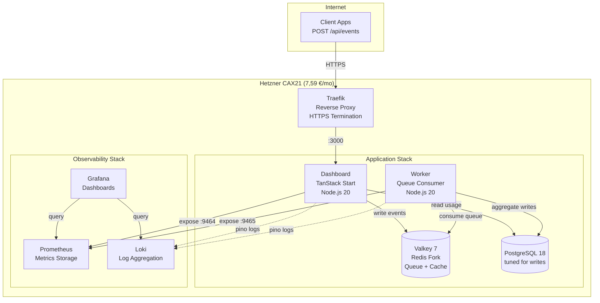

## Zusammenfassung: Ergebnisse der Lasttests

Wir haben **vier Architekturen** getestet. Gleicher Code, gleiche Last (bis zu 1200 gleichzeitige Nutzer, 4,5 Minuten), gleiche Hetzner-Infrastruktur. Das Ergebnis:

| Test | Architektur | vCPU | Kosten/Monat | RPS | Kosten pro<br/>100 RPS | P95-Latenz | Errors | Ergebnis |
|------|-------------|------|--------------|-----|------------------------|------------|--------|----------|
| **1** | Single CAX11 | 2 | 3,79 € | 228 | 1,66 € | 5.303 ms | 0,80 % | ❌ Failed |
| **2** | 2×CAX11 Swarm<br/>(balanced) | 4 | 7,58 € | 354 | 2,14 € | 3.524 ms | 0,00 % | ✅ Passed |
| **3** | **Single CAX21** | **4** | **7,59 €** | **484** | **1,57 €** | **2.462 ms** | **0,00 %** | **🏆 Winner** |
| **4** | CAX21+CAX11 Swarm<br/>(asymmetric) | 6 | 11,38 € | 343 | 3,32 € | 3.557 ms | 0,00 % | ❌ Schlechter als Test 2 |


**Single-Server-Architektur:** Alles läuft in Docker Compose.

### Wichtigste Erkenntnisse:

**🏆 Ein einzelner CAX21 übertrifft alles:**
- **37 % mehr Durchsatz** als Swarm (484 vs. 354 RPS)
- **30 % geringere Latenz** als Swarm (2,5s vs. 3,5s P95)
- **nur 0,01 € teurer** als Swarm (7,59 € vs. 7,58 €)
- **Null operative Komplexität** (keine Overlay Networks, kein Orchestrator-Overhead)

**📉 Die "Distributed Systems Tax" ist real:**
- Traefik verbrauchte **5× mehr CPU** auf Swarm (180 % vs. 36 %) bei **weniger Durchsatz**
- Overlay Network Overhead vernichtet die Performance
- Mehr Server ≠ mehr Performance (Test 4 hat es bewiesen)

Bei kleinem bis mittlerem Umfang (unter 500 RPS) **gewinnt Einfachheit**. Docker Compose auf einem Server übertraf Docker Swarm um 37 % – bei gleichen Kosten. Die monatlichen Gesamtkosten: **€7,59**

Das **AWS-Äquivalent (Vergleich unter gleichen Bedingungen)** wäre €100-120/Monat _(einzelne t4g.xlarge Graviton-Instanz, selbst verwaltet)_

Hier ist, was uns Infrastructure Repatriation im Detail gelehrt hat.


## Das Setup

Wenn du ein B2B-SaaS-Startup baust, kennst du den Pitch: **"Start simple, dann scale mit AWS."** Aber "simple auf AWS" bedeutet 5.000+ €/Monat, sobald du die Managed Services dazu nimmst, die deine Investoren erwarten.

Wir testen **<a href="https://www.hpe.com/emea_europe/en/what-is/cloud-repatriation.html" target="_blank" rel="noopener">Infrastructure Repatriation</a>** für Early-Stage-Startups: Workloads von teuren Cloud-Plattformen zurück auf nachhaltige, vorhersagbare VPS-Infrastruktur.

Unser Testcase: **<a href="https://github.com/eduardosanzb/flagmeter-vps-poc" target="_blank" rel="noopener">FlagMeter</a>** – ein Usage Quota Tracker für B2B-SaaS-Produkte. Simpler Stack: TypeScript, PostgreSQL, Valkey (Redis-Fork), deployed via Docker Compose. Genau die Art von App, bei der AWS-Kosten explodieren.

**Die Startup-Herausforderung:** Kosten unter 10 €/Monat halten und trotzdem beweisen, dass man echte Last bewältigen kann. Infrastruktur-Budget für Kundenakquise einsetzen, nicht für Cloud-Aufschläge.

**Die Frage:** Was ist die einfachste Architektur, die 500 Requests pro Sekunde schafft und dabei sustainable bleibt?

Jeder Accelerator, jeder Tech-Advisor sagt: "Distributed ist besser. Docker Swarm für kleinen Scale, Kubernetes für serious work." Das Playbook ist Gospel: Concerns trennen, Workloads isolieren, horizontal skalieren.

Wir haben **vier identische Lasttests** durchgeführt, um dieses Dogma zu hinterfragen. Gleicher Code, gleiches Lastmuster (1200 gleichzeitige Nutzer bombardieren `/api/events` für 4,5 Minuten), gleiche <a href="https://www.hetzner.com/cloud" target="_blank" rel="noopener">Hetzner Cloud</a> Server. Echtes Geld, echte Infrastruktur, echte Ausfälle.

### Die FlagMeter-Architektur

So sieht der simple, sustainable Stack aus, den wir getestet haben:




**Was Startups tatsächlich bauen:**
- Lambda Functions (1GB Memory, 1,5s avg execution time)
- RDS Multi-AZ (weil "Production braucht HA")
- ElastiCache (weil "Redis ist critical")
- ALB (weil "wir brauchen Load Balancing")
- CloudWatch (weil "wir brauchen Observability")
- NAT Gateway (weil Lambda Internet braucht)

**Kosten bei unserer Testlast (484 RPS für 8h/Tag):**
- Lambda: 9.900 €/Monat (418M Requests × 1,5s × 0,0000166667 €/GB-second)
- RDS db.m5.large Multi-AZ: 280 €/Monat
- ElastiCache cache.m5.large: 180 €/Monat
- ALB + NAT + CloudWatch + Egress: 200 €/Monat
- **Gesamt: 10.560 €/Monat**

Oder bei lighter usage (1h/Tag): Immer noch 1.500–2.000 €/Monat.


*Das FlagMeter Dashboard: Real-time Quota Tracking für B2B SaaS Products. Läuft auf 7,59 €/Monat Infrastruktur.*


## Test 1: Single CAX11 (Die Baseline)

**Setup:**
- <a href="https://www.hetzner.com/cloud/arm" target="_blank" rel="noopener">Hetzner CAX11</a>: 2 vCPU, 4 GB RAM, ARM64
- Kosten: **3,79 €/Monat**
- Alles auf einem Server: App, Worker, PostgreSQL, Valkey, Prometheus, Grafana, Traefik

**Hypothese:** "Das wird unter Last zusammenbrechen."

**Ergebnisse:**
```
RPS: 228
P95 Latency: 5.303 ms (5,3 Sekunden)
Errors: 0,80 % (35 5xx errors, 456 timeouts)
CPU: 100 % durchgehend (0 % idle)
Load Average: 10,64 auf 2 cores
```

**Urteil:** ❌ **Gescheitert**. Die 2-vCPU-Grenze ist real. Services konkurrierten um CPU-Zeit, was zu Kettenausfällen führte.

**Wichtige Erkenntnis:** Wenn Prometheus Metriken sammelt → CPU-Spitze → Dashboard wird langsam → Warteschlange wächst → Timeouts häufen sich. Keine Isolation = Kettenausfälle.

---

## Test 2: 2× CAX11 Docker Swarm (Die "Industry Best Practice")

**Setup:**
- **Manager Node:** CAX11 (2 vCPU) – Traefik, Prometheus, Grafana, Loki
- **Worker Node:** CAX11 (2 vCPU) – App, Worker, PostgreSQL, Valkey
- **Gesamt:** 4 vCPU, 8 GB RAM, **7,58 €/Monat**
- Private Overlay Network verbindet die Nodes

**Hypothese:** "Separation verhindert cascading failures. Observability isolated von der App."

**Ergebnisse:**
```
RPS: 354 (+55 % vs. single CAX11)
P95 Latency: 3.524 ms
Errors: 0,00 % ✅
Manager CPU: Traefik bei 180 % (bottleneck!)
Worker CPU: Comfortable, viel headroom
```

**Urteil:** ✅ **Bestanden** (null Fehler), aber unerwartet langsam.

**Wichtige Beobachtung:** Traefik verbrauchte 180 % CPU auf dem Manager (90 % pro Core). Warum? Das wussten wir zu dem Zeitpunkt noch nicht. Aber die Isolation funktionierte – Observability konnte die Anwendung nicht zum Absturz bringen.

---

## Test 3: Single CAX21 (Der Repatriation Champion)

Bevor wir komplexe Configs testen, wollten wir einen fairen Vergleich: **Gleiche total vCPU wie Swarm (4 cores), single-node simplicity.**

**Setup:**
- <a href="https://www.hetzner.com/cloud/arm" target="_blank" rel="noopener">Hetzner CAX21</a>: 4 vCPU, 8 GB RAM, ARM64
- Kosten: **7,59 €/Monat** (nur 0,01 € mehr als Swarm!)
- Alles auf einem Server – so wie Infrastruktur früher funktioniert hat

**Hypothese:** "Sollte die 354 RPS vom Swarm matchen."

**Ergebnisse:**
```
RPS: 484 (+37 % vs. Swarm!)
P95 Latency: 2.462 ms (−30 % vs. Swarm!)
Errors: 0,00 % ✅
CPU: 2–7 % idle bis zu den letzten Minuten
Traefik: Nur 36 % CPU (vs. 180 % auf Swarm!)
PostgreSQL: 110 % CPU (der tatsächliche bottleneck)
```

**Urteil:** 🏆 **Gewinner**. Beste Performance bei identischen Kosten.

**Die Lektion zur Rückführung:** Traefik verbrauchte **5× weniger CPU** (36 % vs. 180 %) bei **37 % mehr Durchsatz**. Die Localhost-Kommunikation eliminierte die Steuer verteilter Systeme. Das Overlay Network war nicht kostenlos – es war teuer.

---

## Test 4: "Lass uns den Swarm fixen!" (Der 11 €-Fehler)

Wir dachten: "Traefik ist bottlenecked auf 2 vCPU. Upgrade den Manager auf CAX21 (4 vCPU) und problem solved!"

**Setup:**
- **Manager Node:** CAX21 (4 vCPU) ⬆️ **Upgraded!**
- **Worker Node:** CAX11 (2 vCPU)
- **Gesamt:** 6 vCPU, 12 GB RAM, **11,38 €/Monat** (+50 % cost)

**Hypothese:** "Traefik fällt auf ~60 % CPU, wir hitten 400–450 RPS."

**Expected:** 🎯 400–450 RPS
**Actual:** 💥 **343 RPS** (3 % **schlechter** als balanced Swarm!)

**Ergebnisse:**
```
RPS: 343 (−3 % vs. balanced Swarm!)
P95 Latency: 3.497 ms (basically gleich)
Errors: 0,00 % ✅
Manager: Traefik 73 % CPU (comfortable), load 1,79
Worker: Load 5,90 (295 % of capacity!), 10 tasks auf 2 cores
Cost: 50 % mehr als balanced Swarm
```

**Urteil:** ❌ **Katastrophe**. 50 % mehr bezahlt für 3 % schlechtere Performance.

**Der asymmetrische Ausfall:** Der stärkere Manager schob MEHR Traffic, als der Worker bewältigen konnte. Anfragen stauten sich beim Worker, nicht beim Manager. Wir verwandelten einen Traefik-Engpass in einen Worker-Engpass – und machten es schlimmer.

---

## Die Distributed Systems Tax

Warum hat Traefik **5× mehr CPU** im Swarm vs. single-node verbraucht?

**Single-node (sustainable):**
```
Internet → Traefik → App (localhost:3000) → Response
```
- One network hop
- Shared memory communication (minimal overhead)
- Traefik: 36 % CPU für 484 RPS

**Swarm (complex):**
```
Internet → Traefik (manager) →
  Overlay Network (VXLAN) →
  App (worker) →
  Overlay Network →
  Traefik → Response
```
- Three network hops
- VXLAN encapsulation/decapsulation
- Service discovery per request
- Traefik: 73–180 % CPU für 343–354 RPS

**Die Strafe:** ~1.000 ms zusätzliche Latenz + 5× CPU-Overhead. Architekturbedingt, nicht mit Hardware behebbar.


## Was uns Infrastructure Repatriation gelehrt hat

### 1. **Einfachheit ist nachhaltig**

Der einzelne CAX21 übertraf jede verteilte Konfiguration. Keine Overlay Networks, kein Service Discovery, keine operative Komplexität. Ein Server, der seine Aufgabe gut erfüllt.

Für 90 % der B2B-SaaS-Produkte gilt: Ein einzelner VPS bewältigt deine ersten 50.000 Nutzer. Dann hast du Einnahmen, um Komplexität zu rechtfertigen.

### 2. **Die Steuer verteilter Systeme ist real**

Docker Swarms Overlay Network verursacht Kosten:
- 2× zusätzliche Netzwerk-Hops
- VXLAN-Kapselungs-Overhead
- Service-Discovery-Lookups
- TCP-Verbindungsverwaltung

Ergebnis: ~1.000 ms Latenzstrafe + 5× CPU für Routing.

**Nicht mit besserer Hardware behebbar. Es ist architekturbedingt.**

### 3. **Asymmetrische Skalierung scheiterte spektakulär**

Ein Upgrade eines Knotens in einem verteilten System erzeugt Engpässe, die vorher nicht existierten. Der stärkere Knoten überfordert den schwächeren.

**Regel:** In verteilten Systemen müssen Knoten identisch dimensioniert sein, sonst verschlechtert sich die Performance unvorhersehbar.

### 4. **Vertikale Skalierung funktioniert weiterhin**

**Die Daten zeigen:** Vertikale Skalierung mit einem Server bleibt kosteneffektiv weit über 500 RPS hinaus. Bei 1,57 € pro 100 RPS könnte ein CAX31 (14,90 €/Monat, 8 vCPU) ~950 RPS bewältigen, bevor PostgreSQL an seine Grenzen stößt.

**Wann auf verteilte Systeme umsteigen:** Nur wenn der größte Einzelserver ausgelastet ist (CAX41: 16 vCPU, 28,49 €/Monat, geschätzt ~1.500–2.000 RPS) oder geografische Redundanz erforderlich ist.

### 5. **Datenbank-Tuning > Infrastruktur-Skalierung**

Jeder Test zeigte Postgres bei 108–111 % CPU. PostgreSQL zu optimieren (separater Artikel) hat mehr Kapazität freigesetzt als das Hinzufügen von Servern.


## Der Performance-Beweis

---

1. **Linker Peak (16:40–16:50):** 2× CAX11 Swarm Test – 354 RPS, struggling
2. **Rechter Peak (17:00–17:10):** Single CAX21 Test – 484 RPS, smooth


**Wichtige Beobachtungen:**
- Single CAX21-Spitze ist **37 % höher** (484 vs. 354 RPS)
- CAX21-Spike ist **sauberer** (weniger Varianz, stabiler)
- Gleiche Gesamtkosten (7,59 € vs. 7,58 €/Monat)
- Einfachere Architektur = bessere Performance

Diese Grafik fasst die Essenz von Infrastructure Repatriation zusammen: **Einfachheit gewinnt**.


## Wann Distributed Systems Sinn machen

Wir sind nicht anti-distributed. Wir sind anti-premature-distribution.

**Nutze Swarm/K8s wenn:**
- Echte Hochverfügbarkeit erforderlich ist (Multi-Node-Failover)
- RPS > 1.000 dauerhaft
- Geografische Verteilung vorgeschrieben ist
- Compliance-Anforderungen Redundanz erfordern

**Nutze keine verteilten Systeme wenn:**
- "Best Practices sagen..." (hinterfrage das Dogma)
- "Wir könnten irgendwann skalieren" (vorzeitige Optimierung)
- "Verteilt ist robuster" (es ist komplexer = mehr Fehlermodi)


## Die Raus.cloud-Philosophie: Infrastruktur für bootstrapped Startups

Deshalb gibt es **Infrastructure Repatriation**. Die Cloud-Industrie profitiert von Komplexität – Kubernetes, Microservices, Multi-Cloud – als Standardantworten. Für Early-Stage-Startups erzeugt dies operative Schulden, die die Runway verbrennen, bevor du Product-Market-Fit findest.

**Die Realität, der die meisten Gründer gegenüberstehen:**

Du startest auf AWS mit Lambda + RDS, weil "es ist serverless und skaliert automatisch."

```
Monat 1   €200 (wenig Traffic, Testing)
↓
Monat 3   €2.000 (erste echte Nutzer, CloudWatch-Kosten steigen)
↓
Monat 6   €5.000 (moderates Wachstum, ElastiCache hinzugefügt weil "Redis ist kritisch")
↓
Monat 12  €8.000 (Investoren fragen nach Unit Economics, du hast keine Antwort)
```

Währenddessen betreibt dein Konkurrent die gleiche Workload auf einem 15 €/Monat VPS.

**Unser Repatriation-Ansatz für Startups:**
1. **Beginne einfach** (einzelner VPS, Docker Compose) - Spare 95 % des Infrastrukturbudgets
2. **Optimiere was du hast** (PostgreSQL-Konfiguration, Query-Optimierung) - Kostenlose Performance-Gewinne
3. **Skaliere zuerst vertikal** (CAX21 → CAX31 → CAX41) - Lineare Kostenskalierung, keine Architektur-Umschreibungen
4. **Verteile nur wenn nachweislich nötig** (>1.000 RPS dauerhaft oder regulatorische HA-Anforderungen)

**Der vertikale Skalierungspfad, der deine Runway erhält:**
- CAX21 (4 vCPU, 7,59 €): 484 RPS ← *Beginne hier*
- CAX31 (8 vCPU, 14,90 €): ~950 RPS (wenn CAX21 ausgelastet ist)
- CAX41 (16 vCPU, 28,49 €): ~1.500–2.000 RPS (wenn du tatsächlich skalierst)

Die Kosten bleiben bei **1,50–1,90 € pro 100 RPS** bis zum CAX41.

**Vergleich mit AWS Lambda:**
- Geringe Nutzung (1h/Tag): 1.500 €/Monat
- Geschäftszeiten (8h/Tag): 10.500 €/Monat
- 24/7: 30.000+ €/Monat

**Der Unterschied?** 10.000 €/Monat = 2 Senior Engineers, oder 6 Monate Runway, oder dein gesamtes erstes Marketing-Budget.

**Der FlagMeter-Beweis, dass es funktioniert:**
- 484 RPS auf 7,59 €/Monat
- 0 % Fehlerrate
- 2,5 Sekunden P95-Latenz
- Kein DevOps-Team erforderlich
- Kein Vendor Lock-in
- **Infrastrukturkosten <1 % der Einnahmen vom ersten Tag an**

Wenn du ein bootstrapped Startup bist, das 5.000+ €/Monat auf AWS ausgibt, während du Lambda Cold Starts debuggst, anstatt mit Kunden zu sprechen, ist **Repatriation dein Weg zur Profitabilität**.

<div style="text-align: center; margin: 3rem 0;">
  <a href="https://cal.com/eduardosanzb/15min" target="_blank" rel="noopener" style="display: inline-block; background: linear-gradient(135deg, #10b981 0%, #059669 100%); color: white; padding: 1rem 2.5rem; border-radius: 0.5rem; font-weight: 600; font-size: 1.125rem; text-decoration: none; box-shadow: 0 4px 6px rgba(16, 185, 129, 0.25); transition: transform 0.2s, box-shadow 0.2s;" onmouseover="this.style.transform='translateY(-2px)'; this.style.boxShadow='0 6px 12px rgba(16, 185, 129, 0.35)';" onmouseout="this.style.transform='translateY(0)'; this.style.boxShadow='0 4px 6px rgba(16, 185, 129, 0.25)';">
    📞 Book Your Free Infrastructure Audit
  </a>
  <p style="margin-top: 1rem; color: #6b7280; font-size: 0.875rem;">15-Minuten Call • Kein Sales Pitch • Honest Assessment</p>
</div>

---

**Next in Series:**
- Part 2: "Zero DevOps: Deploy Production Infrastructure mit Coolify" *(coming soon)*
- Part 3: "Die 8 €-bis-800 €-Scaling Roadmap" *(coming soon)*

---


**Bereit zur Rückführung?** [Buche ein kostenloses Audit →](https://cal.com/eduardosanzb/15min)

---

*Dieser Artikel ist Teil unserer Infrastructure-Repatriation-Fallstudien. Echte Tests, echte Kosten, echte Lektionen beim Aufbau nachhaltiger Alternativen zur Cloud-Komplexität.*
