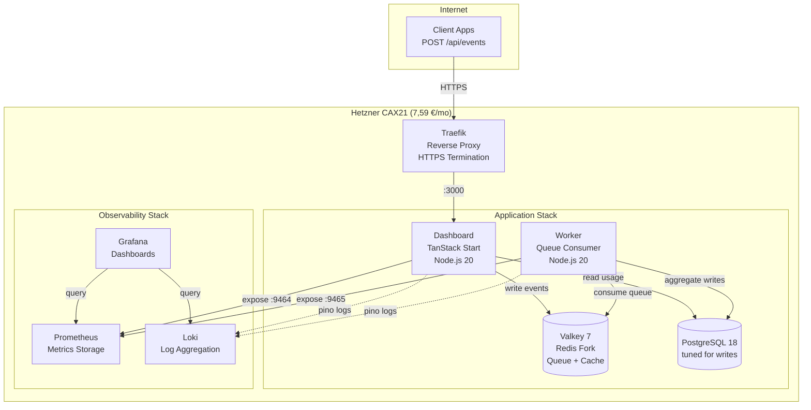

## TL;DR: Was die Lasttests gebracht haben

Wir haben **vier Architekturen** getestet. Gleicher Code, gleiche Last (bis zu 1200 User gleichzeitig, 4,5 Minuten), gleiche Hetzner-Infrastruktur. Das Ergebnis:

| Test | Architektur | vCPU | Kosten/Monat | RPS | Kosten pro<br/>100 RPS | P95-Latenz | Errors | Ergebnis |
|------|-------------|------|--------------|-----|------------------------|------------|--------|----------|
| **1** | Single CAX11 | 2 | 3,79 € | 228 | 1,66 € | 5.303 ms | 0,80 % | ❌ Failed |
| **2** | 2×CAX11 Swarm<br/>(balanced) | 4 | 7,58 € | 354 | 2,14 € | 3.524 ms | 0,00 % | ✅ Passed |
| **3** | **Single CAX21** | **4** | **7,59 €** | **484** | **1,57 €** | **2.462 ms** | **0,00 %** | **🏆 Winner** |
| **4** | CAX21+CAX11 Swarm<br/>(asymmetric) | 6 | 11,38 € | 343 | 3,32 € | 3.557 ms | 0,00 % | ❌ Schlechter als Test 2 |


**Single-Server-Architektur:** Alles läuft in Docker Compose auf einem Hetzner CAX21 (4 vCPU, 8 GB RAM, ARM64).

**Kosten pro Monat:** 7,59 €

**AWS-Equivalent (1:1 Vergleich):** 100–120 €/Monat (single t4g.xlarge Graviton Instance, self-managed)

### Die Key Findings:

**🏆 Ein einzelner CAX21 schlägt alles:**
- **37 % mehr Throughput** als der Swarm (484 vs. 354 RPS)
- **30 % weniger Latency** als der Swarm (2,5s vs. 3,5s P95)
- **nur 0,01 € teurer** als der Swarm (7,59 € vs. 7,58 €)
- **zero operative Komplexität** (keine Overlay Networks, kein Orchestrator-Overhead)

**📉 Die "Distributed Systems Tax" ist real:**
- Traefik hat **5× mehr CPU** auf Swarm gefressen (180 % vs. 36 %) bei **weniger Throughput**
- Overlay Network Overhead killt die Performance
- Mehr Server ≠ mehr Performance (Test 4 hat's bewiesen)

**💡 Die Infrastructure Repatriation Lesson:**
Bei kleinem bis mittlerem Scale (unter 500 RPS) **gewinnt Einfachheit**. Docker Compose auf einem Server hat Docker Swarm um 37 % geschlagen – bei gleichen Kosten.

Hier ist, was wir im Detail gelernt haben.


## Das Setup

Wenn du ein B2B-SaaS-Startup baust, kennst du den Pitch: **"Start simple, dann scale mit AWS."** Aber "simple auf AWS" bedeutet 5.000+ €/Monat, sobald du die Managed Services dazu nimmst, die deine Investoren erwarten.

Wir testen **<a href="https://www.hpe.com/emea_europe/en/what-is/cloud-repatriation.html" target="_blank" rel="noopener">Infrastructure Repatriation</a>** für Early-Stage-Startups: Workloads von teuren Cloud-Plattformen zurück auf nachhaltige, vorhersagbare VPS-Infrastruktur.

Unser Testcase: **<a href="https://github.com/eduardosanzb/flagmeter-vps-poc" target="_blank" rel="noopener">FlagMeter</a>** – ein Usage Quota Tracker für B2B-SaaS-Produkte. Simpler Stack: TypeScript, PostgreSQL, Valkey (Redis-Fork), deployed via Docker Compose. Genau die Art von App, bei der AWS-Kosten explodieren.

**Der Startup-Constraint:** Kosten unter 10 €/Monat halten und trotzdem beweisen, dass man echte Last handlen kann. Infrastruktur-Budget für Customer Acquisition sparen, nicht für Cloud-Markup.

**Die Frage:** Was ist die einfachste Architektur, die 500 Requests pro Sekunde schafft und dabei sustainable bleibt?

Jeder Accelerator, jeder Tech-Advisor sagt: "Distributed ist besser. Docker Swarm für kleinen Scale, Kubernetes für serious work." Das Playbook ist Gospel: Concerns trennen, Workloads isolieren, horizontal skalieren.

Wir haben **vier identische Lasttests** durchgeführt, um dieses Dogma zu challengen. Gleicher Code, gleiches Lastmuster (1200 concurrent Users hämmern `/api/events` für 4,5 Minuten), gleiche <a href="https://www.hetzner.com/cloud" target="_blank" rel="noopener">Hetzner Cloud</a> Server. Echtes Geld, echte Infrastruktur, echte Failures.

### Die FlagMeter-Architektur

So sieht der simple, sustainable Stack aus, den wir getestet haben:




**Was Startups tatsächlich bauen:**
- Lambda Functions (1GB Memory, 1,5s avg execution time)
- RDS Multi-AZ (weil "Production braucht HA")
- ElastiCache (weil "Redis ist critical")
- ALB (weil "wir brauchen Load Balancing")
- CloudWatch (weil "wir brauchen Observability")
- NAT Gateway (weil Lambda Internet braucht)

**Kosten bei unserer Testlast (484 RPS für 8h/Tag):**
- Lambda: 9.900 €/Monat (418M Requests × 1,5s × 0,0000166667 €/GB-second)
- RDS db.m5.large Multi-AZ: 280 €/Monat
- ElastiCache cache.m5.large: 180 €/Monat
- ALB + NAT + CloudWatch + Egress: 200 €/Monat
- **Gesamt: 10.560 €/Monat**

Oder bei lighter usage (1h/Tag): Immer noch 1.500–2.000 €/Monat.

**Performance:** 484 RPS @ P95 latency 2,5s, zero errors


*Das FlagMeter Dashboard: Real-time Quota Tracking für B2B SaaS Products. Läuft auf 7,59 €/Monat Infrastruktur.*

---

## Test 1: Single CAX11 (Die Baseline)

**Setup:**
- <a href="https://www.hetzner.com/cloud/arm" target="_blank" rel="noopener">Hetzner CAX11</a>: 2 vCPU, 4 GB RAM, ARM64
- Kosten: **3,79 €/Monat**
- Alles auf einem Server: App, Worker, PostgreSQL, Valkey, Prometheus, Grafana, Traefik

**Hypothese:** "Das wird unter Last zusammenbrechen."

**Ergebnisse:**
```
RPS: 228
P95 Latency: 5.303 ms (5,3 Sekunden)
Errors: 0,80 % (35 5xx errors, 456 timeouts)
CPU: 100 % durchgehend (0 % idle)
Load Average: 10,64 auf 2 cores
```

**Verdict:** ❌ **Failed**. Die 2-vCPU-Grenze ist real. Services haben um CPU gekämpft, was zu cascading failures geführt hat.

**Key Insight:** Wenn Prometheus Metrics scraped → CPU spike → Dashboard wird langsam → Queue wächst → Timeouts cascaden. Keine Isolation = cascading failures.

---

## Test 2: 2× CAX11 Docker Swarm (Die "Industry Best Practice")

**Setup:**
- **Manager Node:** CAX11 (2 vCPU) – Traefik, Prometheus, Grafana, Loki
- **Worker Node:** CAX11 (2 vCPU) – App, Worker, PostgreSQL, Valkey
- **Gesamt:** 4 vCPU, 8 GB RAM, **7,58 €/Monat**
- Private Overlay Network verbindet die Nodes

**Hypothese:** "Separation verhindert cascading failures. Observability isolated von der App."

**Ergebnisse:**
```
RPS: 354 (+55 % vs. single CAX11)
P95 Latency: 3.524 ms
Errors: 0,00 % ✅
Manager CPU: Traefik bei 180 % (bottleneck!)
Worker CPU: Comfortable, viel headroom
```

**Verdict:** ✅ **Passed** (zero errors), aber unerwartet langsam.

**Key Observation:** Traefik hat 180 % CPU auf dem Manager gefressen (90 % pro Core). Warum? Wussten wir noch nicht. Aber Isolation hat funktioniert – Observability konnte die App nicht crashen.

---

## Test 3: Single CAX21 (Der Repatriation Champion)

Bevor wir komplexe Configs testen, wollten wir einen fairen Vergleich: **Gleiche total vCPU wie Swarm (4 cores), single-node simplicity.**

**Setup:**
- <a href="https://www.hetzner.com/cloud/arm" target="_blank" rel="noopener">Hetzner CAX21</a>: 4 vCPU, 8 GB RAM, ARM64
- Kosten: **7,59 €/Monat** (nur 0,01 € mehr als Swarm!)
- Alles auf einem Server – so wie Infrastruktur früher funktioniert hat

**Hypothese:** "Sollte die 354 RPS vom Swarm matchen."

**Ergebnisse:**
```
RPS: 484 (+37 % vs. Swarm!)
P95 Latency: 2.462 ms (−30 % vs. Swarm!)
Errors: 0,00 % ✅
CPU: 2–7 % idle bis zu den letzten Minuten
Traefik: Nur 36 % CPU (vs. 180 % auf Swarm!)
PostgreSQL: 110 % CPU (der tatsächliche bottleneck)
```

**Verdict:** 🏆 **Winner**. Beste Performance bei identischen Kosten.

**Die Repatriation Lesson:** Traefik hat **5× weniger CPU** verbraucht (36 % vs. 180 %) bei **37 % mehr Throughput**. Localhost Communication hat die distributed systems tax eliminiert. Das Overlay Network war nicht free – es war expensive.

---

## Test 4: "Lass uns den Swarm fixen!" (Der 11 €-Fehler)

Wir dachten: "Traefik ist bottlenecked auf 2 vCPU. Upgrade den Manager auf CAX21 (4 vCPU) und problem solved!"

**Setup:**
- **Manager Node:** CAX21 (4 vCPU) ⬆️ **Upgraded!**
- **Worker Node:** CAX11 (2 vCPU)
- **Gesamt:** 6 vCPU, 12 GB RAM, **11,38 €/Monat** (+50 % cost)

**Hypothese:** "Traefik fällt auf ~60 % CPU, wir hitten 400–450 RPS."

**Expected:** 🎯 400–450 RPS
**Actual:** 💥 **343 RPS** (3 % **schlechter** als balanced Swarm!)

**Ergebnisse:**
```
RPS: 343 (−3 % vs. balanced Swarm!)
P95 Latency: 3.497 ms (basically gleich)
Errors: 0,00 % ✅
Manager: Traefik 73 % CPU (comfortable), load 1,79
Worker: Load 5,90 (295 % of capacity!), 10 tasks auf 2 cores
Cost: 50 % mehr als balanced Swarm
```

**Verdict:** ❌ **Disaster**. 50 % mehr bezahlt für 3 % schlechtere Performance.

**Der asymmetric failure:** Der stronger Manager hat MEHR Traffic gepusht, als der Worker handlen konnte. Requests haben sich beim Worker gequeued, nicht beim Manager. Wir haben einen Traefik bottleneck in einen Worker bottleneck verwandelt – und es schlimmer gemacht.

---

## Die Distributed Systems Tax

Warum hat Traefik **5× mehr CPU** im Swarm vs. single-node verbraucht?

**Single-node (sustainable):**
```
Internet → Traefik → App (localhost:3000) → Response
```
- One network hop
- Shared memory communication (minimal overhead)
- Traefik: 36 % CPU für 484 RPS

**Swarm (complex):**
```
Internet → Traefik (manager) →
  Overlay Network (VXLAN) →
  App (worker) →
  Overlay Network →
  Traefik → Response
```
- Three network hops
- VXLAN encapsulation/decapsulation
- Service discovery per request
- Traefik: 73–180 % CPU für 343–354 RPS

**Die Penalty:** ~1.000 ms added latency + 5× CPU overhead. Architectural, nicht fixable mit Hardware.


## Was uns Infrastructure Repatriation gelehrt hat

### 1. **Simplicity ist sustainable**

Der single CAX21 hat jede distributed Config outperformed. Keine Overlay Networks, kein Service Discovery, keine operative Complexity. Ein Server, der seinen Job gut macht.

Für 90 % der B2B-SaaS-Produkte: Ein single VPS handled deine ersten 50.000 Users. Dann hast du Revenue, um Complexity zu justifyen.

### 2. **Die distributed systems tax ist real**

Docker Swarms Overlay Network kostet:
- 2× additional network hops
- VXLAN encapsulation overhead
- Service discovery lookups
- TCP connection management

Result: ~1.000 ms latency penalty + 5× CPU für Routing.

**Kann nicht mit better Hardware gefixt werden. Es ist architectural.**

### 3. **Asymmetric scaling failed spektakulär**

Einen Node in einem distributed system zu upgraden kreiert bottlenecks, die du vorher nicht hattest. Der stronger Node overwhelmt den weaker.

**Rule:** In distributed systems müssen Nodes identisch sized sein, oder Performance degradiert unpredictably.

### 4. **Vertical scaling funktioniert weiterhin**

- 2 vCPU: Failed (228 RPS mit errors)
- 4 vCPU: Success! (484 RPS, zero errors)
- Next step: CAX31 (8 vCPU) oder CAX41 (16 vCPU) würden likely 800–1.200+ RPS reachen

**Die Data suggestet:** Single-server vertical scaling bleibt cost-effective well beyond 500 RPS. Bei 1,57 € per 100 RPS könnte ein CAX31 (14,90 €/Monat, 8 vCPU) ~950 RPS handlen bevor PostgreSQL limits hit.

**Wann distributed werden:** Nur wenn du den largest single server maxed hast (CAX41: 16 vCPU, 28,49 €/Monat, estimated ~1.500–2.000 RPS) oder geographic redundancy brauchst.

### 5. **Database tuning > infrastructure scaling**

Jeder Test hat Postgres bei 108–111 % CPU gezeigt. PostgreSQL tunen (separater Article) hat mehr Capacity unlocked als Server hinzuzufügen.

---

## Der Performance Proof

Hier ist die real-world Performance-Data von unseren Lasttests. Die zwei Peaks zeigen:

1. **Linker Peak (16:40–16:50):** 2× CAX11 Swarm Test – 354 RPS, struggling
2. **Rechter Peak (17:00–17:10):** Single CAX21 Test – 484 RPS, smooth


**Key Observations:**
- Single CAX21 peak ist **37 % höher** (484 vs. 354 RPS)
- CAX21 spike ist **cleaner** (weniger variance, more stable)
- Same total cost (7,59 € vs. 7,58 €/Monat)
- Simplere Architecture = better Performance

Diese Grafik captured die Essence von Infrastructure Repatriation: **Simplicity wins**.


## Wann Distributed Systems Sinn machen

Wir sind nicht anti-distributed. Wir sind anti-premature-distribution.

**Use Swarm/K8s wenn:**
- True high availability required ist (multi-node failover)
- RPS > 1.000 sustained
- Geographic distribution mandated ist
- Regulatory compliance redundancy demands

**Don't use distributed systems wenn:**
- "Best practices sagen..." (question das Dogma)
- "Wir might scale someday" (premature optimization)
- "Distributed ist more robust" (it's more complex = more failure modes)


## Die Raus.cloud Philosophy: Infrastruktur für Bootstrapped Startups

Deshalb existiert **Infrastructure Repatriation**. Die Cloud-Industry profitiert von Complexity – Kubernetes, Microservices, Multi-Cloud – als default answers. Für early-stage Startups kreiert das operational debt, die Runway burned bevor du product-market fit findest.

**Die Reality, der die meisten Founders facen:**

Du launchst auf AWS mit Lambda + RDS weil "it's serverless und scales automatically."

**Monat 1:** 200 € (light traffic, testing)
**Monat 3:** 2.000 € (some real users, CloudWatch costs climbing)
**Monat 6:** 5.000 € (moderate growth, added ElastiCache weil "Redis ist critical")
**Monat 12:** 8.000 € (investors fragen nach unit economics, du hast no answer)

Meanwhile betreibt dein Competitor die same workload auf einem 15 €/Monat VPS.

**Sie spenden ihre Runway für customer acquisition. Du spendest deine für AWS.**

**Unser Repatriation Approach für Startups:**
1. **Start simple** (single VPS, Docker Compose) - Save 95 % des infrastructure budgets
2. **Tune what you have** (PostgreSQL config, query optimization) - Free performance gains
3. **Scale vertically first** (CAX21 → CAX31 → CAX41) - Linear cost scaling, keine architecture rewrites
4. **Distribute only wenn proven necessary** (>1.000 RPS sustained, oder regulatory HA requirements)

**Der vertical scaling path, der deine runway preserved:**
- CAX21 (4 vCPU, 7,59 €): 484 RPS ← *Start hier*
- CAX31 (8 vCPU, 14,90 €): ~950 RPS (wenn du CAX21 outgrowst)
- CAX41 (16 vCPU, 28,49 €): ~1.500–2.000 RPS (wenn du actually scalst)

Cost bleibt bei **1,50–1,90 € per 100 RPS** through CAX41.

**Contrast mit AWS Lambda:**
- Light usage (1h/day): 1.500 €/Monat
- Business hours (8h/day): 10.500 €/Monat
- 24/7: 30.000+ €/Monat

**Der Unterschied?** 10.000 €/Monat = 2 Senior Engineers, oder 6 Monate runway, oder dein entire erstes Marketing-Budget.

**Der FlagMeter Proof, dass das works:**
- 484 RPS auf 7,59 €/Monat
- 0 % error rate
- 2,5 second P95 latency
- Kein DevOps team required
- Kein vendor lock-in
- **Infrastructure costs <1 % of revenue from day one**

Wenn du ein bootstrapped Startup bist, das 5.000+ €/Monat auf AWS spendest während du Lambda cold starts debuggst instead of mit customers zu talken, ist **Repatriation dein path to profitability**.

<div style="text-align: center; margin: 3rem 0;">
  <a href="https://cal.com/eduardosanzb/15min" target="_blank" rel="noopener" style="display: inline-block; background: linear-gradient(135deg, #10b981 0%, #059669 100%); color: white; padding: 1rem 2.5rem; border-radius: 0.5rem; font-weight: 600; font-size: 1.125rem; text-decoration: none; box-shadow: 0 4px 6px rgba(16, 185, 129, 0.25); transition: transform 0.2s, box-shadow 0.2s;" onmouseover="this.style.transform='translateY(-2px)'; this.style.boxShadow='0 6px 12px rgba(16, 185, 129, 0.35)';" onmouseout="this.style.transform='translateY(0)'; this.style.boxShadow='0 4px 6px rgba(16, 185, 129, 0.25)';">
    📞 Book Your Free Infrastructure Audit
  </a>
  <p style="margin-top: 1rem; color: #6b7280; font-size: 0.875rem;">15-Minuten Call • Kein Sales Pitch • Honest Assessment</p>
</div>

---

**Next in Series:**
- Part 2: "Zero DevOps: Deploy Production Infrastructure mit Coolify" *(coming soon)*
- Part 3: "Die 8 €-bis-800 €-Scaling Roadmap" *(coming soon)*

---


**Ready to repatriate?** [Book einen free Workshop →](https://cal.com/eduardosanzb/15min)

---

*Dieser Article ist part unserer Infrastructure Repatriation Case Studies. Real tests, real costs, real lessons learned while building sustainable alternatives zu cloud complexity.*
