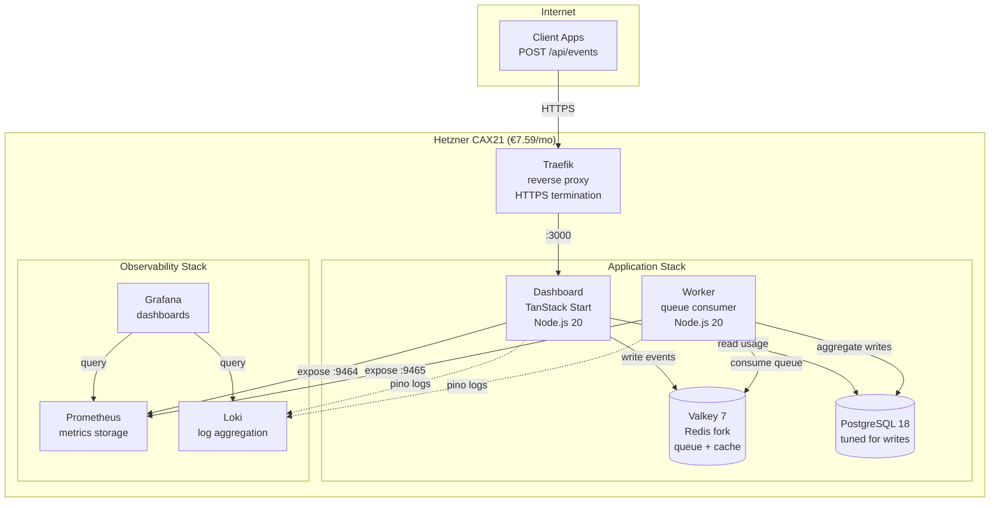

## Executive Summary: Load Test Results

We tested **four architectures** with identical code, identical load patterns (up-to 1200 concurrent users, 4.5 minutes), and identical Hetzner infrastructure. Here's what we learned:

| Test | Architecture | vCPU | Monthly Cost | RPS | Cost per<br/>100 RPS | P95 Latency | Errors | Result |
|------|-------------|------|--------------|-----|---------------------|-------------|--------|--------|
| **1** | Single CAX11 | 2 | €3.79 | 228 | €1.66 | 5,303ms | 0.80% | ❌ Failed |
| **2** | 2×CAX11 Swarm<br/>(balanced) | 4 | €7.58 | 354 | €2.14 | 3,524ms | 0.00% | ✅ Passed |
| **3** | **Single CAX21** | **4** | **€7.59** | **484** | **€1.57** | **2,462ms** | **0.00%** | **🏆 Winner** |
| **4** | CAX21+CAX11 Swarm<br/>(asymmetric) | 6 | €11.38 | 343 | €3.32 | 3,557ms | 0.00% | ❌ Worse than Test 2 |


**Single-server architecture:** Everything runs in Docker Compose on one Hetzner CAX21 (4 vCPU, 8GB RAM, ARM64).

**Total monthly cost:** €7.59/month

**AWS equivalent (apples-to-apples):** €100-120/month (single t4g.xlarge Graviton instance, self-managed)

### Key Findings:

**🏆 Single CAX21 wins everything:**
- **37% more throughput** than balanced Swarm (484 vs 354 RPS)
- **30% lower latency** than balanced Swarm (2.5s vs 3.5s P95)
- **€0.01 more expensive** than Swarm (€7.59 vs €7.58)
- **Zero operational complexity** (no overlay networks, no orchestration)

**📉 Distributed systems tax is real:**
- Traefik used **5× more CPU** on Swarm (180% vs 36%) for **less throughput**
- Overlay network overhead killed performance
- More servers ≠ more performance (Test 4 proved this)

**💡 The repatriation lesson:**
At small-to-medium scale (sub-500 RPS), **simple beats distributed**. Docker Compose on a single server outperformed Docker Swarm by 37% at the same cost.

Here's what infrastructure repatriation taught us in detail.


## The Setup

If you're building a B2B SaaS startup, you've heard the pitch: **"Start simple, then scale with AWS."** But simple on AWS means €5,000+/month once you add the managed services your investors expect.

We're testing **<a href="https://www.hpe.com/emea_europe/en/what-is/cloud-repatriation.html" target="_blank" rel="noopener">infrastructure repatriation</a>** for early-stage startups: moving workloads off expensive cloud platforms back to sustainable, predictable VPS infrastructure.

Our test case: **<a href="https://github.com/eduardosanzb/flagmeter-vps-poc" target="_blank" rel="noopener">FlagMeter</a>**—a usage quota tracker for B2B SaaS products. Simple stack: TypeScript, PostgreSQL, Valkey (Redis fork), deployed via Docker Compose. Exactly the kind of app where AWS cost spirals out of control.

**The startup constraint:** Keep monthly costs under €10 while proving you can handle real load. Save infrastructure budget for customer acquisition, not cloud markup.

**The question:** What's the simplest architecture that handles 500 requests per second while staying sustainable?

Every accelerator, every tech advisor says: "Distributed is better. Docker Swarm for small scale, Kubernetes for serious work." The playbook is gospel: separate concerns, isolate workloads, scale horizontally.

We ran **four identical load tests** to challenge this dogma. Same code, same load pattern (1200 concurrent users hammering `/api/events` for 4.5 minutes), same <a href="https://www.hetzner.com/cloud" target="_blank" rel="noopener">Hetzner Cloud</a> servers. Real money, real infrastructure, real failures.

### The FlagMeter Architecture

Here's the simple, sustainable stack we tested:




**What startups actually build:**
- Lambda functions (1GB memory, 1.5s avg execution time)
- RDS Multi-AZ (because "production needs HA")
- ElastiCache (because "Redis is critical")
- ALB (because "we need load balancing")
- CloudWatch (because "we need observability")
- NAT Gateway (because Lambda needs internet)

**Cost at our test load (484 RPS for 8 hours/day):**
- Lambda: €9,900/month (418M requests × 1.5s × €0.0000166667/GB-second)
- RDS db.m5.large Multi-AZ: €280/month
- ElastiCache cache.m5.large: €180/month
- ALB + NAT + CloudWatch + egress: €200/month
- **Total: €10,560/month**

Or with lighter usage (1 hour/day): Still €1,500-2,000/month.

**Performance:** 484 RPS @ P95 latency 2.5s, zero errors


*The FlagMeter dashboard: Real-time quota tracking for B2B SaaS products. Running on €7.59/month infrastructure.*

---


## Test 1: Single CAX11 (The Baseline)

**Setup:**
- <a href="https://www.hetzner.com/cloud/arm" target="_blank" rel="noopener">Hetzner CAX11</a>: 2 vCPU, 4GB RAM, ARM64
- Cost: **€3.79/month**
- Everything on one server: App, Worker, PostgreSQL, Valkey, Prometheus, Grafana, Traefik

**Hypothesis:** "This will melt under load."

**Results:**
```
RPS: 228
P95 Latency: 5,303ms (5.3 seconds)
Errors: 0.80% (35 5xx errors, 456 timeouts)
CPU: 100% utilized throughout (0% idle)
Load Average: 10.64 on 2 cores
```

**Verdict:** ❌ **Failed**. The 2-vCPU threshold is real. Services competing for CPU created cascading failures.

**Key insight:** When Prometheus scrapes metrics → CPU spike → dashboard slows → queue builds → timeouts cascade. No isolation = cascading failures.

---

## Test 2: 2x CAX11 Docker Swarm (The "Industry Best Practice")

**Setup:**
- **Manager Node:** CAX11 (2 vCPU) - Traefik, Prometheus, Grafana, Loki
- **Worker Node:** CAX11 (2 vCPU) - App, Worker, PostgreSQL, Valkey
- **Total:** 4 vCPU, 8GB RAM, **€7.58/month**
- Private overlay network connecting nodes

**Hypothesis:** "Separation prevents cascading failures. Observability isolated from application."

**Results:**
```
RPS: 354 (+55% vs single CAX11)
P95 Latency: 3,524ms
Errors: 0.00% ✅
Manager CPU: Traefik at 180% (bottleneck!)
Worker CPU: Comfortable, plenty of headroom
```

**Verdict:** ✅ **Passed** (zero errors), but unexpectedly slow.

**Key observation:** Traefik consumed 180% CPU on manager (90% per core). Why? We didn't know yet. But isolation worked—observability couldn't crash the application.

---

## Test 3: Single CAX21 (The Repatriation Champion)

Before testing complex configurations, we wanted a fair comparison: **Same total vCPU as Swarm (4 cores), single-node simplicity.**

**Setup:**
- <a href="https://www.hetzner.com/cloud/arm" target="_blank" rel="noopener">Hetzner CAX21</a>: 4 vCPU, 8GB RAM, ARM64
- Cost: **€7.59/month** (€0.01 more than Swarm!)
- Everything on one server—the way infrastructure used to work

**Hypothesis:** "Should match the Swarm's 354 RPS."

**Results:**
```
RPS: 484 (+37% vs Swarm!)
P95 Latency: 2,462ms (-30% vs Swarm!)
Errors: 0.00% ✅
CPU: 2-7% idle until final minutes
Traefik: Only 36% CPU (vs 180% on Swarm!)
PostgreSQL: 110% CPU (the actual bottleneck)
```

**Verdict:** 🏆 **Winner**. Best performance at identical cost.

**The repatriation lesson:** Traefik used **5x less CPU** (36% vs 180%) for **37% more throughput**. Localhost communication eliminated the distributed systems tax. The overlay network wasn't free—it was expensive.

---

## Test 4: "Let's Fix the Swarm!" (The €11 Mistake)

We thought: "Traefik is bottlenecked on 2 vCPU. Upgrade the manager to CAX21 (4 vCPU) and problem solved!"

**Setup:**
- **Manager Node:** CAX21 (4 vCPU) ⬆️ **Upgraded!**
- **Worker Node:** CAX11 (2 vCPU)
- **Total:** 6 vCPU, 12GB RAM, **€11.38/month** (+50% cost)

**Hypothesis:** "Traefik drops to ~60% CPU, we hit 400-450 RPS."

**Expected:** 🎯 400-450 RPS
**Actual:** 💥 **343 RPS** (3% **worse** than balanced Swarm!)

**Results:**
```
RPS: 343 (-3% vs balanced Swarm!)
P95 Latency: 3,497ms (essentially same)
Errors: 0.00% ✅
Manager: Traefik 73% CPU (comfortable), load 1.79
Worker: Load 5.90 (295% of capacity!), 10 tasks on 2 cores
Cost: 50% more than balanced Swarm
```

**Verdict:** ❌ **Disaster**. Paid 50% more for 3% worse performance.

**The asymmetric failure:** The stronger manager pushed MORE traffic than the worker could handle. Requests queued at the worker instead of manager. We turned a Traefik bottleneck into a worker bottleneck—and made it worse.

---

## The Distributed Systems Tax

Why did Traefik use **5x more CPU** in Swarm vs single-node?

**Single-node (sustainable):**
```
Internet → Traefik → App (localhost:3000) → Response
```
- One network hop
- Shared memory communication (minimal overhead)
- Traefik: 36% CPU for 484 RPS

**Swarm (complex):**
```
Internet → Traefik (manager) →
  Overlay Network (VXLAN) →
  App (worker) →
  Overlay Network →
  Traefik → Response
```
- Three network hops
- VXLAN encapsulation/decapsulation
- Service discovery per request
- Traefik: 73-180% CPU for 343-354 RPS

**The penalty:** ~1,000ms added latency + 5x CPU overhead. Architectural, not fixable with hardware.


## What Infrastructure Repatriation Taught Us

### 1. **Simplicity is sustainable**

The single CAX21 outperformed every distributed configuration. No overlay networks, no service discovery, no operational complexity. One server, doing its job well.

For 90% of B2B SaaS products: a single VPS handles your first 50,000 users. By then, you have revenue to justify complexity.

### 2. **The distributed systems tax is real**

Docker Swarm's overlay network costs:
- 2x additional network hops
- VXLAN encapsulation overhead
- Service discovery lookups
- TCP connection management

Result: ~1,000ms latency penalty + 5x CPU for routing.

**Can't be fixed with better hardware. It's architectural.**

### 3. **Asymmetric scaling fails spectacularly**

Upgrading one node in a distributed system creates bottlenecks you didn't have before. The stronger node overwhelms the weaker one.

**Rule:** In distributed systems, nodes must be identically sized or performance degrades unpredictably.

### 4. **Vertical scaling continues to work**

- 2 vCPU: Failed (228 RPS with errors)
- 4 vCPU: Success! (484 RPS, zero errors)
- Next step: CAX31 (8 vCPU) or CAX41 (16 vCPU) would likely reach 800-1200+ RPS

**The data suggests:** Single-server vertical scaling remains cost-effective well beyond 500 RPS. At €1.57 per 100 RPS, a CAX31 (€14.90/month, 8 vCPU) could handle ~950 RPS before hitting PostgreSQL limits.

**When to distribute:** Only when you've maxed out the largest single server (CAX41: 16 vCPU, €28.49/month, estimated ~1,500-2,000 RPS) or need geographic redundancy.

### 5. **Database tuning > infrastructure scaling**

Every test showed Postgres at 108-111% CPU. Tuning PostgreSQL (separate article) unlocked more capacity than adding servers.

---

## The Performance Proof

Here's the real-world performance data from our load tests. The two peaks show:

1. **Left peak (16:40-16:50):** 2x CAX11 Swarm test - 354 RPS, struggling
2. **Right peak (17:00-17:10):** Single CAX21 test - 484 RPS, smooth


**Key observations:**
- Single CAX21 peak is **37% higher** (484 vs 354 RPS)
- CAX21 spike is **cleaner** (less variance, more stable)
- Same total cost (€7.59 vs €7.58/month)
- Simpler architecture = better performance

This graph captures the essence of infrastructure repatriation: **simplicity wins**.


## When Distributed Systems Make Sense

We're not anti-distributed. We're anti-premature-distribution.

**Use Swarm/K8s when:**
- True high availability required (multi-node failover)
- RPS > 1,000 sustained
- Geographic distribution mandated
- Regulatory compliance demands redundancy

**Don't use distributed systems when:**
- "Best practices say..." (question the dogma)
- "We might scale someday" (premature optimization)
- "Distributed is more robust" (it's more complex = more failure modes)


## The Raus.cloud Philosophy: Infrastructure for Bootstrapped Startups

This is why **infrastructure repatriation** exists. The cloud industry profits from complexity—Kubernetes, microservices, multi-cloud—as default answers. For early-stage startups, these create operational debt that burns runway before you find product-market fit.

**The reality most founders face:**

You launch on AWS with Lambda + RDS because "it's serverless and scales automatically."

**Month 1:** €200 (light traffic, testing)
**Month 3:** €2,000 (some real users, CloudWatch costs climbing)
**Month 6:** €5,000 (moderate growth, added ElastiCache because "Redis is critical")
**Month 12:** €8,000 (investors ask about unit economics, you have no answer)

Meanwhile, your competitor runs the same workload on a €15/month VPS.

**They're spending their runway on customer acquisition. You're spending yours on AWS.**

**Our repatriation approach for startups:**
1. **Start simple** (single VPS, Docker Compose) - Save 95% of infrastructure budget
2. **Tune what you have** (PostgreSQL config, query optimization) - Free performance gains
3. **Scale vertically first** (CAX21 → CAX31 → CAX41) - Linear cost scaling, no architecture rewrites
4. **Distribute only when proven necessary** (>1,000 RPS sustained, or regulatory HA requirements)

**The vertical scaling path that preserves your runway:**
- CAX21 (4 vCPU, €7.59): 484 RPS ← *Start here*
- CAX31 (8 vCPU, €14.90): ~950 RPS (when you outgrow CAX21)
- CAX41 (16 vCPU, €28.49): ~1,500-2,000 RPS (when you're actually scaling)

Cost remains **€1.50-1.90 per 100 RPS** through CAX41.

**Contrast with AWS Lambda:**
- Light usage (1hr/day): €1,500/month
- Business hours (8hr/day): €10,500/month
- 24/7: €30,000+/month

**The difference?** €10,000/month = 2 senior engineers, or 6 months of runway, or your entire first marketing budget.

**The FlagMeter proof this works:**
- 484 RPS on €7.59/month
- 0% error rate
- 2.5 second P95 latency
- No DevOps team required
- No vendor lock-in
- **Infrastructure costs <1% of revenue from day one**

If you're a bootstrapped startup spending €5,000+/month on AWS while debugging Lambda cold starts instead of talking to customers, **repatriation is your path to profitability**.

<div style="text-align: center; margin: 3rem 0;">
  <a href="https://cal.com/eduardosanzb/15min" target="_blank" rel="noopener" style="display: inline-block; background: linear-gradient(135deg, #10b981 0%, #059669 100%); color: white; padding: 1rem 2.5rem; border-radius: 0.5rem; font-weight: 600; font-size: 1.125rem; text-decoration: none; box-shadow: 0 4px 6px rgba(16, 185, 129, 0.25); transition: transform 0.2s, box-shadow 0.2s;" onmouseover="this.style.transform='translateY(-2px)'; this.style.boxShadow='0 6px 12px rgba(16, 185, 129, 0.35)';" onmouseout="this.style.transform='translateY(0)'; this.style.boxShadow='0 4px 6px rgba(16, 185, 129, 0.25)';">
    📞 Book Your Free Infrastructure Audit
  </a>
  <p style="margin-top: 1rem; color: #6b7280; font-size: 0.875rem;">15-minute call • No sales pitch • Honest assessment</p>
</div>

---

**Next in series:**
- Part 2: "Zero DevOps: Deploy Production Infrastructure with Coolify" *(coming soon)*
- Part 3: "The €8 to €800 Scaling Roadmap" *(coming soon)*

---


**Ready to repatriate?** [Book a free workshop →](https://cal.com/eduardosanzb/15min)

---

*This article is part of our infrastructure repatriation case studies. Real tests, real costs, real lessons learned while building sustainable alternatives to cloud complexity.*
