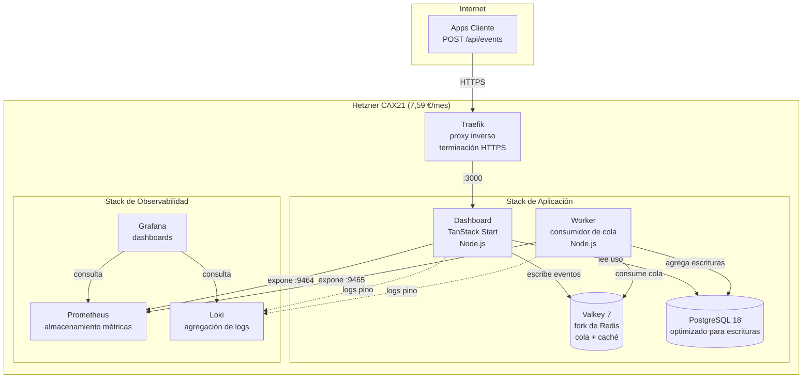

## Resumen Ejecutivo: Resultados de las Pruebas de Carga

Probamos **cuatro arquitecturas** con el mismo código, los mismos patrones de carga (hasta 1.200 usuarios concurrentes, 4,5 minutos) e infraestructura idéntica de Hetzner. Esto es lo que aprendimos:

| Prueba | Arquitectura | vCPU | Coste Mensual | RPS | Coste por<br/>100 RPS | Latencia P95 | Errores | Resultado |
|------|-------------|------|--------------|-----|---------------------|-------------|--------|--------|
| **1** | Single CAX11 | 2 | 3,79 € | 228 | 1,66 € | 5.303ms | 0,80% | ❌ Falló |
| **2** | 2×CAX11 Swarm<br/>(balanceado) | 4 | 7,58 € | 354 | 2,14 € | 3.524ms | 0,00% | ✅ Aprobó |
| **3** | **Single CAX21** | **4** | **7,59 €** | **484** | **1,57 €** | **2.462ms** | **0,00%** | **🏆 Ganador** |
| **4** | CAX21+CAX11 Swarm<br/>(asimétrico) | 6 | 11,38 € | 343 | 3,32 € | 3.557ms | 0,00% | ❌ Peor que Prueba 2 |

**Arquitectura de servidor único:** Todo se ejecuta en Docker Compose.


### Hallazgos Clave:

**🏆 El CAX21 único gana en todo:**
- **37% más de rendimiento** que el Swarm balanceado (484 vs 354 RPS)
- **30% menos de latencia** que el Swarm balanceado (2,5s vs 3,5s P95)
- **0,01 € más caro** que Swarm (7,59 € vs 7,58 €)
- **Cero complejidad operativa** (sin redes overlay, sin orquestación)

**📉 El impuesto de los sistemas distribuidos es real:**
- Traefik usó **5 veces más CPU** en Swarm (180% vs 36%) para **menos rendimiento**
- La sobrecarga de la red overlay mató el rendimiento
- Más servidores ≠ más rendimiento (la Prueba 4 lo demostró)

A pequeña y mediana escala (menos de 500 RPS), **lo simple vence a lo distribuido**. Docker Compose en un solo servidor superó a Docker Swarm en un 37% al mismo coste. Todo esto con un **coste mensual total de 7,59 €**.

El **equivalente en AWS (comparación directa)** sería de 100-120 €/mes _(una sola instancia Graviton t4g.xlarge, autogestionada)_.

A continuación, detallamos lo que nos enseñó la repatriación de infraestructura.


## La Configuración

Si estás creando una startup SaaS B2B, habrás escuchado el discurso: **"Empieza simple, luego escala con AWS"**. Pero "simple" en AWS significa más de 5.000 €/mes una vez que añades los servicios gestionados que tus inversores esperan.

Estamos probando la **<a href="https://www.hpe.com/emea_europe/en/what-is/cloud-repatriation.html" target="_blank" rel="noopener">repatriación de infraestructura</a>** para startups en etapas iniciales: mover las cargas de trabajo de plataformas de nube costosas de vuelta a una infraestructura VPS sostenible y predecible.

Nuestro caso de prueba: **<a href="https://github.com/eduardosanzb/flagmeter-vps-poc" target="_blank" rel="noopener">FlagMeter</a>**, un rastreador de cuotas de uso para productos SaaS B2B. Stack simple: TypeScript, PostgreSQL, Valkey (fork de Redis), desplegado mediante Docker Compose. Exactamente el tipo de aplicación donde el coste de AWS se descontrola.

**La restricción de la startup:** Mantener los costes mensuales por debajo de 10 € mientras se demuestra que se puede manejar una carga real. Ahorrar el presupuesto de infraestructura para la adquisición de clientes, no para el margen de la nube.

**La pregunta:** ¿Cuál es la arquitectura más simple que maneja 500 solicitudes por segundo manteniéndose sostenible?

Cada aceleradora, cada asesor técnico dice: "Lo distribuido es mejor. Docker Swarm para pequeña escala, Kubernetes para trabajo serio". El manual es sagrado: separar responsabilidades, aislar cargas de trabajo, escalar horizontalmente.

Realizamos **cuatro pruebas de carga idénticas** para desafiar este dogma. Mismo código, mismo patrón de carga (1.200 usuarios concurrentes atacando `/api/events` durante 4,5 minutos), mismos servidores de <a href="https://www.hetzner.com/cloud" target="_blank" rel="noopener">Hetzner Cloud</a>. Dinero real, infraestructura real, fallos reales.

### La Arquitectura de FlagMeter

Este es el stack simple y sostenible que probamos:




**Lo que las startups realmente construyen:**
- Funciones Lambda (1GB de memoria, 1,5s de tiempo medio de ejecución)
- RDS Multi-AZ (porque "la producción necesita alta disponibilidad")
- ElastiCache (porque "Redis es crítico")
- ALB (porque "necesitamos balanceo de carga")
- CloudWatch (porque "necesitamos observabilidad")
- NAT Gateway (porque Lambda necesita internet)

**Coste con nuestra carga de prueba (484 RPS durante 8 horas/día):**
- Lambda: 9.900 €/mes (418M peticiones × 1,5s × 0,0000166667 €/GB-segundo)
- RDS db.m5.large Multi-AZ: 280 €/mes
- ElastiCache cache.m5.large: 180 €/mes
- ALB + NAT + CloudWatch + egress: 200 €/mes
- **Total: 10.560 €/mes**

O con un uso más ligero (1 hora/día): Sigue siendo de 1.500-2.000 €/mes.


*El dashboard de FlagMeter: Seguimiento de cuotas en tiempo real para productos SaaS B2B. Ejecutándose en una infraestructura de 7,59 €/mes.*


## Prueba 1: CAX11 único (La línea base)

**Configuración:**
- <a href="https://www.hetzner.com/cloud/arm" target="_blank" rel="noopener">Hetzner CAX11</a>: 2 vCPU, 4GB RAM, ARM64
- Coste: **3,79 €/mes**
- Todo en un servidor: App, Worker, PostgreSQL, Valkey, Prometheus, Grafana, Traefik

**Hipótesis:** "Esto se derretirá bajo carga".

**Resultados:**
```
RPS: 228
Latencia P95: 5.303ms (5,3 segundos)
Errores: 0,80% (35 errores 5xx, 456 timeouts)
CPU: 100% utilizada en todo momento (0% libre)
Load Average: 10,64 en 2 núcleos
```

**Veredicto:** ❌ **Falló**. El umbral de 2 vCPU es real. Los servicios compitiendo por la CPU crearon fallos en cascada.

**Perspectiva clave:** Cuando Prometheus extrae métricas → pico de CPU → el dashboard se ralentiza → la cola crece → los timeouts se suceden en cascada. Sin aislamiento = fallos en cascada.


## Prueba 2: 2x CAX11 Docker Swarm (La "Mejor Práctica de la Industria")

**Configuración:**
- **Nodo Manager:** CAX11 (2 vCPU) - Traefik, Prometheus, Grafana, Loki
- **Nodo Worker:** CAX11 (2 vCPU) - App, Worker, PostgreSQL, Valkey
- **Total:** 4 vCPU, 8GB RAM, **7,58 €/mes**
- Red privada overlay conectando los nodos

**Hipótesis:** "La separación evita fallos en cascada. La observabilidad está aislada de la aplicación".

**Resultados:**
```
RPS: 354 (+55% vs CAX11 único)
Latencia P95: 3.524ms
Errores: 0,00% ✅
CPU Manager: Traefik al 180% (¡cuello de botella!)
CPU Worker: Cómodo, con mucho margen
```

**Veredicto:** ✅ **Aprobó** (cero errores), pero inesperadamente lento.

**Observación clave:** Traefik consumió un 180% de CPU en el manager (90% por núcleo). ¿Por qué? Aún no lo sabíamos. Pero el aislamiento funcionó: la observabilidad no pudo colapsar la aplicación.


## Prueba 3: CAX21 único (El Campeón de la Repatriación)

Antes de probar configuraciones complejas, queríamos una comparación justa: **mismo total de vCPU que el Swarm (4 núcleos), simplicidad de un solo nodo.**

**Configuración:**
- <a href="https://www.hetzner.com/cloud/arm" target="_blank" rel="noopener">Hetzner CAX21</a>: 4 vCPU, 8GB RAM, ARM64
- Coste: **7,59 €/mes** (¡0,01 € más que el Swarm!)
- Todo en un servidor, como solía funcionar la infraestructura.

**Hipótesis:** "Debería igualar los 354 RPS del Swarm".

**Resultados:**
```
RPS: 484 (¡+37% vs Swarm!)
Latencia P95: 2.462ms (¡-30% vs Swarm!)
Errores: 0,00% ✅
CPU: 2-7% libre hasta los minutos finales
Traefik: Solo 36% CPU (¡vs 180% en Swarm!)
PostgreSQL: 110% CPU (el verdadero cuello de botella)
```

**Veredicto:** 🏆 **Ganador**. Mejor rendimiento al mismo coste.

**La lección:** Traefik usó **5 veces menos CPU** (36% vs 180%) para un **37% más de rendimiento**. La comunicación en localhost eliminó el "impuesto de los sistemas distribuidos". La red overlay no era gratis: era cara.


## Prueba 4: "¡Arreglemos el Swarm!" (El error de los 11 €)

Pensamos: "Traefik está limitado por las 2 vCPU. ¡Mejoremos el manager a CAX21 (4 vCPU) y problema resuelto!".

**Configuración:**
- **Nodo Manager:** CAX21 (4 vCPU) ⬆️ **¡Mejorado!**
- **Nodo Worker:** CAX11 (2 vCPU)
- **Total:** 6 vCPU, 12GB RAM, **11,38 €/mes** (+50% de coste)

**Hipótesis:** "Traefik baja al ~60% de CPU, alcanzamos 400-450 RPS".

**Esperado:** 🎯 400-450 RPS
**Real:** 💥 **343 RPS** (¡un 3% **peor** que el Swarm balanceado!)

**Resultados:**
```
RPS: 343 (-3% vs Swarm balanceado)
Latencia P95: 3.497ms (esencialmente igual)
Errores: 0,00% ✅
Manager: Traefik 73% CPU (cómodo), carga 1,79
Worker: Carga 5,90 (¡295% de la capacidad!), 10 tareas en 2 núcleos
Coste: 50% más que el Swarm balanceado
```

**Veredicto:** ❌ **Desastre**. Pagamos un 50% más por un rendimiento un 3% peor.

**El fallo asimétrico:** El manager más fuerte envió MÁS tráfico del que el worker podía manejar. Las peticiones se encolaron en el worker en lugar de en el manager. Convertimos un cuello de botella de Traefik en un cuello de botella del worker, y lo empeoramos.

---

1. **Pico izquierdo (16:40-16:50):** Prueba Swarm 2x CAX11 - 354 RPS, con dificultades
2. **Pico derecho (17:00-17:10):** Prueba CAX21 único - 484 RPS, fluido


**Observaciones clave:**
- El pico del CAX21 único es un **37% más alto** (484 vs 354 RPS)
- El pico del CAX21 es **más limpio** (menos varianza, más estable)
- Mismo coste total (7,59 € vs 7,58 €/mes)
- Arquitectura más simple = mejor rendimiento

Este gráfico captura la esencia de la repatriación de infraestructura: **la simplicidad gana**.


## El impuesto de los sistemas distribuidos

¿Por qué Traefik usó **5 veces más CPU** en Swarm que en un solo nodo?

**Nodo único (sostenible):**
```
Internet → Traefik → App (localhost:3000) → Respuesta
```
- Un salto de red
- Comunicación de memoria compartida (sobrecarga mínima)
- Traefik: 36% CPU para 484 RPS

**Swarm (complejo):**
```
Internet → Traefik (manager) →
  Red Overlay (VXLAN) →
  App (worker) →
  Red Overlay →
  Traefik → Respuesta
```
- Tres saltos de red
- Encapsulación/desencapsulación VXLAN
- Descubrimiento de servicios por petición
- Traefik: 73-180% CPU para 343-354 RPS

**La penalización:** ~1.000ms de latencia añadida + 5 veces más de sobrecarga de CPU. Es un problema arquitectónico, no se soluciona con hardware.


## Lo que esto nos enseñó

### 1. **La simplicidad es sostenible**

El CAX21 único superó a todas las configuraciones distribuidas. Sin redes overlay, sin descubrimiento de servicios, sin complejidad operativa. Un solo servidor, haciendo bien su trabajo.

**Para el 90% de los productos SaaS B2B**: un solo VPS maneja tus primeros 50.000 usuarios. Para entonces, tendrás ingresos para justificar la complejidad.

### 2. **El impuesto de los sistemas distribuidos es real**

Costes de la red overlay de Docker Swarm:
- 2 saltos de red adicionales
- Sobrecarga de encapsulación VXLAN
- Búsquedas de descubrimiento de servicios
- Gestión de conexiones TCP

El resultado fue una penalización de ~1.000ms de latencia + 5 veces más CPU para el enrutamiento. **No se puede arreglar con mejor hardware. Es arquitectónico.**

### 3. **El escalado asimétrico falla espectacularmente**

Mejorar un nodo en un sistema distribuido crea cuellos de botella que no tenías antes. El nodo más fuerte abruma al más débil.

**Regla:** En los sistemas distribuidos, los nodos deben tener un tamaño idéntico o el rendimiento se degrada de forma impredecible.

### 4. **El escalado vertical sigue funcionando**

**Los datos sugieren:** El escalado vertical en un solo servidor sigue siendo rentable mucho más allá de los 500 RPS. A 1,57 € por cada 100 RPS, un CAX31 (14,90 €/mes, 8 vCPU) podría manejar ~950 RPS antes de alcanzar los límites de PostgreSQL.

**Cuándo distribuir:** Solo cuando hayas maximizado el servidor único más grande (CAX41: 16 vCPU, 28,49 €/mes, estimado ~1.500-2.000 RPS) o necesites redundancia geográfica.

### 5. **Ajuste de la base de datos > escalado de infraestructura**

Cada prueba mostró a Postgres al 108-111% de CPU. Ajustar PostgreSQL (artículo aparte) desbloqueó más capacidad que añadir servidores.


## Cuándo tienen sentido los sistemas distribuidos

No somos anti-distribuidos. Somos anti-distribución prematura.

**Usa Swarm/K8s cuando:**
- Se requiere alta disponibilidad real (failover multi-nodo)
- RPS > 1.000 sostenidos
- Se exige distribución geográfica
- El cumplimiento normativo exige redundancia

**No uses sistemas distribuidos cuando:**
- "Las mejores prácticas dicen..." (cuestiona el dogma)
- "Podríamos escalar algún día" (optimización prematura)
- "Lo distribuido es más robusto" (es más complejo = más modos de fallo)


## La filosofía de Raus.cloud: Infraestructura para startups con recursos limitados

Es por esto que existe la **repatriación de infraestructura**. La industria de la nube se beneficia de la complejidad —Kubernetes, microservicios, multi-nube— como respuestas por defecto. Para las startups en etapas iniciales, estas crean una deuda operativa que consume recursos antes de encontrar el ajuste producto-mercado (product-market fit).

**La realidad a la que se enfrentan la mayoría de los fundadores:**

Lanzas en AWS con Lambda + RDS porque "es serverless y escala automáticamente".

```
Mes 1 200 € (tráfico ligero, pruebas)
↓
Mes 3 2.000 € (algunos usuarios reales, los costes de CloudWatch aumentan)
↓
Mes 6 5.000 € (crecimiento moderado, se añade ElastiCache porque "Redis es crítico")
↓
Mes 12 8.000 € (los inversores preguntan por la economía unitaria, no tienes respuesta)
```

Mientras tanto, tu competidor ejecuta la misma carga de trabajo en un VPS de 15 €/mes.


**Nuestro enfoque de repatriación para startups:**
1. **Empieza simple** (un solo VPS, Docker Compose) - Ahorra el 95% del presupuesto de infraestructura
2. **Ajusta lo que tienes** (configuración de PostgreSQL, optimización de consultas) - Ganancias de rendimiento gratuitas
3. **Escala verticalmente primero** (CAX21 → CAX31 → CAX41) - Escalado de costes lineal, sin reescrituras de arquitectura
4. **Distribuye solo cuando se demuestre necesario** (>1.000 RPS sostenidos, o requisitos normativos de alta disponibilidad)


Si eres una startup con recursos limitados que gasta más de 5.000 €/mes en AWS mientras depuras los arranques en frío de Lambda en lugar de hablar con los clientes, **la repatriación es tu camino hacia la rentabilidad**.

<div style="text-align: center; margin: 3rem 0;">
  <a href="https://cal.com/eduardosanzb/15min" target="_blank" rel="noopener" style="display: inline-block; background: linear-gradient(135deg, #10b981 0%, #059669 100%); color: white; padding: 1rem 2.5rem; border-radius: 0.5rem; font-weight: 600; font-size: 1.125rem; text-decoration: none; box-shadow: 0 4px 6px rgba(16, 185, 129, 0.25); transition: transform 0.2s, box-shadow 0.2s;" onmouseover="this.style.transform='translateY(-2px)'; this.style.boxShadow='0 6px 12px rgba(16, 185, 129, 0.35)';" onmouseout="this.style.transform='translateY(0)'; this.style.boxShadow='0 4px 6px rgba(16, 185, 129, 0.25)';">
    📞 Reserva tu Auditoría de Infraestructura Gratuita
  </a>
  <p style="margin-top: 1rem; color: #6b7280; font-size: 0.875rem;">Llamada de 15 minutos • Sin discurso de ventas • Evaluación honesta</p>
</div>

---

**Siguiente en la serie:**
- Parte 2: "Cero DevOps: Despliega infraestructura de producción con Coolify" *(próximamente)*
- Parte 3: "La hoja de ruta de escalado de 8 € a 800 €" *(próximamente)*

---


**¿Listo para repatriar?** [Reserva un taller gratuito →](https://cal.com/eduardosanzb/15min)

---

*Este artículo es parte de nuestros casos de estudio sobre repatriación de infraestructura. Pruebas reales, costes reales, lecciones reales aprendidas mientras construimos alternativas sostenibles a la complejidad de la nube.*
