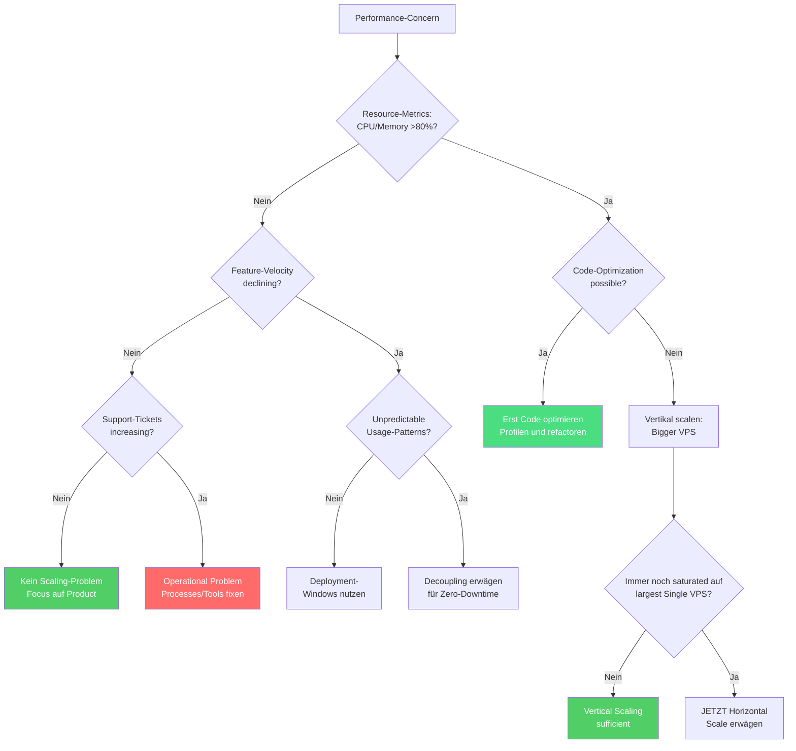

Europäische B2B SaaS-Startups verschwenden zwischen 10% und 90% ihrer Runway für Infrastruktur, die sie nicht brauchen. Sie scalen Komplexität statt Wertschöpfung und verbrennen Cash für Lösungen, die für Companies 100x ihrer Größe designed sind. (Den Makrotrend der Cloud-Repatriierung haben wir in einem [früheren Artikel](/de/blog/cloud-repatriation-2025-data/) behandelt.)

Nach der Analyse von Patterns aus über 50 Infrastruktur-Assessments hab ich festgestellt, dass die Anpassung der Infrastrukturausgaben an den tatsächlichen Umsatz—nicht an imaginäre Scale—die Kosten um 60-70% senken kann, bei gleichzeitig besserer Performance.

Das folgende Framework zeigt genau, welche Infrastruktur du in jeder Wachstumsphase brauchst. Es basiert auf einem simplen Prinzip: Start mit €8/Monat und füg Komplexität nur hinzu, wenn spezifische Business-Trigger es erfordern.

## Das umsatzbasierte Infrastruktur-Framework

| Typisches Setup | Wann Upgraden | Akzeptable Downtime | Ca. Monatliche Kosten |
|-----------------|---------------|---------------------|----------------------|
| **Kleiner VPS (2-4 Cores)**<br/>Alles gekoppelt<br/><a href="https://docs.docker.com/compose/" target="_blank" rel="noopener">Docker Compose</a> | CPU/Memory >80% sustained<br/>ODER schnellere Deploys nötig | 15-30 Minuten | €8 |
| **Mittlerer VPS (4-8 Cores)**<br/>Storage Volumes hinzufügen<br/>Blue-Green Deployments | Deployment-Friction<br/>killt Feature-Velocity | 5 Minuten | €15-20 |
| **Großer VPS/Dedicated**<br/>Separate Data Layer<br/>Replication Setup | Kunden-SLAs erfordern<br/>höhere Availability | Sekunden | €30-50 |
| **Self-hosted HA**<br/><a href="https://github.com/zalando/patroni" target="_blank" rel="noopener">Patroni</a> + <a href="https://pgbackrest.org/" target="_blank" rel="noopener">pgBackRest</a><br/>Automatisches Failover | Mehrere tägliche Deploys<br/>Geografische Distribution nötig | Nahe Null | €50-100 |
| **Managed Services** | ALLE diese Bedingungen:<br/>• DB-Kosten >€2k/Mo self-hosted<br/>• Vertraglich 99,95%+ SLA<br/>• SOC2/Compliance required<br/>• Keine PostgreSQL-Expertise | Null | €100+ |

Anders visualisiert—wo solltest du basierend auf deinem Umsatz und deinen Reliability-Anforderungen sein?

Das ist nicht theoretisch. <a href="https://twitter.com/levelsio" target="_blank" rel="noopener">Pieter Levels</a> betreibt Photo AI mit $1,6M Jahresumsatz auf einem einzigen $40/Monat DigitalOcean VPS. <a href="https://37signals.com/" target="_blank" rel="noopener">37signals</a> <a href="https://world.hey.com/dhh/we-stand-to-save-7m-over-five-years-from-our-cloud-exit-53996caa" target="_blank" rel="noopener">wechselte von $3,2M jährlichen AWS-Ausgaben zu self-hosted Hardware</a> und sparte $7M über fünf Jahre. Das Pattern ist konsistent: Der tatsächliche Infrastrukturbedarf matcht selten das, was Cloud-Provider dir einreden wollen.

## Warum Startups ihre Infrastruktur over-engineeren

Drei psychologische Kräfte pushen Teams zu vorzeitiger Komplexität:

**Fear of Success**: "Was, wenn wir morgen auf TechCrunch featured werden?" treibt Architektur-Decisions mehr als tatsächliche Traffic-Patterns. Teams bauen für imaginäres 10x-Growth, während ihre aktuelle Infrastruktur mit 20% Utilization läuft. Realität: Du kannst einen VPS in unter 5 Minuten von 2 auf 32 Cores scalen, wenn Traffic tatsächlich ankommt. Für Phantom-Load zu bauen ist wie ein Warehouse zu kaufen, bevor du Inventory hast.

**Cargo-Cult Architecture**: Startups mit 5 Engineers implementieren Microservices, weil Netflix sie hat. Aber Netflix hat 2.500+ Engineers, die sonst jede Stunde Merge-Conflicts erzeugen würden. Deren Solutions lösen Probleme, die du nicht hast. Jeder Microservice, den du hinzufügst, erhöht den operativen Overhead um etwa 20%—gemessen in Deployment-Zeit, Debug-Complexity und Coordination-Cost. (Diese Falle haben wir in unserer [Docker Swarm Analyse](/de/blog/docker-swarm-test-11-euro-lesson/) im Detail untersucht.)

**Fehldiagnose des Problems**: Dieses Pattern killt mehr Startups als die anderen—und ich war Teil von einem. Ich hab einem B2B API-Integrator geholfen, das aufzusetzen, was wir für "Enterprise-Grade Infrastructure" hielten, um ihr massives Growth zu handlen. Wir haben eine komplexe Architecture auf Kubernetes gebaut mit Serverless-Layers aufgeteilt auf US- und EU-Regions, mehreren Worker-Services und aufwendigen Observability-Setups.

Die Architecture selbst war nicht falsch—es war die Cloud-Implementation, die unmanageable wurde (Serverless-Connectors, Network-Configs, Database-Certificates, VPC-Peering). Sechs Monate später verbrachten Engineers mehr Zeit damit, durch das Infrastructure-Maze zu navigieren, als Features zu shippen. Teams brannten durch konstantes Firefighting aus. Der echte Bottleneck? Customer Support ertrank—nicht durch Load, sondern durch Bugs, deren Fix Tage dauerte, weil jede Änderung Coordination über Services erforderte. Rückblickend wünschte ich, ich hätte auf einen simpleren Approach gepusht. Ein single large VPS hätte ihre actual Load handlen können, während sie Fixes in Stunden statt Tagen hätten shippen können.

Dasselbe Pattern hab ich bei einem anderen Startup gesehen, das €6.000 monatlich für AWS verbrannte bei wirklich minimaler gleichzeitiger Nutzung. Sie hatten mehrere RDS-Instances angesammelt, jede "prepared for Scale," in Regions, die sie nicht bedienten. Das Team hatte internalized, dass hohe Infrastrukturkosten Table Stakes für ein "echtes" Startup seien. Ein single €28/Monat VPS hätte ihre actual Load mit besserer Performance handlen können—aber niemand hat die Assumptions hinterfragt, bis die Runway weg war. Das sind 8 Monate Burn, die sie zu 24+ Monaten mit derselben Feature-Velocity hätten stretchen können.

## Die drei Dimensionen von Scaling verstehen

Bevor wir ins Detail gehen: Scaling passiert über drei connected Dimensions:

1. **Hardware Scaling** - Compute-Ressourcen an tatsächliche Load anpassen
2. **Architecture Scaling** - Entscheiden, wann Components decoupled werden
3. **Operational Scaling** - Die Fähigkeit deines Teams, Features zu shippen und Issues zu debuggen

Eine Dimension zu ignorieren erzeugt die oben beschriebenen Dysfunctions. Schauen wir uns jede im Detail an.

### Dimension 1: Hardware Scaling entlang des Revenue-Pfades

Basierend auf Patterns aus echten Deployments, hier wie Infrastruktur sich natürlich mit Business-Growth entwickelt:

#### Phase 1: Launch (€8/Mo) — Maintenance Windows akzeptieren

```text
┌─────────────────────────────────────────────────────┐
│        Single VPS - 2 vCPU, 4GB RAM (€8/Mo)         │
│  ┌─────────────┐  ┌─────────────┐  ┌────────────┐   │
│  │ App + Worker│  │ PostgreSQL  │  │Redis/Valkey│   │
│  └─────────────┘  └─────────────┘  └────────────┘   │
│                    ┌────────────┐                   │
│                    │ Monitoring │                   │
│                    └────────────┘                   │
└─────────────────────────────────────────────────────┘
```

**Für wen das passt**: Pre-Revenue Startups, MVP-Validation, erste 10-100 Customers, die verstehen, dass du noch baust.

**Upgrade-Process**: Kunden über 15-30 Minuten Maintenance Window informieren, Services stoppen, Daten backupen (pg_dump + Redis AOF), VPS resizen, restarten. <a href="https://www.hetzner.com/cloud" target="_blank" rel="noopener">Hetzner</a> erlaubt Online-Resizing—die actual Downtime ist nur die Service-Restart-Zeit.

**Wann upgraden**: Sustained CPU-Usage über 80%, Memory-Pressure verursacht Swapping, oder Deployment-Downtime blockt Feature-Releases.

#### Phase 2: Growth (€15-20/Mo) — Volumes enablen schnelle Recovery

```text
┌───────────────────────────────────────────────────────────────┐
│                Infrastructure - €15-20/Mo total               │
│                                                               │
│  ┌─────────────────────────────┐  ┌────────────────────────┐  │
│  │ Application VPS (€7,59/Mo)  │  │ Hetzner Volume (€2-5)  │  │
│  │      4 vCPU, 8GB RAM        │  │                        │  │
│  │  ┌───────────┐ ┌─────────┐  │  │  ┌──────────────────┐  │  │
│  │  │App+Worker │ │Monitor  │  │─▶│  │ PostgreSQL Data  │  │  │
│  │  └───────────┘ └─────────┘  │  │  │ Redis Snapshots  │  │  │
│  │                             │  │  └──────────────────┘  │  │
│  └─────────────────────────────┘  └────────────────────────┘  │
└───────────────────────────────────────────────────────────────┘
```

**Für wen das passt**: Erste zahlende Customers, €1-10k monatlicher Revenue, Basic SLA-Expectations entstehen.

**Key Improvement**: Die Trennung von Data und Compute via Volumes bedeutet Upgrades in 5 Minuten: Services stoppen, Volume detachen, neuen VPS erstellen, Volume attachen, starten. Deine Data persistiert independent.

**Echte Performance**: Dieses Setup handlet 484-500 Requests pro Sekunde sustained für typische B2B SaaS Workloads (gemischte Read/Write, moderate Database-Queries), ausreichend für die meisten Products unter €50k MRR. Deine spezifische Performance variiert basierend auf Application-Efficiency und Query-Complexity.

#### Phase 3: Serious Revenue (€30-50/Mo) — Zero-Downtime Application Deploys

```text
┌─────────────────────────────────────────────────────────────────────────┐
│                    Infrastructure - €30-50/Mo total                     │
│                                                                         │
│  ┌─────────────────────────────┐     ┌─────────────────────────────┐    │
│  │  App VPS - €14,90/Mo        │     │  Data VPS - €7,59/Mo        │    │
│  │  8 vCPU, 16GB RAM           │     │  4 vCPU, 8GB RAM            │    │
│  │                             │     │                             │    │
│  │  ┌─────────┐ ┌─────────┐    │     │  ┌─────────────────────┐    │    │
│  │  │   App   │ │ Workers │    │────▶│  │     PostgreSQL      │    │    │
│  │  └─────────┘ └─────────┘    │     │  └─────────────────────┘    │    │
│  │  ┌─────────────────────┐    │     │  ┌─────────────────────┐    │    │
│  │  │   Reverse Proxy     │    │────▶│  │   Redis + AOF       │    │    │
│  │  └─────────────────────┘    │     │  └─────────────────────┘    │    │
│  │                             │     │  ┌─────────────────────┐    │    │
│  │                             │     │  │   Backup Volumes    │    │    │
│  │                             │     │  └─────────────────────┘    │    │
│  └─────────────────────────────┘     └─────────────────────────────┘    │
└─────────────────────────────────────────────────────────────────────────┘
```

**Für wen das passt**: €10-100k monatlicher Revenue, echte Customer-SLAs, kann sich keine extended Downtime leisten.

**Zero-Downtime App Deployments**: Neuen App VPS hochfahren, Health Check, Traffic switchen, alten VPS terminaten. Die Data Layer bleibt untouched. Note: Erfordert Session-Management-Strategy (stateless Tokens, Sticky Sessions oder Session Store) um aktive User-Connections während des Switchovers zu handlen.

**Data Layer Updates**: <a href="https://www.postgresql.org/docs/current/high-availability.html" target="_blank" rel="noopener">PostgreSQL Streaming Replication</a> zur neuen Instance, Replica promoten, Connection Strings switchen. Downtime gemessen in Sekunden für Connection-Switchover.

#### Phase 3.5: Self-Hosted HA (€50-100/Mo) — Vor Managed Services

```text
┌─────────────────────────────────────────────────────────────────────────┐
│                  HA Infrastructure - €50-100/Mo total                   │
│                                                                         │
│  ┌─────────────────────────────┐     ┌─────────────────────────────┐    │
│  │     Application Layer       │     │   Data Layer mit HA         │    │
│  │                             │     │                             │    │
│  │  ┌─────────┐ ┌─────────┐    │     │  ┌─────────────────────┐    │    │
│  │  │   App   │ │   App   │    │────▶│  │ PostgreSQL + Patroni│    │    │
│  │  │ Primary │ │ Standby │    │     │  └─────────────────────┘    │    │
│  │  └─────────┘ └─────────┘    │     │            │                │    │
│  │        │          │         │     │            ▼                │    │
│  │        │          │         │     │  ┌─────────────────────┐    │    │
│  │        └──────────┼─────────│────▶│  │  pgBackRest Backups │    │    │
│  │                   │         │     │  └─────────────────────┘    │    │
│  │                   │         │     │  ┌─────────────────────┐    │    │
│  │                   └─────────│────▶│  │   Redis Sentinel    │    │    │
│  │                             │     │  └─────────────────────┘    │    │
│  └─────────────────────────────┘     └─────────────────────────────┘    │
└─────────────────────────────────────────────────────────────────────────┘
```

**Für wen das passt**: €100-500k monatlicher Revenue, High Availability needed ohne Managed Service Premiums.

**Key Tools**:
- <a href="https://github.com/zalando/patroni" target="_blank" rel="noopener">Patroni</a> für PostgreSQL automatisches Failover
- <a href="https://pgbackrest.org/" target="_blank" rel="noopener">pgBackRest</a> für Point-in-Time Recovery
- <a href="https://redis.io/docs/latest/operate/oss_and_stack/management/sentinel/" target="_blank" rel="noopener">Redis Sentinel</a> für Cache-Layer Redundancy
- Automated Health Checks und Failover-Scripts

**Maintenance Reality**: Trotz der Complexity erfordert dieses Setup nach Stabilisierung 30-60 Minuten monatliche Maintenance. Die initiale Stabilisierungs-Phase (erste 2-3 Monate) erfordert mehr hands-on Tuning und Monitoring.

#### Phase 4: Conditional Complexity (€100+/Mo) — Nur wenn getriggert

Managed Services werden nicht allein durch Revenue getriggert. Du brauchst **ALLE** diese Conditions—nicht eine oder zwei, sondern jede einzelne:
- Database Ops-Kosten übersteigen €2k/Monat self-hosted
- Customers verlangen vertraglich 99,95%+ SLA oder SOC2-Certification
- Data Residency-Regulations gelten (Government Contracts, Healthcare)
- Dein Team hat wirklich keine PostgreSQL/Linux-Expertise

Wenn auch nur eine Condition fehlt, zahlst du wahrscheinlich Premium für Capabilities, die du nicht brauchst. Das geht nicht um technical Capability—es geht um Risk-Management. Managed Services traden Money für reduced Operational Risk und Compliance-Burden. Dieser Trade macht Sinn, wenn dein Business-Model es fordert, nicht früher.

**Cost Reality**: <a href="https://aws.amazon.com/rds/postgresql/pricing/" target="_blank" rel="noopener">AWS RDS</a> wirbt mit $379/Monat (db.r5.xlarge Basis-Preis), kostet aber actually $864+ wenn du Production-Essentials hinzufügst: 500GB Storage ($115), Backup-Storage ($50), provisionierte IOPS ($200) und Multi-AZ Redundancy ($120). Ein vergleichbarer <a href="https://www.hetzner.com/cloud" target="_blank" rel="noopener">Hetzner</a> Dedicated Server (32 Cores, 256GB RAM) kostet €513/Monat—8x die Resources für 40% weniger.

### Dimension 2: Architecture Evolution - Die Stateful Services Challenge

Die zentrale Challenge bei Architecture Scaling dreht sich um Stateful Services—Components, die Data halten, die du nicht verlieren kannst. Dein Application Code kann jederzeit restarten ohne Consequences. Deine Database nicht. Dieser fundamentale Unterschied treibt die meisten Architecture-Decisions.

**Das Problem verstehen**: Stell dir deine Application als Restaurant vor. Die Küche (stateless Application) kann schließen und reopenen—du machst einfach alle laufenden Orders neu. Aber das Inventory-System (Database) muss perfekte Records darüber führen, was auf Lager ist, was bestellt wurde und was bezahlt wurde. Diesen State zu verlieren bedeutet Business-Chaos.

**Starting Point - Coupled Architecture**:
Alles läuft zusammen auf einer Machine. Simple zu verstehen, zu debuggen und zu deployen. Wie ein Food Truck, wo Cooking und Storage im selben Vehicle passieren. Perfect für den Start.

**Evolution - Decoupled Architecture**:
Trenne die Küche vom Warehouse. Jetzt kannst du dein Cooking Equipment upgraden ohne das Inventory anzufassen. Aber du hast Complexity hinzugefügt: Delivery Trucks zwischen Locations, Coordination Overhead, mehr Failure Points.

**Nur decouplen wenn**:
- Deine Customers das System zu unpredictable Zeiten über Timezones nutzen (keine Maintenance Windows planbar)
- Verschiedene Components fundamental unterschiedliche Resources brauchen (Database braucht Memory, App braucht CPU)
- Deployment-Frequency übersteigt, was Maintenance Windows erlauben
- Team Members sich auf verschiedene Layers spezialisieren

**Coupled bleiben wenn**:
- Du Maintenance Windows planen kannst, die deine Customers akzeptieren
- Der operative Overhead der Distribution dessen Benefits übersteigt
- Deine Load unter 1.000 Requests pro Sekunde liegt
- Simplicity deinem Team hilft, schneller zu sein

### Dimension 3: Operational Scaling - Der Hidden Multiplier

Operational Scaling ist oft wichtiger als pure Infrastruktur. Es ist der Unterschied zwischen einem Team, das fearlessly shipped, und einem, das von seiner eigenen Creation paralyzed ist. Diese Hidden Costs akkumulieren: Engineering-Zeit für Infrastructure ist Runway, die nicht in Product fließt.

**High-Velocity Indicators**:
- Deployment braucht ein Command und ist in unter 10 Minuten done
- Debugging von Production Issues dauert Minuten, nicht Stunden
- Ein Engineer managed Infrastructure part-time
- Neue Features gehen von Idea zu Production in Tagen

**Low-Velocity Warning Signs**:
- Deployments requiren mehrere Leute und scheduled Meetings
- Debugging requirt Correlation von Logs über mehrere Services und Timezones
- Infrastructure-Work consumt mehrere Full-Time Engineers
- Neue Features dauern Wochen, weil sie mehrere Services touchen

Der B2B API-Integrator exemplifiziert Operational Scaling Failure. Sie hatten schöne Architecture-Diagrams und "Enterprise-Grade" alles. Aber wenn etwas um 3 Uhr morgens broke, brauchten drei Engineers vier Stunden, um durch Lambda Functions, API Gateways, Event Buses und Multi-Region Databases zu tracen, um einen simplen Config-Error zu finden. Ihr sophisticated Setup wurde zu einer Liability, die das Team ausbrannte und sie zwei Key-Customers kostete, die nicht auf den Fix warten konnten.

## Das Diagnostic Framework

Wenn jemand sagt "wir müssen scalen," meinen sie normalerweise "irgendetwas fühlt sich slow oder broken an." Dieses Framework hilft, den echten Constraint zu identifizieren:



Die meisten Teams discovern, dass sie Operational Problems haben, keine Scaling-Problems. Aber hier ist die entscheidende Frage: Warum braucht dein Code so viel Power? Ein single large VPS (16 vCPU, 32GB RAM) handlet etwa 1.500-2.000 Requests pro Sekunde für well-optimized Applications—mehr Traffic als die meisten Startups vor Series A sehen. Wenn du mit signifikant weniger strugglest, profile erst deinen Code. Oft kostet dich eine unoptimized Database-Query oder ein N+1-Problem 10x mehr als bessere Infrastructure.

## Common Traps und wie du sie vermeidest

**Trap 1: "Wir wachsen fast, wir brauchen Kubernetes"**
Von 100 auf 1.000 Customers zu wachsen fühlt sich wie Hypergrowth an. Ist es nicht—zumindest nicht aus Infrastructure-Perspective. Monitor die actual Resource-Usage, nicht Customer-Count. Bis du consistently CPU über 80% oder Memory Pressure mit Swapping siehst, löst du imaginary Problems.

**Trap 2: "Microservices geben uns Flexibility"**
Jede Service-Boundary, die du schaffst, addet Operational Tax: separate Deployments, API-Versioning, Distributed Debugging, Data-Consistency Challenges. Start monolithic und extract Services nur, wenn Teams wirklich nicht mehr efficient zusammenarbeiten können. Selbst dann, consider Modular Monoliths vor full Service-Separation. (Warum Monolithen Microservices für die meisten Startups beaten, haben wir in unserem [Docker Swarm Deep Dive](/de/blog/docker-swarm-test-11-euro-lesson/) behandelt.)

**Trap 3: "Managed Services eliminieren Operations"**
Sie eliminieren einige Operations und adden andere. Du tradest Server-Patching gegen Cost-Optimization, Capacity-Planning und Vendor Lock-in. Calculate die echten Total Costs: Diese $379/Monat RDS-Instance wird $864+ nach Storage, Backups, IOPS und Multi-AZ. Self-hosted PostgreSQL auf equivalent Hardware kostet 60-80% weniger und performt besser.

**Trap 4: "Wir brauchen ein Data Warehouse ab Tag 1"**
Deine PostgreSQL-Database kann Analytical Queries locker handlen, bis du Millionen Records hast. Ein separates Analytical System hinzuzufügen, bevor du es brauchst, bedeutet ETL-Pipelines zu maintainen, mit Data-Sync umzugehen und zu debuggen, warum deine Dashboards andere Numbers zeigen als deine Application. Wait, bis Queries wirklich Production slowen.

**Trap 5: "Infrastructure-Complexity zeigt Maturity"**
Einige der most successful Companies betreiben surprisingly simple Setups. <a href="https://stackoverflow.blog/2022/03/14/how-stack-overflow-uses-net-and-azure/" target="_blank" rel="noopener">Stack Overflow</a> servte 100+ Millionen Developers mit 9 Webservern. WhatsApp handlete 900 Millionen Users mit 32 Engineers. Complexity ist keine Sophistication—es ist oft ein Failure, simple Solutions zu finden.

---

Die Traps oben sind nicht hypothetisch—ich hab jede einzelne davon Runway von vielversprechenden Startups drainen sehen. Die gute News: Sie sind alle fixbar. Hier ist, wie du rausfindest, wo du stehst.

## Action: Deinen Current State assessen

Zu verstehen, wo du stehst, hilft Optimization-Opportunities zu identifizieren:

**1. Calculate deine Infrastructure-Burden**:
Wenn du €1.000/Monat für Infrastructure ausgibst bei €20.000/Monat Revenue, sind das 5%—scheint healthy, right? Aber wenn du in der Cloud bist, zahlst du wahrscheinlich 60-70% zu viel. Diese €1.000 könnten €300-400 sein für equivalent oder bessere Performance. Das sind €7.200/Jahr zurück in deiner Tasche—genug um einen Contractor für einen Monat zu funden oder Experiments zu runnen, die sich deine Competition nicht leisten kann. (Caveat: Assumes ähnliche Workload-Characteristics und proper Migration-Planning.)

Wenn du €5.000/Monat ausgibst bei €10.000/Monat Revenue, sind das 50%—du blutest Runway für Complexity aus, die Customer Acquisition fundieren sollte. Jeden Monat, den du Optimization verzögerst, gewinnt dein Competitor mit leaner Infrastructure Ground.

**2. Miss Operational Velocity (die Hidden Costs)**:
- Wie lange von Code-Commit zu Production-Deployment?
- Wie viele Leute müssen sich für ein Release koordinieren?
- Wie schnell kannst du einen Production-Error tracen?
- Welcher Prozentsatz der Engineering-Zeit geht in Infrastructure?

Jede Stunde für Infrastructure-Complexity ist eine Stunde nicht für Product. Bei €100/Stunde Engineering-Kosten verbrennt ein Team, das 20% der Zeit für Ops aufwendet, €3.200/Monat allein an Opportunity Costs.

**3. Check die Utilization-Reality**:
Nicht raten—messen. SSH in deinen Server und run diese Commands um actual Resource-Usage zu sehen:
```bash
# Quick Server-Check
top          # Ist CPU wirklich constrained?
free -h      # Ist Memory unter Pressure?
df -h        # Ist Disk Space ein Issue?
netstat -i   # Ist Network saturated?

# Oder besser: Proper Monitoring mit Prometheus/Grafana
# Zeigt Trends, nicht nur Snapshots
```

Wenn nichts davon sustained Constraints zeigt (>80% für extended Periods), hast du kein Scaling-Problem—du hast ein Perception-Problem.

**4. Gegen das Framework mappen**:
Wo platziert dein aktuelles Setup dich? Betreibst du Phase-4-Infrastructure mit Phase-2-Revenue? Diese Gap repräsentiert Runway, die du zurückholen könntest.

Die meisten Teams discovern, dass sie 1-2 Phasen ahead sind, wo die Economics es rechtfertigen. Ein Startup, das €8.000/Monat für distributed Services ausgibt, während es Dutzende Customers bedient, ist nicht "prepared for Scale"—sie verbrennen Runway für Complexity, die aktiv Product Development slowt.

> **Key Insight: Jede Phase funded das nächste Level von Reliability. Zahl nicht für Phase-4-Architecture bei Phase-1-Revenue.**

**Wichtiger Disclaimer**: Dieses Framework priorisiert Capital-Efficiency für self-funded oder Early-Stage Startups. Wenn du Venture-backed mit 2+ Jahren Runway bist, könnte Infrastructure-Cost-Optimization premature Optimization sein—deine Zeit ist besser in Product-Market Fit investiert. Ebenso, wenn du in heavily regulated Industries bist (Finance, Healthcare, Government), könnten Compliance-Requirements dich zu Managed Services zwingen, unabhängig von Costs.

## Was wir machen

Wenn du €3k–15k/Monat für Cloud-Infrastructure ausgibst und dich fragst, ob's einen simpleren Weg gibt, machen wir fokussierte **72-Stunden Infrastructure Audits** um deine Options zu mappen. No Commitment, nur Data.

**→ [Infrastructure Audit anfragen](https://raus.cloud)**

<div style="text-align: center; margin: 3rem 0;">
  <a href="https://cal.com/eduardosanzb/15min" target="_blank" rel="noopener" style="display: inline-block; background: linear-gradient(135deg, #10b981 0%, #059669 100%); color: white; padding: 1rem 2.5rem; border-radius: 0.5rem; font-weight: 600; font-size: 1.125rem; text-decoration: none; box-shadow: 0 4px 6px rgba(16, 185, 129, 0.25); transition: transform 0.2s, box-shadow 0.2s;" onmouseover="this.style.transform='translateY(-2px)'; this.style.boxShadow='0 6px 12px rgba(16, 185, 129, 0.35)';" onmouseout="this.style.transform='translateY(0)'; this.style.boxShadow='0 4px 6px rgba(16, 185, 129, 0.25)';">
    Kostenloses Infrastructure Audit buchen
  </a>
  <p style="margin-top: 1rem; color: #6b7280; font-size: 0.875rem;">15-Minuten Call • Kein Sales Pitch • Ehrliche Assessment</p>
</div>

---

*Eduardo betreibt [raus.cloud](https://raus.cloud) und hilft europäischen B2B SaaS-Companies, Infrastructure-Kosten um 60-70% zu senken durch sustainable Architectures. Dieses Framework entstand aus Patterns, die bei über 50 Infrastructure-Assessments observed wurden.*
