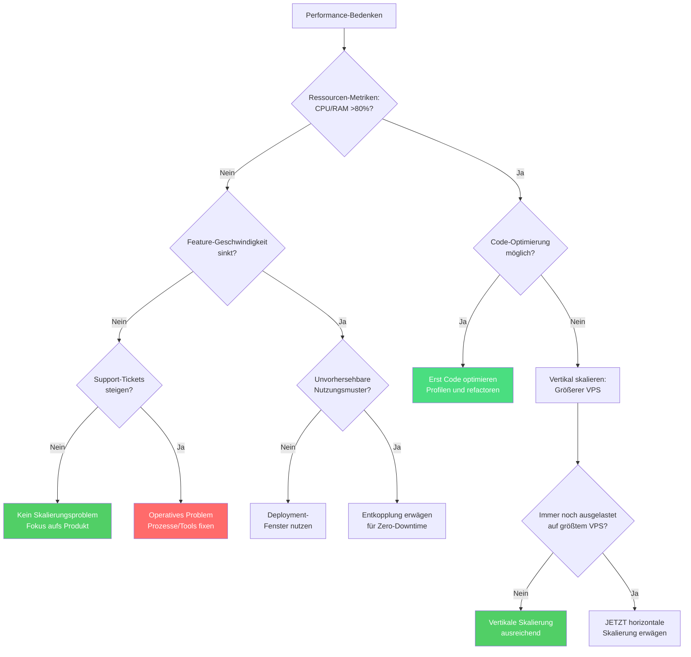

Europäische B2B-SaaS-Startups verschwenden zwischen 10% und 90% ihres Runways für Infrastruktur, die sie nicht brauchen. Sie skalieren Komplexität statt Wertschöpfung und verbrennen Geld für Lösungen, die für Unternehmen konzipiert sind, die 100-mal so groß sind. (Den [Makrotrend der Cloud-Repatriierung](/de/blog/cloud-repatriation-2025-data/) haben wir in einem früheren Artikel behandelt.)

Nach der Analyse von Mustern aus über 50 Infrastruktur-Assessments habe ich festgestellt, dass die Anpassung der Infrastrukturausgaben an den tatsächlichen Umsatz – nicht an imaginäre Größenordnungen – die Kosten um 60-70% senken kann, bei gleichzeitig besserer Performance.

Das folgende Framework zeigt genau, welche Infrastruktur du in jeder Wachstumsphase brauchst. Es basiert auf einem einfachen Prinzip: Starte bei €8/Monat und füge Komplexität nur dann hinzu, wenn konkrete geschäftliche Anforderungen es erfordern.

## Das umsatzbasierte Infrastruktur-Framework

| Typisches Setup | Wann upgraden | Akzeptable Ausfallzeit | Ca. monatliche Kosten |
|-----------------|---------------|------------------------|----------------------|
| **Kleiner VPS (2-4 Kerne)**<br/>Alles gekoppelt<br/><a href="https://docs.docker.com/compose/" target="_blank" rel="noopener">Docker Compose</a> | CPU/RAM dauerhaft >80%<br/>ODER schnellere Deployments nötig | 15-30 Minuten | €8 |
| **Mittlerer VPS (4-8 Kerne)**<br/>Storage Volumes hinzufügen<br/>Blue-Green Deployments | Deployment-Reibung<br/>bremst Feature-Entwicklung | 5 Minuten | €15-20 |
| **Großer VPS/Dedicated**<br/>Separater Data Layer<br/>Replikation einrichten | Kunden-SLAs erfordern<br/>höhere Verfügbarkeit | Sekunden | €30-50 |
| **Self-Hosted HA**<br/><a href="https://github.com/zalando/patroni" target="_blank" rel="noopener">Patroni</a> + <a href="https://pgbackrest.org/" target="_blank" rel="noopener">pgBackRest</a><br/>Automatisches Failover | Mehrere Deployments täglich<br/>Geografische Verteilung nötig | Nahezu null | €50-100 |
| **Managed Services** | ALLE diese Bedingungen:<br/>• DB-Kosten >€2k/Mo. Self-Hosted<br/>• Vertragliche 99,95%+ SLA<br/>• SOC2/Compliance erforderlich<br/>• Keine PostgreSQL-Expertise | Null | €100+ |

Anders visualisiert – wo solltest du basierend auf Umsatz und Verfügbarkeitsanforderungen stehen?

Das ist keine Theorie. <a href="https://twitter.com/levelsio" target="_blank" rel="noopener">Pieter Levels</a> betreibt Photo AI mit 1,6 Mio. $ Jahresumsatz auf einem einzigen 40$/Monat DigitalOcean VPS. <a href="https://37signals.com/" target="_blank" rel="noopener">37signals</a> <a href="https://world.hey.com/dhh/we-stand-to-save-7m-over-five-years-from-our-cloud-exit-53996caa" target="_blank" rel="noopener">wechselte von 3,2 Mio. $ jährlichen AWS-Ausgaben zu selbst gehosteter Hardware</a> und sparte über fünf Jahre 7 Mio. $. Das Muster ist eindeutig: Der tatsächliche Infrastrukturbedarf entspricht selten dem, was Cloud-Anbieter einem einreden wollen.

## Warum Startups ihre Infrastruktur überentwickeln

Drei psychologische Kräfte treiben Teams zu vorzeitiger Komplexität:

**Angst vor dem Erfolg**: "Was, wenn wir morgen auf TechCrunch landen?" beeinflusst Architekturentscheidungen mehr als tatsächliche Traffic-Muster. Teams bauen für imaginäres 10-faches Wachstum, während ihre aktuelle Infrastruktur bei 20% Auslastung dümpelt. Realität: Du kannst einen VPS in unter 5 Minuten von 2 auf 32 Kerne hochskalieren, wenn der Traffic tatsächlich kommt. Für Phantomlast zu bauen ist wie ein Lagerhaus zu kaufen, bevor man überhaupt Inventar hat.

**Cargo-Cult-Architektur**: Startups mit 5 Entwicklern implementieren Microservices, weil Netflix sie hat. Aber Netflix hat über 2.500 Entwickler, die sonst stündlich Merge-Konflikte produzieren würden. Deren Lösungen lösen Probleme, die du nicht hast. Jeder Microservice, den du hinzufügst, erhöht den operativen Aufwand um etwa 20% – gemessen in Deployment-Zeit, Debugging-Komplexität und Koordinationskosten. (Diese Falle haben wir in [unserer Docker-Swarm-Analyse](/de/blog/docker-swarm-test-11-euro-lesson/) im Detail untersucht.)

**Fehldiagnose des Problems**: Dieses Muster bringt mehr Startups um als die anderen – und ich war selbst Teil von einem. Ich half einem B2B-API-Integrator dabei, eine vermeintlich "Enterprise-Grade"-Infrastruktur für ihr massives Wachstum aufzusetzen. Wir bauten eine komplexe Architektur auf Kubernetes mit Serverless-Schichten, aufgeteilt auf US- und EU-Regionen, mehrere Worker-Services und aufwendige Observability-Setups.

Die Architektur selbst war nicht falsch – es war die Cloud-Implementierung, die unbeherrschbar wurde (Serverless-Konnektoren, Netzwerkkonfigurationen, Datenbank-Zertifikate, VPC-Peering). Sechs Monate später verbrachten die Entwickler mehr Zeit damit, sich durch das Infrastruktur-Labyrinth zu kämpfen, als Features auszuliefern. Teams brannten aus vom ständigen Feuerlöschen. Der eigentliche Engpass? Der Kundensupport ging unter – nicht wegen der Last, sondern wegen Bugs, deren Behebung Tage dauerte, weil jede Änderung Koordination über mehrere Services erforderte. Rückblickend wünschte ich, ich hätte auf einen einfacheren Ansatz gedrängt. Ein einzelner großer VPS hätte ihre tatsächliche Last problemlos bewältigt und ihnen ermöglicht, Fixes in Stunden statt Tagen auszuliefern.

Ich sah das gleiche Muster bei einem anderen Startup, das €6.000 monatlich für AWS ausgab – bei wirklich minimaler gleichzeitiger Nutzung. Sie hatten mehrere RDS-Instanzen angesammelt, jede "für Skalierung vorbereitet", in Regionen, die sie gar nicht bedienten. Das Team hatte verinnerlicht, dass hohe Infrastrukturkosten zum Standard für ein "echtes" Startup gehören. Ein einzelner €28/Monat VPS hätte ihre tatsächliche Last mit besserer Performance bewältigen können – aber niemand hinterfragte die Annahmen, bis der Runway aufgebraucht war. Das sind 8 Monate Burn, die sie mit gleicher Feature-Geschwindigkeit auf 24+ Monate hätten strecken können.

## Die drei Dimensionen der Skalierung verstehen

Bevor wir ins Detail gehen: Skalierung findet über drei miteinander verbundene Dimensionen statt:

1. **Hardware-Skalierung** – Rechenressourcen an die tatsächliche Last anpassen
2. **Architektur-Skalierung** – Entscheiden, wann Komponenten entkoppelt werden
3. **Operative Skalierung** – Die Fähigkeit deines Teams, Features auszuliefern und Probleme zu debuggen

Eine Dimension zu ignorieren erzeugt die oben beschriebenen Dysfunktionen. Schauen wir uns jede im Detail an.

### Dimension 1: Hardware-Skalierung entlang des Umsatzpfads

Basierend auf Mustern aus echten Deployments, hier wie sich Infrastruktur natürlich mit dem Geschäftswachstum entwickelt:

#### Phase 1: Launch (€8/Mo.) – Wartungsfenster akzeptieren

```text
┌─────────────────────────────────────────────────────┐
│        Einzelner VPS - 2 vCPU, 4GB RAM (€8/Mo.)     │
│  ┌─────────────┐  ┌─────────────┐  ┌────────────┐   │
│  │ App + Worker│  │ PostgreSQL  │  │Redis/Valkey│   │
│  └─────────────┘  └─────────────┘  └────────────┘   │
│                    ┌────────────┐                   │
│                    │ Monitoring │                   │
│                    └────────────┘                   │
└─────────────────────────────────────────────────────┘
```

**Für wen das passt**: Pre-Revenue-Startups, MVP-Validierung, erste 10-100 Kunden, die verstehen, dass du noch baust.

**Upgrade-Prozess**: Kunden per E-Mail über 15-30 Minuten Wartungsfenster informieren, Services stoppen, Daten sichern (pg_dump + Redis AOF), VPS resizen, neustarten. <a href="https://www.hetzner.com/cloud" target="_blank" rel="noopener">Hetzner</a> erlaubt Online-Resizing – die tatsächliche Ausfallzeit ist nur die Service-Neustartzeit.

**Wann upgraden**: Dauerhaft CPU-Auslastung über 80%, Speicherdruck verursacht Swapping, oder Deployment-Ausfallzeit beginnt Feature-Releases zu blockieren.

#### Phase 2: Wachstum (€15-20/Mo.) – Volumes ermöglichen schnelle Wiederherstellung

```text
┌───────────────────────────────────────────────────────────────┐
│                Infrastruktur - €15-20/Mo. gesamt              │
│                                                               │
│  ┌─────────────────────────────┐  ┌────────────────────────┐  │
│  │ Application VPS (€7,59/Mo.) │  │ Hetzner Volume (€2-5)  │  │
│  │      4 vCPU, 8GB RAM        │  │                        │  │
│  │  ┌───────────┐ ┌─────────┐  │  │  ┌──────────────────┐  │  │
│  │  │App+Worker │ │Monitor  │  │─▶│  │ PostgreSQL Data  │  │  │
│  │  └───────────┘ └─────────┘  │  │  │ Redis Snapshots  │  │  │
│  │                             │  │  └──────────────────┘  │  │
│  └─────────────────────────────┘  └────────────────────────┘  │
└───────────────────────────────────────────────────────────────┘
```

**Für wen das passt**: Erste zahlende Kunden, €1-10k monatlicher Umsatz, erste SLA-Erwartungen entstehen.

**Zentrale Verbesserung**: Die Trennung von Daten und Compute via Volumes bedeutet, dass Upgrades nur 5 Minuten dauern: Services stoppen, Volume abtrennen, neuen VPS erstellen, Volume anhängen, starten. Deine Daten bleiben unabhängig erhalten.

**Echte Performance**: Dieses Setup bewältigt 484-500 Requests pro Sekunde dauerhaft für typische B2B-SaaS-Workloads (gemischte Read/Write-Operationen, moderate Datenbankabfragen), ausreichend für die meisten Produkte unter €50k MRR. Die konkrete Performance variiert je nach Anwendungseffizienz und Abfragekomplexität.

#### Phase 3: Ernsthafte Umsätze (€30-50/Mo.) – Zero-Downtime Application Deployments

```text
┌─────────────────────────────────────────────────────────────────────────┐
│                    Infrastruktur - €30-50/Mo. gesamt                    │
│                                                                         │
│  ┌─────────────────────────────┐     ┌─────────────────────────────┐    │
│  │  App VPS - €14,90/Mo.       │     │  Data VPS - €7,59/Mo.       │    │
│  │  8 vCPU, 16GB RAM           │     │  4 vCPU, 8GB RAM            │    │
│  │                             │     │                             │    │
│  │  ┌─────────┐ ┌─────────┐    │     │  ┌─────────────────────┐    │    │
│  │  │   App   │ │ Workers │    │────▶│  │     PostgreSQL      │    │    │
│  │  └─────────┘ └─────────┘    │     │  └─────────────────────┘    │    │
│  │  ┌─────────────────────┐    │     │  ┌─────────────────────┐    │    │
│  │  │   Reverse Proxy     │    │────▶│  │   Redis + AOF       │    │    │
│  │  └─────────────────────┘    │     │  └─────────────────────┘    │    │
│  │                             │     │  ┌─────────────────────┐    │    │
│  │                             │     │  │   Backup Volumes    │    │    │
│  │                             │     │  └─────────────────────┘    │    │
│  └─────────────────────────────┘     └─────────────────────────────┘    │
└─────────────────────────────────────────────────────────────────────────┘
```

**Für wen das passt**: €10-100k monatlicher Umsatz, echte Kunden-SLAs, kann sich längere Ausfallzeiten nicht leisten.

**Zero-Downtime App-Deployments**: Neuen App-VPS hochfahren, Health-Check durchführen, Traffic umleiten, alten VPS terminieren. Der Data Layer bleibt unberührt. Hinweis: Erfordert eine Session-Management-Strategie (Stateless Tokens, Sticky Sessions oder Session Store), um aktive Benutzerverbindungen während des Wechsels zu handhaben.

**Data-Layer-Updates**: <a href="https://www.postgresql.org/docs/current/high-availability.html" target="_blank" rel="noopener">PostgreSQL Streaming Replication</a> zur neuen Instanz, Replica promoten, Connection Strings umstellen. Ausfallzeit im Sekundenbereich für den Verbindungswechsel.

#### Phase 3.5: Self-Hosted HA (€50-100/Mo.) – Vor Managed Services

```text
┌─────────────────────────────────────────────────────────────────────────┐
│                  HA-Infrastruktur - €50-100/Mo. gesamt                  │
│                                                                         │
│  ┌─────────────────────────────┐     ┌─────────────────────────────┐    │
│  │     Application Layer       │     │   Data Layer mit HA         │    │
│  │                             │     │                             │    │
│  │  ┌─────────┐ ┌─────────┐    │     │  ┌─────────────────────┐    │    │
│  │  │   App   │ │   App   │    │────▶│  │ PostgreSQL + Patroni│    │    │
│  │  │ Primary │ │ Standby │    │     │  └─────────────────────┘    │    │
│  │  └─────────┘ └─────────┘    │     │            │                │    │
│  │        │          │         │     │            ▼                │    │
│  │        │          │         │     │  ┌─────────────────────┐    │    │
│  │        └──────────┼─────────│────▶│  │  pgBackRest Backups │    │    │
│  │                   │         │     │  └─────────────────────┘    │    │
│  │                   │         │     │  ┌─────────────────────┐    │    │
│  │                   └─────────│────▶│  │   Redis Sentinel    │    │    │
│  │                             │     │  └─────────────────────┘    │    │
│  └─────────────────────────────┘     └─────────────────────────────┘    │
└─────────────────────────────────────────────────────────────────────────┘
```

**Für wen das passt**: €100-500k monatlicher Umsatz, Hochverfügbarkeit benötigt ohne Managed-Service-Aufpreise.

**Zentrale Tools**:
- <a href="https://github.com/zalando/patroni" target="_blank" rel="noopener">Patroni</a> für automatisches PostgreSQL-Failover
- <a href="https://pgbackrest.org/" target="_blank" rel="noopener">pgBackRest</a> für Point-in-Time Recovery
- <a href="https://redis.io/docs/latest/operate/oss_and_stack/management/sentinel/" target="_blank" rel="noopener">Redis Sentinel</a> für Cache-Layer-Redundanz
- Automatisierte Health-Checks und Failover-Skripte

**Wartungsrealität**: Trotz der Komplexität erfordert dieses Setup nach der Stabilisierung 30-60 Minuten monatliche Wartung. Die anfängliche Stabilisierungsphase (erste 2-3 Monate) erfordert mehr praktisches Tuning und Monitoring.

#### Phase 4: Bedingte Komplexität (€100+/Mo.) – Nur wenn ausgelöst

Managed Services werden nicht allein durch Umsatz ausgelöst. Du brauchst **ALLE** diese Bedingungen – nicht eine oder zwei, sondern jede einzelne:
- Datenbank-Betriebskosten übersteigen €2k/Monat bei Self-Hosting
- Kunden verlangen vertraglich 99,95%+ SLA oder SOC2-Zertifizierung
- Datenresidenz-Vorschriften gelten (Regierungsaufträge, Gesundheitswesen)
- Dein Team hat wirklich keine PostgreSQL/Linux-Expertise

Wenn auch nur eine Bedingung fehlt, zahlst du wahrscheinlich einen Aufpreis für Fähigkeiten, die du nicht brauchst. Hier geht es nicht um technische Fähigkeiten – es geht um Risikomanagement. Managed Services tauschen Geld gegen reduziertes Betriebsrisiko und Compliance-Last. Dieser Tausch macht Sinn, wenn dein Geschäftsmodell es erfordert, nicht vorher.

**Kostenrealität**: <a href="https://aws.amazon.com/rds/postgresql/pricing/" target="_blank" rel="noopener">AWS RDS</a> wirbt mit 379$/Monat (db.r5.xlarge Basispreis), kostet aber tatsächlich 864$+ wenn du Produktionsessentials hinzurechnest: 500GB Speicher (115$), Backup-Speicher (50$), Provisioned IOPS (200$) und Multi-AZ-Redundanz (120$). Ein vergleichbarer <a href="https://www.hetzner.com/cloud" target="_blank" rel="noopener">Hetzner</a> Dedicated Server (32 Kerne, 256GB RAM) kostet €513/Monat – 8-fache Ressourcen für 40% weniger.

### Dimension 2: Architektur-Evolution – Die Herausforderung zustandsbehafteter Services

Die zentrale Herausforderung bei der Architektur-Skalierung dreht sich um zustandsbehaftete Services – Komponenten, die Daten halten, die du nicht verlieren darfst. Dein Anwendungscode kann jederzeit neu starten ohne Konsequenzen. Deine Datenbank nicht. Dieser fundamentale Unterschied bestimmt die meisten Architekturentscheidungen.

**Das Problem verstehen**: Stell dir deine Anwendung wie ein Restaurant vor. Die Küche (zustandslose Anwendung) kann schließen und wieder öffnen – du machst einfach alle laufenden Bestellungen neu. Aber das Inventarsystem (Datenbank) muss perfekte Aufzeichnungen führen darüber, was auf Lager ist, was bestellt wurde und was bezahlt wurde. Diese Daten zu verlieren bedeutet Geschäftschaos.

**Ausgangspunkt – Gekoppelte Architektur**:
Alles läuft zusammen auf einer Maschine. Einfach zu verstehen, zu debuggen und zu deployen. Wie ein Foodtruck, wo Kochen und Lagerung im selben Fahrzeug stattfinden. Perfekt für den Start.

**Evolution – Entkoppelte Architektur**:
Trenne die Küche vom Lager. Jetzt kannst du die Küchengeräte upgraden, ohne das Inventar anzufassen. Aber du hast Komplexität hinzugefügt: Lieferwagen zwischen den Standorten, Koordinationsaufwand, mehr Fehlerpunkte.

**Nur entkoppeln, wenn**:
- Deine Kunden das System zu unvorhersehbaren Zeiten über Zeitzonen hinweg nutzen (keine Wartungsfenster planbar)
- Verschiedene Komponenten fundamental unterschiedliche Ressourcen brauchen (Datenbank braucht RAM, App braucht CPU)
- Die Deployment-Frequenz übersteigt, was Wartungsfenster erlauben
- Teammitglieder sich auf verschiedene Schichten spezialisieren

**Gekoppelt bleiben, wenn**:
- Du Wartungsfenster planen kannst, die deine Kunden akzeptieren
- Der operative Aufwand der Verteilung deren Nutzen übersteigt
- Deine Last unter 1.000 Requests pro Sekunde liegt
- Einfachheit deinem Team hilft, schneller zu sein

### Dimension 3: Operative Skalierung – Der versteckte Multiplikator

Operative Skalierung ist oft wichtiger als reine Infrastruktur. Es ist der Unterschied zwischen einem Team, das furchtlos ausliefert, und einem, das von der eigenen Schöpfung gelähmt ist. Diese versteckten Kosten summieren sich: Entwicklerzeit, die für Infrastruktur aufgewendet wird, ist Runway, der nicht ins Produkt fließt.

**Indikatoren für hohe Geschwindigkeit**:
- Deployment braucht einen Befehl und ist in unter 10 Minuten fertig
- Debugging von Produktionsproblemen dauert Minuten, nicht Stunden
- Ein Entwickler managed die Infrastruktur nebenbei
- Neue Features gehen in Tagen von der Idee in Produktion

**Warnsignale für niedrige Geschwindigkeit**:
- Deployments erfordern mehrere Personen und geplante Meetings
- Debugging erfordert Korrelation von Logs über mehrere Services und Zeitzonen
- Infrastrukturarbeit verbraucht mehrere Vollzeit-Entwickler
- Neue Features brauchen Wochen, weil sie mehrere Services betreffen

Der vorher erwähnte B2B-API-Integrator ist ein Paradebeispiel für Versagen bei der operativen Skalierung. Sie hatten wunderschöne Architekturdiagramme und "Enterprise-Grade" alles. Aber wenn um 3 Uhr nachts etwas kaputtging, brauchten drei Entwickler vier Stunden, um durch Lambda-Funktionen, API-Gateways, Event-Busse und Multi-Region-Datenbanken zu navigieren, nur um einen simplen Konfigurationsfehler zu finden. Ihr ausgeklügeltes Setup wurde zur Belastung, die das Team ausbrannte und sie zwei wichtige Kunden kostete, die nicht auf den Fix warten konnten.

## Das Diagnose-Framework

Wenn jemand sagt "wir müssen skalieren", meint er meistens "irgendetwas fühlt sich langsam oder kaputt an". Dieses Framework hilft, den echten Engpass zu identifizieren:



Die meisten Teams stellen fest, dass sie operative Probleme haben, keine Skalierungsprobleme. Aber hier ist die entscheidende Frage: Warum braucht dein Code so viel Rechenleistung? Ein einzelner großer VPS (16 vCPU, 32GB RAM) bewältigt etwa 1.500-2.000 Requests pro Sekunde für gut optimierte Anwendungen – mehr Traffic als die meisten Startups vor der Series A sehen. Wenn du mit deutlich weniger kämpfst, profile erst deinen Code. Oft kostet dich eine nicht optimierte Datenbankabfrage oder ein N+1-Problem 10-mal mehr als bessere Infrastruktur.

## Häufige Fallen und wie du sie vermeidest

**Falle 1: "Wir wachsen schnell, wir brauchen Kubernetes"**
Von 100 auf 1.000 Kunden zu wachsen fühlt sich nach Hypergrowth an. Ist es nicht – zumindest nicht aus Infrastrukturperspektive. Überwache die tatsächliche Ressourcennutzung, nicht die Kundenanzahl. Solange du nicht dauerhaft CPU über 80% siehst oder Speicherdruck Swapping verursacht, löst du imaginäre Probleme.

**Falle 2: "Microservices geben uns Flexibilität"**
Jede Service-Grenze, die du schaffst, erzeugt operativen Aufwand: separate Deployments, API-Versionierung, verteiltes Debugging, Datenkonsistenz-Herausforderungen. Starte monolithisch und extrahiere Services erst, wenn Teams wirklich nicht mehr effizient zusammenarbeiten können. Selbst dann: Erwäge modulare Monolithen, bevor du Services komplett trennst. (Warum Monolithen für die meisten Startups Microservices schlagen, haben wir in [unserem Docker-Swarm-Deep-Dive](/de/blog/docker-swarm-test-11-euro-lesson/) behandelt.)

**Falle 3: "Managed Services eliminieren Betriebsaufwand"**
Sie eliminieren manche Betriebsaufgaben und fügen andere hinzu. Du tauschst Server-Patching gegen Kostenoptimierung, Kapazitätsplanung und Vendor-Lock-in. Berechne die echten Gesamtkosten: Diese 379$/Monat RDS-Instanz wird 864$+ nach Storage, Backups, IOPS und Multi-AZ. Self-Hosted PostgreSQL auf vergleichbarer Hardware kostet 60-80% weniger und performt besser.

**Falle 4: "Wir brauchen von Tag eins ein Data Warehouse"**
Deine PostgreSQL-Datenbank kann analytische Abfragen gut bewältigen, bis du Millionen von Datensätzen hast. Ein separates Analysesystem hinzuzufügen, bevor du es brauchst, bedeutet ETL-Pipelines zu pflegen, Datensynchronisation zu handhaben und zu debuggen, warum deine Dashboards andere Zahlen zeigen als deine Anwendung. Warte, bis Abfragen die Produktion tatsächlich verlangsamen.

**Falle 5: "Infrastruktur-Komplexität zeigt Reife"**
Einige der erfolgreichsten Unternehmen betreiben überraschend einfache Setups. <a href="https://stackoverflow.blog/2022/03/14/how-stack-overflow-uses-net-and-azure/" target="_blank" rel="noopener">Stack Overflow</a> bediente über 100 Millionen Entwickler mit 9 Webservern. WhatsApp handhabte 900 Millionen Nutzer mit 32 Entwicklern. Komplexität ist keine Raffinesse – sie ist oft das Versagen, einfache Lösungen zu finden.

---

Die obigen Fallen sind nicht hypothetisch – ich habe jede einzelne gesehen, wie sie Runway von vielversprechenden Startups abgezogen hat. Die gute Nachricht: Sie sind alle behebbar. Hier ist, wie du herausfindest, wo du stehst.

## Handeln: Deinen aktuellen Stand bewerten

Zu verstehen, wo du stehst, hilft Optimierungspotenziale zu identifizieren:

**1. Berechne deine Infrastruktur-Belastung**:
Wenn du €1.000/Monat für Infrastruktur ausgibst bei €20.000/Monat Umsatz, sind das 5% – scheint gesund, oder? Aber wenn du in der Cloud bist, zahlst du wahrscheinlich immer noch 60-70% zu viel. Diese €1.000 könnten €300-400 sein für gleichwertige oder bessere Performance. Das sind €7.200/Jahr zurück in deiner Tasche – genug, um einen Freelancer für einen Monat zu finanzieren oder Experimente durchzuführen, die sich deine Konkurrenz nicht leisten kann. (Einschränkung: setzt ähnliche Workload-Charakteristiken und ordentliche Migrationsplanung voraus.)

Wenn du €5.000/Monat ausgibst bei €10.000/Monat Umsatz, sind das 50% – du verblutest Runway für Komplexität, die Kundenakquise finanzieren sollte. Jeden Monat, den du Optimierung aufschiebst, gewinnt die Konkurrenz mit schlankerer Infrastruktur Boden.

**2. Miss die operative Geschwindigkeit (die versteckten Kosten)**:
- Wie lange von Code-Commit bis Produktions-Deployment?
- Wie viele Leute müssen für ein Release koordinieren?
- Wie schnell kannst du einen Produktionsfehler nachverfolgen?
- Welcher Prozentsatz der Entwicklerzeit geht für Infrastruktur drauf?

Jede Stunde, die für Infrastruktur-Komplexität aufgewendet wird, ist eine Stunde weniger fürs Produkt. Bei €100/Stunde Entwicklerkosten verbrennt ein Team, das 20% der Zeit für Ops aufwendet, €3.200/Monat allein an Opportunitätskosten.

**3. Prüfe die Auslastungsrealität**:
Nicht raten – messen. Verbinde dich per SSH mit deinem Server und führe diese Befehle aus, um die tatsächliche Ressourcennutzung zu sehen:
```bash
# Schneller Server-Check
top          # Ist CPU wirklich ausgelastet?
free -h      # Steht der Speicher unter Druck?
df -h        # Ist Festplattenplatz ein Problem?
netstat -i   # Ist das Netzwerk gesättigt?

# Oder besser: Ordentliches Monitoring mit Prometheus/Grafana
# Zeigt Trends, nicht nur Momentaufnahmen
```

Wenn nichts davon dauerhafte Auslastung zeigt (>80% über längere Zeiträume), hast du kein Skalierungsproblem – du hast ein Wahrnehmungsproblem.

**4. Mit dem Framework abgleichen**:
Wo platziert dein aktuelles Setup dich? Betreibst du Phase-4-Infrastruktur mit Phase-2-Umsatz? Diese Lücke repräsentiert Runway, den du zurückgewinnen könntest.

Die meisten Teams stellen fest, dass sie 1-2 Phasen voraus sind, verglichen mit dem, was die Wirtschaftlichkeit rechtfertigt. Ein Startup, das €8.000/Monat für verteilte Services ausgibt, während es dutzende Kunden bedient, ist nicht "auf Skalierung vorbereitet" – es verbrennt Runway für Komplexität, die aktiv die Produktentwicklung verlangsamt.

> **Zentrale Erkenntnis: Jede Phase finanziert die nächste Stufe der Zuverlässigkeit. Zahle nicht für Phase-4-Architektur bei Phase-1-Umsatz.**

**Wichtiger Hinweis**: Dieses Framework priorisiert Kapitaleffizienz für selbstfinanzierte oder frühe Startups. Wenn du VC-finanziert bist mit 2+ Jahren Runway, ist Infrastrukturkosten-Optimierung möglicherweise vorzeitige Optimierung – deine Zeit ist besser in Product-Market-Fit investiert. Ebenso, wenn du in stark regulierten Branchen bist (Finanzen, Gesundheitswesen, Regierung), können Compliance-Anforderungen Managed Services erzwingen, unabhängig von den Kosten.

## Was wir tun

Wenn du €3k–15k/Monat für Cloud-Infrastruktur ausgibst und dich fragst, ob es einen einfacheren Weg gibt, führen wir fokussierte **72-Stunden-Infrastruktur-Audits** durch, um deine Optionen aufzuzeigen. Keine Verpflichtung, nur Daten.

**→ [Infrastruktur-Audit anfragen](https://raus.cloud)**

<div style="text-align: center; margin: 3rem 0;">
  <a href="https://cal.com/eduardosanzb/15min" target="_blank" rel="noopener" style="display: inline-block; background: linear-gradient(135deg, #10b981 0%, #059669 100%); color: white; padding: 1rem 2.5rem; border-radius: 0.5rem; font-weight: 600; font-size: 1.125rem; text-decoration: none; box-shadow: 0 4px 6px rgba(16, 185, 129, 0.25); transition: transform 0.2s, box-shadow 0.2s;" onmouseover="this.style.transform='translateY(-2px)'; this.style.boxShadow='0 6px 12px rgba(16, 185, 129, 0.35)';" onmouseout="this.style.transform='translateY(0)'; this.style.boxShadow='0 4px 6px rgba(16, 185, 129, 0.25)';">
    Kostenloses Infrastruktur-Audit buchen
  </a>
  <p style="margin-top: 1rem; color: #6b7280; font-size: 0.875rem;">15-Minuten-Gespräch • Kein Sales-Pitch • Ehrliche Einschätzung</p>
</div>

---

*Eduardo betreibt [raus.cloud](https://raus.cloud) und hilft europäischen B2B-SaaS-Unternehmen, Infrastrukturkosten um 60-70% zu senken durch nachhaltige Architekturen. Dieses Framework entstand aus Mustern, die bei über 50 Infrastruktur-Assessments beobachtet wurden.*
