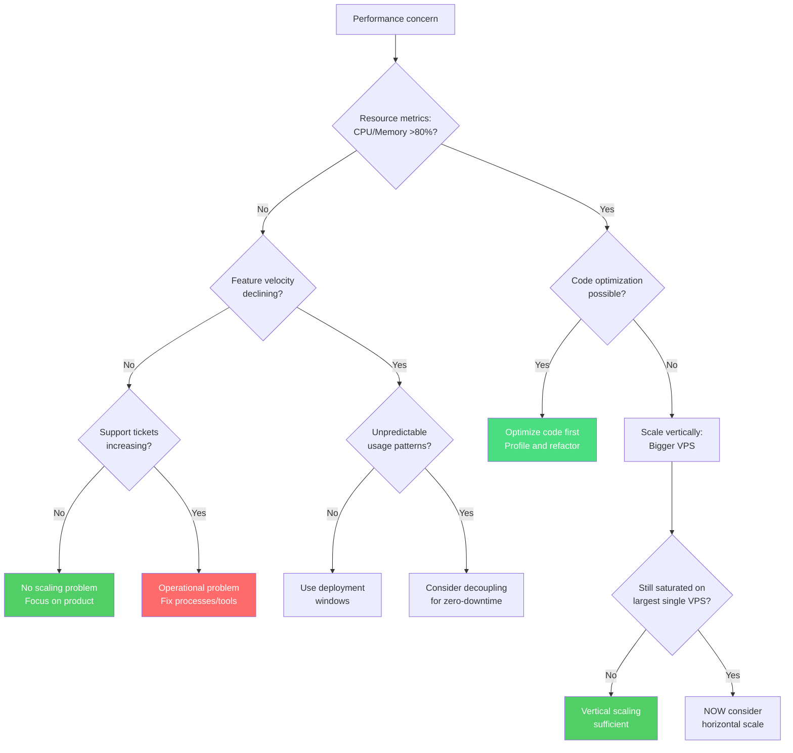

European B2B SaaS startups waste between 10% and 90% of their runway on infrastructure they don't need. They scale complexity instead of value delivery, burning cash on solutions designed for companies 100x their size. (We covered the [macro trend of cloud repatriation](/blog/cloud-repatriation-2025-data/) in a previous article.)

After analyzing patterns across 50+ infrastructure assessments, I've found that matching infrastructure spending to actual revenue—not imagined scale—can reduce costs by 60-70% while improving performance.

The framework below shows exactly what infrastructure you need at each stage of growth. It's based on a simple principle: start at €8/month and only add complexity when specific business triggers demand it.

## The Revenue-Based Infrastructure Framework

| Typical Setup | When to Upgrade | Acceptable Downtime | Approx. Monthly Cost |
|---------------|-----------------|---------------------|---------------------|
| **Small VPS (2-4 cores)**<br/>Everything coupled<br/><a href="https://docs.docker.com/compose/" target="_blank" rel="noopener">Docker Compose</a> | CPU/memory >80% sustained<br/>OR need faster deployments | 15-30 minutes | €8 |
| **Medium VPS (4-8 cores)**<br/>Add storage volumes<br/>Blue-green deployments | Deployment friction<br/>impacting feature velocity | 5 minutes | €15-20 |
| **Large VPS/Dedicated**<br/>Separate data layer<br/>Replication setup | Customer SLAs require<br/>higher availability | Seconds | €30-50 |
| **Self-hosted HA**<br/><a href="https://github.com/zalando/patroni" target="_blank" rel="noopener">Patroni</a> + <a href="https://pgbackrest.org/" target="_blank" rel="noopener">pgBackRest</a><br/>Automated failover | Multiple daily deploys<br/>Geographic distribution needs | Near-zero | €50-100 |
| **Managed services** | ALL these conditions:<br/>• DB costs >€2k/mo self-hosted<br/>• Contractual 99.95%+ SLA<br/>• SOC2/compliance required<br/>• No PostgreSQL expertise | Zero | €100+ |

Visualized another way—where should you be based on your revenue and reliability needs?

This isn't theoretical. <a href="https://twitter.com/levelsio" target="_blank" rel="noopener">Pieter Levels</a> runs Photo AI, generating $1.6M annually, on a single $40/month DigitalOcean VPS. Meanwhile, <a href="https://37signals.com/" target="_blank" rel="noopener">37signals</a> <a href="https://world.hey.com/dhh/we-stand-to-save-7m-over-five-years-from-our-cloud-exit-53996caa" target="_blank" rel="noopener">moved from $3.2M yearly AWS spending to self-hosted hardware</a> and saved $7M over five years. The pattern is consistent: actual infrastructure needs rarely match what cloud providers suggest you need.

## Why Startups Over-Engineer Their Infrastructure

Three psychological forces push teams toward premature complexity:

**Fear of Success**: "What if we're featured on TechCrunch tomorrow?" drives architectural decisions more than actual traffic patterns. Teams build for imaginary 10x growth while their current infrastructure runs at 20% capacity. Reality: you can scale a VPS from 2 to 32 cores in under 5 minutes when traffic actually arrives. Building for phantom load is like buying a warehouse before you have inventory.

**Cargo Cult Architecture**: Startups with 5 engineers implement microservices because Netflix has them. But Netflix has 2,500+ engineers who would otherwise create merge conflicts every hour. Their solutions solve problems you don't have. Each microservice you add increases operational overhead by roughly 20%—measured in deployment time, debugging complexity, and coordination cost. (We explored this trap in detail in [our Docker Swarm analysis](/blog/docker-swarm-test-11-euro-lesson/).)

**Misdiagnosing the Problem**: This pattern kills more startups than the others—and I was part of one. I helped a B2B API integrator set up what we thought was "enterprise-grade infrastructure" to handle their massive growth. We built a complex architecture on Kubernetes with serverless layers split across US and EU regions, multiple worker services, and elaborate observability setups.

The architecture itself wasn't wrong—it was the cloud implementation that became unmanageable (serverless connectors, network configurations, database certificates, VPC peering). Six months later, engineers spent more time navigating the infrastructure maze than shipping features. Teams were burning out from constant firefighting. The real bottleneck? Customer support was drowning—not from load, but from bugs that took days to fix because every change required coordinating across services. Looking back, I wish I had pushed for a simpler approach. A single large VPS could have handled their actual load while letting them ship fixes in hours instead of days.

I saw the same pattern at another startup burning €6,000 monthly on AWS with genuinely minimal concurrent usage. They'd accumulated multiple RDS instances, each "prepared for scale," in regions they didn't serve. The team had internalized that high infrastructure costs were table stakes for a "real" startup. A single €28/month VPS could have handled their actual load with better performance—but nobody questioned the assumptions until the runway was gone.

## Understanding the Three Dimensions of Scaling

Before diving into specifics, scaling happens across three interconnected dimensions:

1. **Hardware scaling** - Matching computational resources to actual load
2. **Architecture scaling** - Deciding when to decouple components
3. **Operational scaling** - Your team's ability to ship features and debug issues

Ignoring any dimension creates the dysfunctions described above. Let's examine each in detail.

### Dimension 1: Hardware Scaling Along the Revenue Path

Based on patterns from real deployments, here's how infrastructure naturally evolves with business growth:

#### Stage 1: Launch (€8/mo) — Accept Maintenance Windows

```text
┌─────────────────────────────────────────────────────┐
│         Single VPS - 2 vCPU, 4GB RAM (€8/mo)        │
│  ┌─────────────┐  ┌─────────────┐  ┌────────────┐   │
│  │ App + Worker│  │ PostgreSQL  │  │Redis/Valkey│   │
│  └─────────────┘  └─────────────┘  └────────────┘   │
│                    ┌────────────┐                   │
│                    │ Monitoring │                   │
│                    └────────────┘                   │
└─────────────────────────────────────────────────────┘
```

**Who this fits**: Pre-revenue startups, MVP validation, first 10-100 customers who understand you're still building.

**Upgrade process**: Email customers about a 15-30 minute maintenance window, stop services, backup data (pg_dump + Redis AOF), resize VPS, restart. <a href="https://www.hetzner.com/cloud" target="_blank" rel="noopener">Hetzner</a> allows online resizing—the actual downtime is just service restart time.

**When to upgrade**: Sustained CPU usage above 80%, memory pressure causing swapping, or deployment downtime starts blocking feature releases.

#### Stage 2: Growing (€15-20/mo) — Volumes Enable Fast Recovery

```text
┌───────────────────────────────────────────────────────────────┐
│                Infrastructure - €15-20/mo total               │
│                                                               │
│  ┌─────────────────────────────┐  ┌────────────────────────┐  │
│  │ Application VPS (€7.59/mo)  │  │ Hetzner Volume (€2-5)  │  │
│  │      4 vCPU, 8GB RAM        │  │                        │  │
│  │  ┌───────────┐ ┌─────────┐  │  │  ┌──────────────────┐  │  │
│  │  │App+ Worker│ │Monitor  │  │─▶│  │ PostgreSQL Data  │  │  │
│  │  └───────────┘ └─────────┘  │  │  │ Redis Snapshots  │  │  │
│  │                             │  │  └──────────────────┘  │  │
│  └─────────────────────────────┘  └────────────────────────┘  │
└───────────────────────────────────────────────────────────────┘
```

**Who this fits**: First paying customers, €1-10k monthly revenue, basic SLA expectations forming.

**Key improvement**: Separating data from compute via volumes means upgrades take 5 minutes: stop services, detach volume, create new VPS, attach volume, start. Your data persists independently.

**Real performance**: This setup handles 484-500 requests per second sustained, sufficient for most B2B SaaS products under €50k MRR.

#### Stage 3: Serious Revenue (€30-50/mo) — Zero-Downtime Application Deploys

```text
┌─────────────────────────────────────────────────────────────────────────┐
│                    Infrastructure - €30-50/mo total                     │
│                                                                         │
│  ┌─────────────────────────────┐     ┌─────────────────────────────┐    │
│  │  App VPS - €14.90/mo        │     │  Data VPS - €7.59/mo        │    │
│  │  8 vCPU, 16GB RAM           │     │  4 vCPU, 8GB RAM            │    │
│  │                             │     │                             │    │
│  │  ┌─────────┐ ┌─────────┐    │     │  ┌─────────────────────┐    │    │
│  │  │   App   │ │ Workers │    │────▶│  │     PostgreSQL      │    │    │
│  │  └─────────┘ └─────────┘    │     │  └─────────────────────┘    │    │
│  │  ┌─────────────────────┐    │     │  ┌─────────────────────┐    │    │
│  │  │   Reverse Proxy     │    │────▶│  │   Redis + AOF       │    │    │
│  │  └─────────────────────┘    │     │  └─────────────────────┘    │    │
│  │                             │     │  ┌─────────────────────┐    │    │
│  │                             │     │  │   Backup Volumes    │    │    │
│  │                             │     │  └─────────────────────┘    │    │
│  └─────────────────────────────┘     └─────────────────────────────┘    │
└─────────────────────────────────────────────────────────────────────────┘
```

**Who this fits**: €10-100k monthly revenue, real customer SLAs, cannot afford extended downtime.

**Zero-downtime app deployments**: Spin up new app VPS, health check, switch traffic, terminate old VPS. The data layer remains untouched.

**Data layer updates**: <a href="https://www.postgresql.org/docs/current/high-availability.html" target="_blank" rel="noopener">PostgreSQL streaming replication</a> to new instance, promote replica, switch connection strings. Downtime measured in seconds for connection switchover.

#### Stage 3.5: Self-Hosted HA (€50-100/mo) — Before Managed Services

```text
┌─────────────────────────────────────────────────────────────────────────┐
│                  HA Infrastructure - €50-100/mo total                   │
│                                                                         │
│  ┌─────────────────────────────┐     ┌─────────────────────────────┐    │
│  │     Application Layer       │     │   Data Layer with HA        │    │
│  │                             │     │                             │    │
│  │  ┌─────────┐ ┌─────────┐    │     │  ┌─────────────────────┐    │    │
│  │  │   App   │ │   App   │    │────▶│  │ PostgreSQL + Patroni│    │    │
│  │  │ Primary │ │ Standby │    │     │  └─────────────────────┘    │    │
│  │  └─────────┘ └─────────┘    │     │            │                │    │
│  │        │          │         │     │            ▼                │    │
│  │        │          │         │     │  ┌─────────────────────┐    │    │
│  │        └──────────┼─────────│────▶│  │  pgBackRest Backups │    │    │
│  │                   │         │     │  └─────────────────────┘    │    │
│  │                   │         │     │  ┌─────────────────────┐    │    │
│  │                   └─────────│────▶│  │   Redis Sentinel    │    │    │
│  │                             │     │  └─────────────────────┘    │    │
│  └─────────────────────────────┘     └─────────────────────────────┘    │
└─────────────────────────────────────────────────────────────────────────┘
```

**Who this fits**: €100-500k monthly revenue, needing high availability without managed service premiums.

**Key tools**:
- <a href="https://github.com/zalando/patroni" target="_blank" rel="noopener">Patroni</a> for PostgreSQL automatic failover
- <a href="https://pgbackrest.org/" target="_blank" rel="noopener">pgBackRest</a> for point-in-time recovery
- <a href="https://redis.io/docs/latest/operate/oss_and_stack/management/sentinel/" target="_blank" rel="noopener">Redis Sentinel</a> for cache layer redundancy
- Automated health checks and failover scripts

**Maintenance reality**: Despite the complexity, this setup requires ~30 minutes monthly maintenance once stable.

#### Stage 4: Conditional Complexity (€100+/mo) — Only When Triggered

Managed services aren't triggered by revenue alone. You need **ALL** of these conditions—not one or two, but every single one:
- Database operational costs exceed €2k/month self-hosted
- Customers contractually require 99.95%+ SLA or SOC2 certification
- Data residency regulations apply (government contracts, healthcare)
- Your team genuinely lacks PostgreSQL/Linux expertise

If you're missing even one condition, you're likely paying a premium for capabilities you don't need.

**Cost reality**: <a href="https://aws.amazon.com/rds/postgresql/pricing/" target="_blank" rel="noopener">AWS RDS</a> advertises at $379/month but actually costs $864+ with storage, backups, and Multi-AZ. A comparable <a href="https://www.hetzner.com/cloud" target="_blank" rel="noopener">Hetzner</a> dedicated server (32 cores, 256GB RAM) costs €513/month—8x the resources for 40% less.

### Dimension 2: Architecture Evolution - The Stateful Services Challenge

The core challenge in architecture scaling revolves around stateful services—components that hold data you can't lose. Your application code can restart anytime without consequence. Your database cannot. This fundamental difference drives most architectural decisions.

**Understanding the Problem**: Imagine your application as a restaurant. The kitchen (stateless application) can close and reopen—you just remake any in-progress orders. But the inventory system (database) must maintain perfect records of what's in stock, what's been ordered, and what's been paid for. Losing this state means business chaos.

**Starting Point - Coupled Architecture**:
Everything runs together on one machine. Simple to understand, debug, and deploy. Like a food truck where cooking and storage happen in the same vehicle. Perfect for starting out.

**Evolution - Decoupled Architecture**:
Separate the kitchen from the warehouse. Now you can upgrade your cooking equipment without touching inventory. But you've added complexity: delivery trucks between locations, coordination overhead, more points of failure.

**Decouple only when**:
- Your customers use the system at unpredictable times across timezones (can't schedule maintenance)
- Different components need fundamentally different resources (database needs memory, app needs CPU)
- Deployment frequency exceeds what maintenance windows allow
- Team members specialize in different layers

**Stay coupled when**:
- You can schedule maintenance windows your customers accept
- The operational overhead of distribution exceeds its benefits
- Your load is under 1,000 requests per second
- Simplicity helps your team move faster

### Dimension 3: Operational Scaling - The Hidden Multiplier

Operational scaling often matters more than raw infrastructure. It's the difference between a team that ships fearlessly and one paralyzed by their own creation. This hidden cost compounds: engineering time spent on infrastructure is runway not spent on product.

**High-velocity indicators**:
- Deployment takes one command and completes in under 10 minutes
- Debugging production issues takes minutes, not hours
- One engineer manages infrastructure part-time
- New features go from idea to production in days

**Low-velocity warning signs**:
- Deployments require multiple people and scheduled meetings
- Debugging requires correlating logs across multiple services and time zones
- Infrastructure work consumes multiple full-time engineers
- New features take weeks because they touch multiple services

The B2B API integrator mentioned earlier exemplifies operational scaling failure. They had beautiful architecture diagrams and "enterprise-grade" everything. But when something broke at 3 AM, it took three engineers four hours to trace through Lambda functions, API gateways, event buses, and multi-region databases to find a simple configuration error. Their sophisticated setup became a liability that burned out the team.

## The Diagnostic Framework

When someone says "we need to scale," they usually mean "something feels slow or broken." This framework helps identify the real constraint:




Most teams discover they face operational problems, not scaling problems. But here's the crucial question: why does your code need so much power? A single large VPS (16 vCPU, 32GB RAM) handles approximately 1,500-2,000 requests per second—more traffic than most startups see before Series A. If you're struggling with less, the problem might be your code, not your infrastructure.

## Common Traps and How to Avoid Them

**Trap 1: "We're growing fast, we need Kubernetes"**
Growing from 100 to 1,000 customers feels like hypergrowth. It's not—at least not from an infrastructure perspective. Monitor actual resource usage, not customer count. Until you consistently see CPU above 80% or memory pressure causing swapping, you're solving imaginary problems.

**Trap 2: "Microservices give us flexibility"**
Every service boundary you create adds operational tax: separate deployments, API versioning, distributed debugging, data consistency challenges. Start monolithic and extract services only when teams genuinely can't work together efficiently. Even then, consider modular monoliths before full service separation. (We covered why monoliths beat microservices for most startups in [our Docker Swarm deep dive](/blog/docker-swarm-test-11-euro-lesson/).)

**Trap 3: "Managed services eliminate operations"**
They eliminate some operations and add others. You trade server patching for cost optimization, capacity planning, and vendor lock-in. Calculate the true total cost: that $379/month RDS instance becomes $864+ after storage, backups, IOPS, and Multi-AZ. Self-hosted PostgreSQL on equivalent hardware costs 60-80% less and performs better.

**Trap 4: "We need a data warehouse from day one"**
Your PostgreSQL database can handle analytical queries just fine until you have millions of records. Adding a separate analytical system before you need it means maintaining ETL pipelines, dealing with data synchronization, and debugging why your dashboards show different numbers than your application. Wait until queries actually slow down production.

**Trap 5: "Infrastructure complexity shows maturity"**
Some of the most successful companies run surprisingly simple setups. <a href="https://stackoverflow.blog/2022/03/14/how-stack-overflow-uses-net-and-azure/" target="_blank" rel="noopener">Stack Overflow</a> served 100+ million developers on 9 web servers. WhatsApp handled 900 million users with 32 engineers. Complexity isn't sophistication—it's often a failure to find simple solutions.

---

The traps above aren't hypothetical—I've seen each one drain runway from promising startups. The good news: they're all fixable. Here's how to figure out where you stand.

## Taking Action: Assess Your Current State

Understanding where you stand helps identify optimization opportunities:

**1. Calculate your infrastructure burden**:
If you're spending €1,000/month on infrastructure while making €20,000/month revenue, that's 5%—seems healthy, right? But if you're in the cloud, you're likely still overpaying by 60-70%. That €1,000 could be €300-400 for better performance. That's €7,200/year back in your pocket—enough to fund a contractor for a month or run experiments your competitors can't afford.

If you're spending €5,000/month while making €10,000/month, that's 50%—you're hemorrhaging runway on complexity that should be funding customer acquisition. Every month you delay optimization, your competitor with leaner infrastructure gains ground.

**2. Measure operational velocity (the hidden cost)**:
- How long from code commit to production deployment?
- How many people must coordinate for a release?
- How quickly can you trace a production error?
- What percentage of engineering time goes to infrastructure?

Every hour spent on infrastructure complexity is an hour not spent on product. At €100/hour engineering cost, a team spending 20% of time on ops burns €3,200/month just in opportunity cost.

**3. Check utilization reality (or just use proper observability)**:
```bash
# Quick server check
top          # Is CPU actually constrained?
free -h      # Is memory under pressure?
df -h        # Is disk space an issue?
netstat -i   # Is network saturated?

# Or better: proper monitoring with Prometheus/Grafana
# Shows trends, not just snapshots
```

If none show constraints, you don't have a scaling problem.

**4. Map against the framework**:
Where does your current setup place you? Are you running Stage 4 infrastructure with Stage 2 revenue? That gap represents runway you could reclaim.

Most teams discover they're 1-2 stages ahead of where economics justify. A startup spending €8,000/month on distributed services while serving dozens of customers isn't "prepared for scale"—they're burning runway on complexity that actively slows product development.

> **Key insight: Each stage funds the next level of reliability. Don't pay for Stage 4 architecture at Stage 1 revenue.**

## What We're Doing

If you're spending €3k–15k/month on cloud infrastructure and wondering whether there's a simpler path, we're running focused **72-hour infrastructure audits** to map out your options. No commitment, just data.

**→ [Request an infrastructure audit](https://raus.cloud)**

<div style="text-align: center; margin: 3rem 0;">
  <a href="https://cal.com/eduardosanzb/15min" target="_blank" rel="noopener" style="display: inline-block; background: linear-gradient(135deg, #10b981 0%, #059669 100%); color: white; padding: 1rem 2.5rem; border-radius: 0.5rem; font-weight: 600; font-size: 1.125rem; text-decoration: none; box-shadow: 0 4px 6px rgba(16, 185, 129, 0.25); transition: transform 0.2s, box-shadow 0.2s;" onmouseover="this.style.transform='translateY(-2px)'; this.style.boxShadow='0 6px 12px rgba(16, 185, 129, 0.35)';" onmouseout="this.style.transform='translateY(0)'; this.style.boxShadow='0 4px 6px rgba(16, 185, 129, 0.25)';">
    Book Your Free Infrastructure Audit
  </a>
  <p style="margin-top: 1rem; color: #6b7280; font-size: 0.875rem;">15-minute call • No sales pitch • Honest assessment</p>
</div>

---

*Eduardo runs [raus.cloud](https://raus.cloud), helping European B2B SaaS companies cut infrastructure costs by 60-70% through sustainable architectures. This framework emerged from patterns observed across 50+ infrastructure assessments.*
