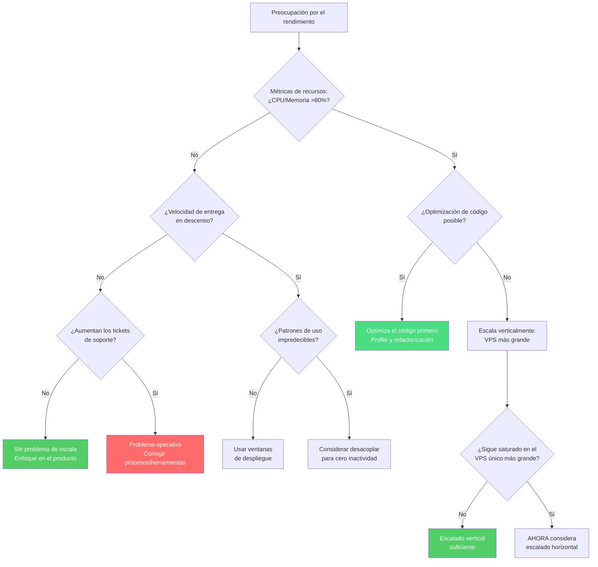

Las startups SaaS B2B europeas desperdician entre el 10% y el 90% de su capital en infraestructura que no necesitan. Escalan la complejidad en lugar de la entrega de valor, quemando dinero en soluciones diseñadas para empresas 100 veces su tamaño. (Cubrimos la [tendencia macro de la repatriación de la nube](/es/blog/cloud-repatriation-2025-data/) en un artículo anterior).

Después de analizar patrones en más de 50 evaluaciones de infraestructura, he descubierto que ajustar el gasto en infraestructura a los ingresos reales —no a una escala imaginaria— puede reducir los costes entre un 60% y un 70%, al tiempo que mejora el rendimiento.

El siguiente marco de trabajo muestra exactamente qué infraestructura necesitas en cada etapa de crecimiento. Se basa en un principio simple: empieza con 8 €/mes y solo añade complejidad cuando los disparadores comerciales específicos lo exijan.

## El marco de trabajo de infraestructura basado en ingresos

| Configuración típica | Cuándo actualizar | Tiempo de inactividad aceptable | Coste mensual aprox. |
|---------------|-----------------|---------------------|---------------------|
| **VPS pequeño (2-4 núcleos)**<br/>Todo acoplado<br/><a href="https://docs.docker.com/compose/" target="_blank" rel="noopener">Docker Compose</a> | CPU/memoria >80% sostenido<br/>O necesidad de despliegues más rápidos | 15-30 minutos | 8 € |
| **VPS mediano (4-8 núcleos)**<br/>Añadir volúmenes de almacenamiento<br/>Despliegues Blue-green | La fricción en el despliegue<br/>afecta a la velocidad de entrega | 5 minutos | 15-20 € |
| **VPS grande/Dedicado**<br/>Capa de datos separada<br/>Configuración de replicación | Los SLA de los clientes requieren<br/>mayor disponibilidad | Segundos | 30-50 € |
| **Alta disponibilidad (HA) autogestionada**<br/><a href="https://github.com/zalando/patroni" target="_blank" rel="noopener">Patroni</a> + <a href="https://pgbackrest.org/" target="_blank" rel="noopener">pgBackRest</a><br/>Failover automático | Múltiples despliegues diarios<br/>Necesidad de distribución geográfica | Casi cero | 50-100 € |
| **Servicios gestionados** | TODAS estas condiciones:<br/>• Costes de DB >2k €/mes autogestionada<br/>• SLA contractual de +99,95%<br/>• Requisito de SOC2/cumplimiento<br/>• Sin experiencia en PostgreSQL | Cero | +100 € |

Visualizado de otra manera: ¿dónde deberías estar según tus ingresos y necesidades de fiabilidad?

Esto no es teórico. <a href="https://twitter.com/levelsio" target="_blank" rel="noopener">Pieter Levels</a> opera Photo AI, que genera 1,6 millones de dólares anuales, en un único VPS de DigitalOcean de 40 $/mes. Mientras tanto, <a href="https://37signals.com/" target="_blank" rel="noopener">37signals</a> <a href="https://world.hey.com/dhh/we-stand-to-save-7m-over-five-years-from-our-cloud-exit-53996caa" target="_blank" rel="noopener">pasó de un gasto anual de 3,2 millones de dólares en AWS a hardware autogestionado</a>, ahorrando 7 millones de dólares en cinco años. El patrón es consistente: las necesidades reales de infraestructura rara vez coinciden con lo que los proveedores de nube sugieren que necesitas.

## Por qué las startups sobre-dimensionan su infraestructura

Tres fuerzas psicológicas empujan a los equipos hacia una complejidad prematura:

**Miedo al éxito**: "¿Qué pasa si mañana aparecemos en TechCrunch?" impulsa decisiones arquitectónicas más que los patrones de tráfico reales. Los equipos construyen para un crecimiento imaginario de 10x mientras su infraestructura actual funciona al 20% de su capacidad. Realidad: puedes escalar un VPS de 2 a 32 núcleos en menos de 5 minutos cuando el tráfico realmente llegue. Construir para una carga fantasma es como comprar un almacén antes de tener inventario.

**Arquitectura de culto al cargo**: Startups con 5 ingenieros implementan microservicios porque Netflix los tiene. Pero Netflix tiene más de 2.500 ingenieros que, de lo contrario, crearían conflictos de fusión cada hora. Sus soluciones resuelven problemas que tú no tienes. Cada microservicio que añades aumenta la sobrecarga operativa en aproximadamente un 20%, medido en tiempo de despliegue, complejidad de depuración y coste de coordinación. (Exploramos esta trampa en detalle en [nuestro análisis de Docker Swarm](/es/blog/docker-swarm-test-11-euro-lesson/).)

**Diagnóstico erróneo del problema**: Este patrón acaba con más startups que los demás — y yo fui parte de una. Ayudé a un integrador de API B2B a configurar lo que pensábamos que era "infraestructura de nivel empresarial" para manejar su crecimiento masivo. Construimos una arquitectura compleja en Kubernetes con capas serverless divididas entre regiones de EE. UU. y la UE, múltiples servicios de workers y configuraciones de observabilidad elaboradas.

La arquitectura en sí no era incorrecta, fue la implementación en la nube lo que se volvió inmanejable (conectores serverless, configuraciones de red, certificados de base de datos, peering de VPC). Seis meses después, los ingenieros pasaban más tiempo navegando por el laberinto de la infraestructura que lanzando funcionalidades. Los equipos estaban agotados por apagar incendios constantes. ¿El verdadero cuello de botella? La atención al cliente estaba desbordada, no por la carga, sino por errores que tardaban días en solucionarse porque cada cambio requería coordinación entre servicios. Mirando hacia atrás, desearía haber impulsado un enfoque más simple. Un solo VPS grande podría haber manejado su carga real permitiéndoles lanzar correcciones en horas en lugar de días.

Vi el mismo patrón en otra startup que gastaba 6.000 € mensuales en AWS con un uso concurrente genuinamente mínimo. Habían acumulado múltiples instancias de RDS, cada una "preparada para escalar", en regiones a las que no daban servicio. El equipo había interiorizado que los altos costes de infraestructura eran el precio de entrada para una startup "real". Un solo VPS de 28 €/mes podría haber manejado su carga real con un mejor rendimiento, pero nadie cuestionó las suposiciones hasta que se acabó el capital. Eso son 8 meses de vida de la empresa que podrían haber extendido a más de 24 meses con la misma velocidad de desarrollo.

## Comprendiendo las tres dimensiones del escalado

Antes de entrar en detalles, el escalado ocurre en tres dimensiones interconectadas:

1. **Escalado de hardware**: Ajustar los recursos computacionales a la carga real.
2. **Escalado de arquitectura**: Decidir cuándo desacoplar componentes.
3. **Escalado operativo**: La capacidad de tu equipo para lanzar funcionalidades y depurar problemas.

Ignorar cualquier dimensión crea las disfunciones descritas anteriormente. Examinemos cada una en detalle.

### Dimensión 1: Escalado de hardware a lo largo del camino de los ingresos

Basándonos en patrones de despliegues reales, así evoluciona naturalmente la infraestructura con el crecimiento del negocio:

#### Etapa 1: Lanzamiento (8 €/mes) — Acepta ventanas de mantenimiento

```text
┌─────────────────────────────────────────────────────┐
│       VPS único - 2 vCPU, 4GB RAM (8 €/mes)         │
│  ┌─────────────┐  ┌─────────────┐  ┌────────────┐   │
│  │ App + Worker│  │ PostgreSQL  │  │Redis/Valkey│   │
│  └─────────────┘  └─────────────┘  └────────────┘   │
│                    ┌────────────┐                   │
│                    │ Monitoriz. │                   │
│                    └────────────┘                   │
└─────────────────────────────────────────────────────┘
```

**Para quién es**: Startups antes de generar ingresos, validación de MVP, primeros 10-100 clientes que entienden que todavía estás construyendo.

**Proceso de actualización**: Avisar a los clientes por correo sobre una ventana de mantenimiento de 15-30 minutos, detener servicios, hacer copia de seguridad de los datos (pg_dump + Redis AOF), redimensionar el VPS, reiniciar. <a href="https://www.hetzner.com/cloud" target="_blank" rel="noopener">Hetzner</a> permite el redimensionamiento online; el tiempo de inactividad real es solo el tiempo de reinicio del servicio.

**Cuándo actualizar**: Uso sostenido de la CPU por encima del 80%, presión de memoria que causa swapping, o cuando el tiempo de inactividad por despliegue empieza a bloquear el lanzamiento de funcionalidades.

#### Etapa 2: Crecimiento (15-20 €/mes) — Los volúmenes permiten una recuperación rápida

```text
┌───────────────────────────────────────────────────────────────┐
│               Infraestructura - 15-20 €/mes total             │
│                                                               │
│  ┌─────────────────────────────┐  ┌────────────────────────┐  │
│  │ VPS Aplicación (7,59 €/mes)  │  │ Volumen Hetzner (2-5 €)│  │
│  │      4 vCPU, 8GB RAM        │  │                        │  │
│  │  ┌───────────┐ ┌─────────┐  │  │  ┌──────────────────┐  │  │
│  │  │App+ Worker│ │Monitor  │  │─▶│  │ Datos PostgreSQL │  │  │
│  │  └───────────┘ └─────────┘  │  │  │ Snapshots Redis  │  │  │
│  │                             │  │  └──────────────────┘  │  │
│  └─────────────────────────────┘  └────────────────────────┘  │
└───────────────────────────────────────────────────────────────┘
```

**Para quién es**: Primeros clientes de pago, ingresos mensuales de 1k-10k €, empiezan a formarse expectativas básicas de SLA.

**Mejora clave**: Separar los datos del cómputo a través de volúmenes significa que las actualizaciones llevan 5 minutos: detener servicios, desconectar volumen, crear nuevo VPS, conectar volumen, iniciar. Tus datos persisten de forma independiente.

**Rendimiento real**: Esta configuración maneja 484-500 solicitudes por segundo de forma sostenida para cargas de trabajo típicas de SaaS B2B (mezcla de lectura/escritura, consultas moderadas a la base de datos), suficiente para la mayoría de los productos con menos de 50k € de MRR (ingresos mensuales recurrentes). Tu rendimiento específico variará según la eficiencia de la aplicación y la complejidad de las consultas.

#### Etapa 3: Ingresos serios (30-50 €/mes) — Despliegues de aplicación sin tiempo de inactividad

```text
┌─────────────────────────────────────────────────────────────────────────┐
│                   Infraestructura - 30-50 €/mes total                   │
│                                                                         │
│  ┌─────────────────────────────┐     ┌─────────────────────────────┐    │
│  │  VPS App - 14,90 €/mes       │     │  VPS Datos - 7,59 €/mes      │    │
│  │  8 vCPU, 16GB RAM           │     │  4 vCPU, 8GB RAM            │    │
│  │                             │     │                             │    │
│  │  ┌─────────┐ ┌─────────┐    │     │  ┌─────────────────────┐    │    │
│  │  │   App   │ │ Workers │    │────▶│  │     PostgreSQL      │    │    │
│  │  └─────────┘ └─────────┘    │     │  └─────────────────────┘    │    │
│  │  ┌─────────────────────┐    │     │  ┌─────────────────────┐    │    │
│  │  │   Proxy Inverso     │    │────▶│  │   Redis + AOF       │    │    │
│  │  └─────────────────────┘    │     │  └─────────────────────┘    │    │
│  │                             │     │  ┌─────────────────────┐    │    │
│  │                             │     │  │  Volúmenes Backup   │    │    │
│  │                             │     │  └─────────────────────┘    │    │
│  └─────────────────────────────┘     └─────────────────────────────┘    │
└─────────────────────────────────────────────────────────────────────────┘
```

**Para quién es**: 10k-100k € de ingresos mensuales, SLA reales con clientes, no se puede permitir tiempos de inactividad prolongados.

**Despliegues de app sin tiempo de inactividad**: Activar un nuevo VPS de app, comprobar salud, desviar tráfico, terminar el VPS antiguo. La capa de datos permanece intacta. Nota: Requiere una estrategia de gestión de sesiones (tokens sin estado, sesiones pegajosas o almacén de sesiones) para manejar las conexiones activas de los usuarios durante el cambio.

**Actualizaciones de la capa de datos**: <a href="https://www.postgresql.org/docs/current/high-availability.html" target="_blank" rel="noopener">Replicación en streaming de PostgreSQL</a> a una nueva instancia, promover la réplica, cambiar las cadenas de conexión. El tiempo de inactividad se mide en segundos para el cambio de conexión.

#### Etapa 3.5: Alta Disponibilidad (HA) autogestionada (50-100 €/mes) — Antes de los servicios gestionados

```text
┌─────────────────────────────────────────────────────────────────────────┐
│                 Infraestructura HA - 50-100 €/mes total                 │
│                                                                         │
│  ┌─────────────────────────────┐     ┌─────────────────────────────┐    │
│  │     Capa de Aplicación      │     │    Capa de Datos con HA     │    │
│  │                             │     │                             │    │
│  │  ┌─────────┐ ┌─────────┐    │     │  ┌─────────────────────┐    │    │
│  │  │   App   │ │   App   │    │────▶│  │ PostgreSQL + Patroni│    │    │
│  │  │ Principal │ │ Secundaria│    │     │  └─────────────────────┘    │    │
│  │  └─────────┘ └─────────┘    │     │            │                │    │
│  │        │          │         │     │            ▼                │    │
│  │        │          │         │     │  ┌─────────────────────┐    │    │
│  │        └──────────┼─────────│────▶│  │  Backups pgBackRest │    │    │
│  │                   │         │     │  └─────────────────────┘    │    │
│  │                   │         │     │  ┌─────────────────────┐    │    │
│  │                   └─────────│────▶│  │   Redis Sentinel    │    │    │
│  │                             │     │  └─────────────────────┘    │    │
│  └─────────────────────────────┘     └─────────────────────────────┘    │
└─────────────────────────────────────────────────────────────────────────┘
```

**Para quién es**: 100k-500k € de ingresos mensuales, necesidad de alta disponibilidad sin pagar los sobrecostes de los servicios gestionados.

**Herramientas clave**:
- <a href="https://github.com/zalando/patroni" target="_blank" rel="noopener">Patroni</a> para el failover automático de PostgreSQL.
- <a href="https://pgbackrest.org/" target="_blank" rel="noopener">pgBackRest</a> para la recuperación en un punto en el tiempo.
- <a href="https://redis.io/docs/latest/operate/oss_and_stack/management/sentinel/" target="_blank" rel="noopener">Redis Sentinel</a> para la redundancia de la capa de caché.
- Scripts de comprobación de salud y failover automatizados.

**Realidad del mantenimiento**: A pesar de la complejidad, esta configuración requiere entre 30 y 60 minutos de mantenimiento mensual una vez estabilizada. El periodo inicial de estabilización (primeros 2-3 meses) requiere un ajuste y monitorización más manual.

#### Etapa 4: Complejidad condicional (+100 €/mes) — Solo cuando se dispare

Los servicios gestionados no se activan solo por los ingresos. Necesitas **TODAS** estas condiciones, ni una ni dos, sino todas y cada una:
- Los costes operativos de la base de datos superan los 2.000 €/mes autogestionada.
- Los clientes exigen contractualmente un SLA del +99,95% o certificación SOC2.
- Se aplican normativas de residencia de datos (contratos gubernamentales, sanidad).
- Tu equipo carece genuinamente de experiencia en PostgreSQL/Linux.

Si te falta siquiera una condición, probablemente estés pagando un sobrecoste por capacidades que no necesitas. No se trata de capacidad técnica, sino de gestión de riesgos. Los servicios gestionados intercambian dinero por una reducción del riesgo operativo y la carga de cumplimiento. Ese intercambio tiene sentido cuando tu modelo de negocio lo exige, no antes.

**Realidad de costes**: <a href="https://aws.amazon.com/rds/postgresql/pricing/" target="_blank" rel="noopener">AWS RDS</a> se anuncia a 379 $/mes (precio base db.r5.xlarge) pero en realidad cuesta +864 $ cuando añades los esenciales de producción: 500GB de almacenamiento (115 $), almacenamiento de backups (50 $), IOPS provisionados (200 $) y redundancia Multi-AZ (120 $). Un servidor dedicado comparable de <a href="https://www.hetzner.com/cloud" target="_blank" rel="noopener">Hetzner</a> (32 núcleos, 256GB de RAM) cuesta 513 €/mes: 8 veces más recursos por un 40% menos.

### Dimensión 2: Evolución de la arquitectura - El desafío de los servicios con estado

El desafío central en el escalado de la arquitectura gira en torno a los servicios con estado (stateful): componentes que contienen datos que no puedes perder. El código de tu aplicación puede reiniciarse en cualquier momento sin consecuencias. Tu base de datos no. Esta diferencia fundamental impulsa la mayoría de las decisiones arquitectónicas.

**Entendiendo el problema**: Imagina tu aplicación como un restaurante. La cocina (aplicación sin estado) puede cerrar y volver a abrir; simplemente vuelves a preparar cualquier pedido en curso. Pero el sistema de inventario (base de datos) debe mantener registros perfectos de lo que hay en stock, lo que se ha pedido y lo que se ha pagado. Perder este estado significa el caos para el negocio.

**Punto de partida - Arquitectura acoplada**:
Todo se ejecuta junto en una sola máquina. Simple de entender, depurar y desplegar. Como un food truck donde la cocina y el almacenamiento están en el mismo vehículo. Perfecto para empezar.

**Evolución - Arquitectura desacoplada**:
Separar la cocina del almacén. Ahora puedes actualizar tu equipo de cocina sin tocar el inventario. Pero has añadido complejidad: camiones de reparto entre ubicaciones, sobrecarga de coordinación, más puntos de fallo.

**Desacopla solo cuando**:
- Tus clientes usen el sistema en horarios impredecibles en diferentes zonas horarias (no puedes programar mantenimiento).
- Diferentes componentes necesiten recursos fundamentalmente diferentes (la base de datos necesita memoria, la app necesita CPU).
- La frecuencia de despliegue supere lo que permiten las ventanas de mantenimiento.
- Los miembros del equipo se especialicen en diferentes capas.

**Mantente acoplado cuando**:
- Puedas programar ventanas de mantenimiento que tus clientes acepten.
- La sobrecarga operativa de la distribución supere sus beneficios.
- Tu carga sea inferior a 1.000 solicitudes por segundo.
- La simplicidad ayude a tu equipo a moverse más rápido.

### Dimensión 3: Escalado operativo - El multiplicador oculto

El escalado operativo a menudo importa más que la infraestructura pura. Es la diferencia entre un equipo que despliega sin miedo y uno paralizado por su propia creación. Este coste oculto se acumula: el tiempo de ingeniería dedicado a la infraestructura es tiempo que no se dedica al producto.

**Indicadores de alta velocidad**:
- El despliegue se hace con un comando y se completa en menos de 10 minutos.
- Depurar problemas de producción lleva minutos, no horas.
- Un ingeniero gestiona la infraestructura a tiempo parcial.
- Las nuevas funcionalidades pasan de idea a producción en días.

**Señales de advertencia de baja velocidad**:
- Los despliegues requieren varias personas y reuniones programadas.
- La depuración requiere correlacionar logs en múltiples servicios y zonas horarias.
- El trabajo de infraestructura consume a varios ingenieros a tiempo completo.
- Las nuevas funcionalidades tardan semanas porque tocan múltiples servicios.

El integrador de API B2B mencionado anteriormente ejemplifica el fallo en el escalado operativo. Tenían hermosos diagramas de arquitectura y todo era de "nivel empresarial". Pero cuando algo se rompía a las 3 de la mañana, tres ingenieros tardaban cuatro horas en rastrear funciones Lambda, API gateways, buses de eventos y bases de datos multiregión para encontrar un simple error de configuración. Su sofisticada configuración se convirtió en una carga que agotó al equipo y les costó dos clientes clave que no podían esperar a la solución.

## El marco de diagnóstico

Cuando alguien dice "necesitamos escalar", normalmente quiere decir "algo se siente lento o roto". Este marco ayuda a identificar la restricción real:



La mayoría de los equipos descubren que enfrentan problemas operativos, no de escala. Pero aquí está la pregunta crucial: ¿por qué tu código necesita tanta potencia? Un solo VPS grande (16 vCPU, 32GB RAM) maneja aproximadamente entre 1.500 y 2.000 solicitudes por segundo para aplicaciones bien optimizadas, más tráfico del que ven la mayoría de las startups antes de una Serie A. Si tienes problemas con mucho menos, perfila tu código primero. A menudo, una consulta de base de datos no optimizada o un problema de N+1 te cuesta 10 veces más de lo que costaría una mejor infraestructura.

## Trampas comunes y cómo evitarlas

**Trampa 1: "Estamos creciendo rápido, necesitamos Kubernetes"**
Crecer de 100 a 1.000 clientes parece un hipercrecimiento. No lo es, al menos no desde el punto de vista de la infraestructura. Monitoriza el uso real de recursos, no el número de clientes. Hasta que no veas consistentemente la CPU por encima del 80% o presión de memoria causando swapping, estás resolviendo problemas imaginarios.

**Trampa 2: "Los microservicios nos dan flexibilidad"**
Cada límite de servicio que creas añade un impuesto operativo: despliegues separados, versionado de API, depuración distribuida, desafíos de consistencia de datos. Empieza monolítico y extrae servicios solo cuando los equipos realmente no puedan trabajar juntos de forma eficiente. Incluso entonces, considera monolitos modulares antes de la separación total de servicios. (Cubrimos por qué los monolitos vencen a los microservicios para la mayoría de las startups en [nuestro análisis profundo de Docker Swarm](/es/blog/docker-swarm-test-11-euro-lesson/).)

**Trampa 3: "Los servicios gestionados eliminan las operaciones"**
Eliminan algunas operaciones y añaden otras. Cambias el parcheo de servidores por la optimización de costes, la planificación de capacidad y el bloqueo del proveedor. Calcula el coste total real: esa instancia RDS de 379 $/mes se convierte en +864 $ después de almacenamiento, backups, IOPS y Multi-AZ. PostgreSQL autogestionado en hardware equivalente cuesta entre un 60% y un 80% menos y rinde mejor.

**Trampa 4: "Necesitamos un almacén de datos (data warehouse) desde el primer día"**
Tu base de datos PostgreSQL puede manejar consultas analíticas perfectamente hasta que tengas millones de registros. Añadir un sistema analítico separado antes de necesitarlo significa mantener pipelines ETL, lidiar con la sincronización de datos y depurar por qué tus dashboards muestran números diferentes a los de tu aplicación. Espera hasta que las consultas realmente ralenticen la producción.

**Trampa 5: "La complejidad de la infraestructura muestra madurez"**
Algunas de las empresas más exitosas funcionan con configuraciones sorprendentemente simples. <a href="https://stackoverflow.blog/2022/03/14/how-stack-overflow-uses-net-and-azure/" target="_blank" rel="noopener">Stack Overflow</a> servía a más de 100 millones de desarrolladores con 9 servidores web. WhatsApp manejaba 900 millones de usuarios con 32 ingenieros. La complejidad no es sofisticación; a menudo es un fallo al encontrar soluciones simples.

---

Las trampas anteriores no son hipotéticas; he visto a cada una consumir el capital de startups prometedoras. La buena noticia: todas son solucionables. Aquí te explicamos cómo averiguar en qué situación te encuentras.

## Pasando a la acción: Evalúa tu estado actual

Entender dónde te encuentras ayuda a identificar oportunidades de optimización:

**1. Calcula tu carga de infraestructura**:
Si gastas 1.000 €/mes en infraestructura mientras generas 20.000 €/mes de ingresos, eso es un 5%, parece saludable, ¿verdad? Pero si estás en la nube, es probable que sigas pagando de más entre un 60% y un 70%. Esos 1.000 € podrían ser 300-400 € por un rendimiento equivalente o mejor. Eso son 7.200 € al año que vuelven a tu bolsillo, lo suficiente para financiar a un colaborador durante un mes o realizar experimentos que tus competidores no pueden permitirse. (Nota: asume características de carga de trabajo similares y una planificación de migración adecuada).

Si gastas 5.000 € mensuales mientras ingresas 10.000 €, eso es un 50%; estás perdiendo capital en una complejidad que debería estar financiando la adquisición de clientes. Cada mes que retrasas la optimización, tu competidor con una infraestructura más ligera gana terreno.

**2. Mide la velocidad operativa (el coste oculto)**:
- ¿Cuánto tiempo pasa desde el commit del código hasta el despliegue en producción?
- ¿Cuántas personas deben coordinarse para un lanzamiento?
- ¿Qué tan rápido puedes rastrear un error de producción?
- ¿Qué porcentaje del tiempo de ingeniería se dedica a la infraestructura?

Cada hora dedicada a la complejidad de la infraestructura es una hora que no se dedica al producto. Con un coste de ingeniería de 100 €/hora, un equipo que dedica el 20% de su tiempo a operaciones quema 3.200 €/mes solo en coste de oportunidad.

**3. Comprueba la realidad de la utilización**:
No adivines, mide. Conéctate por SSH a tu servidor y ejecuta estos comandos para ver el uso real de los recursos:
```bash
# Comprobación rápida del servidor
top          # ¿Está la CPU realmente limitada?
free -h      # ¿Hay presión de memoria?
df -h        # ¿Es un problema el espacio en disco?
netstat -i   # ¿Está saturada la red?

# O mejor: monitorización adecuada con Prometheus/Grafana
# Muestra tendencias, no solo instantáneas
```

Si ninguno muestra restricciones sostenidas (>80% durante periodos prolongados), no tienes un problema de escala, tienes un problema de percepción.

**4. Mapea contra el marco de trabajo**:
¿Dónde te sitúa tu configuración actual? ¿Estás ejecutando una infraestructura de Etapa 4 con ingresos de Etapa 2? Esa brecha representa capital que podrías recuperar.

La mayoría de los equipos descubren que están 1 o 2 etapas por delante de lo que justifica la economía. Una startup que gasta 8.000 €/mes en servicios distribuidos mientras atiende a docenas de clientes no está "preparada para escalar"; está quemando capital en una complejidad que ralentiza activamente el desarrollo del producto.

> **Idea clave: Cada etapa financia el siguiente nivel de fiabilidad. No pagues por una arquitectura de Etapa 4 con ingresos de Etapa 1.**

**Aviso importante**: Este marco prioriza la eficiencia de capital para startups autofinanciadas o en etapas iniciales. Si tienes respaldo de capital riesgo con más de 2 años de vida asegurada, optimizar los costes de infraestructura podría ser una optimización prematura; tu tiempo se emplea mejor en encontrar el encaje producto-mercado. Del mismo modo, si estás en industrias fuertemente reguladas (finanzas, salud, gobierno), los requisitos de cumplimiento pueden obligarte a usar servicios gestionados independientemente del coste.

## Lo que estamos haciendo

Si gastas entre 3.000 y 15.000 €/mes en infraestructura de nube y te preguntas si hay un camino más simple, estamos realizando **auditorías de infraestructura de 72 horas** para trazar tus opciones. Sin compromiso, solo datos.

**→ [Solicita una auditoría de infraestructura](https://raus.cloud/es/)**

<div style="text-align: center; margin: 3rem 0;">
  <a href="https://cal.com/eduardosanzb/15min" target="_blank" rel="noopener" style="display: inline-block; background: linear-gradient(135deg, #10b981 0%, #059669 100%); color: white; padding: 1rem 2.5rem; border-radius: 0.5rem; font-weight: 600; font-size: 1.125rem; text-decoration: none; box-shadow: 0 4px 6px rgba(16, 185, 129, 0.25); transition: transform 0.2s, box-shadow 0.2s;" onmouseover="this.style.transform='translateY(-2px)'; this.style.boxShadow='0 6px 12px rgba(16, 185, 129, 0.35)';" onmouseout="this.style.transform='translateY(0)'; this.style.boxShadow='0 4px 6px rgba(16, 185, 129, 0.25)';">
    Reserva tu Auditoría de Infraestructura Gratuita
  </a>
  <p style="margin-top: 1rem; color: #6b7280; font-size: 0.875rem;">Llamada de 15 minutos • Sin discurso de ventas • Evaluación honesta</p>
</div>

---

*Eduardo dirige [raus.cloud](https://raus.cloud/es/), ayudando a empresas SaaS B2B europeas a reducir los costes de infraestructura entre un 60% y un 70% mediante arquitecturas sostenibles. Este marco de trabajo surgió de los patrones observados en más de 50 evaluaciones de infraestructura.*
